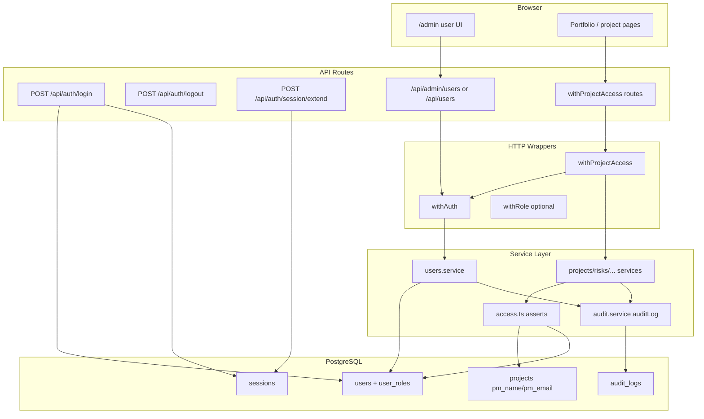

# Phase 10: Users, Roles & Server Authorization - Research

**Researched:** 2026-08-26
**Domain:** Multi-role RBAC, account lifecycle, scrypt sessions, company + project authorization on brownfield Next.js 16 / PostgreSQL
**Confidence:** HIGH

## Summary

Phase 10 replaces v1.0's single `is_admin` bit with spec roles **CPMO**, **PM**, and **Viewer** while keeping the existing scrypt + DB session stack. Authorization must compose **role checks with tenant checks** — never replace `company_id` scoping (Pitfall 10). The hardened path already flows `withAuth` → `withProjectAccess` → `assertProjectAccess` with 28+ project routes and Vitest cross-company 403 proofs; this phase extends that spine rather than introducing CASL, next-auth, or a parallel wrapper family.

The highest-risk work is **decoupling CPMO from global admin bypass**. Today `assertProjectAccess` and `listProjects` treat `is_admin` as cross-tenant superuser [VERIFIED: lib/services/access.ts:29-32, lib/repositories/projects.repo.ts:62-66]. CPMO must be **company-scoped portfolio access** only. PM write access uses an **interim** assignment check matching `projects.pm_name` / `projects.pm_email` text fields until Phase 11 ships assignment windows; Viewer denies all mutating service methods with 403 tests, not UI hiding alone (Pitfall 8).

Schema adds `user_roles`, `users.status`, `users.email`, soft-delete/deactivate columns, incremental `audit_logs`, and a one-time role backfill (`is_admin = 1` → CPMO, else → PM). User admin moves from global `/api/admin/users` + physical `DELETE` [VERIFIED: lib/repositories/admin.repo.ts:85-88] to company-scoped CPMO CRUD with audit on lock/unlock and profile changes (USER-05). Session resolution must reject Inactive/Locked users mid-session, not only at login (AUTH-06). No new npm packages — extend Zod ^4.4.3, Vitest 4, and existing HTTP wrappers.

**Primary recommendation:** Extend `lib/services/access.ts` with role helpers and `assertPmWriteAccess` (interim PM field match), widen `SessionUser`/`AccessActor` with `roles[]` + `status`, migrate schema in `migratePostgresSchema`, replace global admin bypass with company-scoped CPMO, and gate every mutating project service with Viewer-deny + PM-write asserts — ship the Vitest role matrix in the same plans as API changes.

## Architectural Responsibility Map

| Capability | Primary Tier | Secondary Tier | Rationale |
|------------|-------------|----------------|-----------|
| User CRUD, lock/unlock, role assignment | API / Backend | Database | CPMO admin actions; server validates uniqueness, status, audit |
| Login, logout, session extend | API / Backend | Database (`sessions`) | scrypt verify + cookie session; status gate at login and on every `getSessionUser` |
| Role + tenant authorization | API / Backend (services) | — | `authorize()` at service top; routes stay thin via `withAuth` / `withProjectAccess` |
| Session payload (roles, status) | API / Backend | — | Loaded in `getSessionUser`; consumed by wrappers as `AccessActor` |
| Admin user UI (minimal) | Browser / Client | API | No UI-SPEC; extend `/admin` enough for CPMO user management; mutate controls hidden for Viewer |
| Role matrix regression tests | — (Vitest node project) | API / services | HYG-03 gate; Viewer POST → 403 proofs alongside UI |
| Audit on user mutations | API / Backend (service) | Database (`audit_logs`) | Incremental start USER-05; Phase 18 completes coverage |
| Interim PM assignment lookup | API / Backend (service) | Database (`projects.pm_*`) | Text match until Phase 11 `assertPmWriteAccess` window table |

<user_constraints>
## User Constraints (from CONTEXT.md)

### Locked Decisions

#### Roles & Mapping from v1.0

- Spec roles are **CPMO**, **PM**, **Viewer**. Permissions are the **union** of assigned roles (USER-03).
- Backfill: existing `is_admin = 1` users become CPMO; all other existing users become PM (preserves current write access). Do not silently make everyone Viewer.
- Keep `is_admin` as a derived/compat flag if needed for leftover routes, but **authorization truth is `roles[]`**. New checks must not rely on `is_admin` alone.
- A user may hold multiple roles. Empty roles after update is invalid — at least one role required.

#### Account Lifecycle

- Status: Active / Inactive / Locked (USER-04). Only Active can log in (AUTH-06).
- Locked username and email cannot be reused on another account (USER-02).
- Soft-delete / deactivate: never physically DELETE a user who has generated business data (USER-06). History still shows display name. Prefer Inactive or a `deleted_at` flag — planner picks the existing-pattern analog.
- USER-05: lock, unlock, and other user-record changes record who and when (start `auditLog` here; Phase 18 completes coverage).

#### Session & Login

- Keep scrypt + DB sessions (`lib/auth.ts`). AUTH-01/03 already exist — extend, don't replace.
- Inactive/Locked: reject at login AND reject session resolution if status changes mid-session (cannot obtain or keep a session).
- Session expiry stays 7 days unless spec demands otherwise; extending a valid session refreshes `expires_at` without dropping cookies (AUTH-02). Do not invent a separate "draft token."
- Unique username and unique email at create/update (case-insensitive email recommended).

#### Server Authorization (AUTH-04, AUTH-05)

- **CPMO:** full company portfolio (all company projects).
- **PM:** view and update only assigned projects. Until Phase 11 assignment windows land, treat current project PM identity (`projects.pm_*` / existing owner field — planner confirms analog) as the assignment. Document this as interim; Phase 11 replaces it with `assertPmWriteAccess`.
- **Viewer:** read only — all mutating methods 403. Hiding UI is not access control.
- Company isolation from v1.0 (`withProjectAccess` / `company_id`) stays. Role checks **compose** with tenant checks, never replace them (Pitfall 10).
- Prefer extending `lib/services/access.ts` + thin `withRole` / service asserts over a new wrapper family. Keep `withAuth` / `withProjectAccess`.

#### UI

- `workflow.ui_phase` is false — no UI-SPEC this phase. Admin user screens and nav visibility may be updated enough that a CPMO can manage users; Viewer must not see mutate controls. Server tests are the gate.

#### Testing

- Vitest 4. Role matrix: Viewer POST → 403; PM on unassigned project → 403; CPMO company-scoped → 200; Inactive/Locked login → reject.
- Cross-company 403 must not regress.
- TDD for authz I/O (role assert, login status, unique constraints).

### Claude's Discretion

- Table names (`user_roles` vs join table), email uniqueness SQL, exact session-refresh endpoint, and whether admin UI is a new page vs extending an existing members/admin screen.

### Deferred Ideas (OUT OF SCOPE)

- Full PM assignment history and collaborator windows — Phase 11
- Weekly-report Viewer rules beyond mutate-deny — later phases
- Complete AUDIT-01 coverage — Phase 18
- Replacing Jira/AI/export
- DATA-01 migrations out of getDb()
</user_constraints>

<phase_requirements>
## Phase Requirements

| ID | Description | Research Support |
|----|-------------|------------------|
| USER-01 | Admin list/search/filter users by status, role, unit | Company-scoped `users.service` + repo with JOIN on `user_roles`; filter by `status`, role array, `company_id` as unit analog; extend `/admin` or new `/api/users` route |
| USER-02 | Unique username/email; locked credentials reserved | PG `UNIQUE(username)`, `UNIQUE(LOWER(email))`; locked rows remain — no reuse on another account |
| USER-03 | Multi-role union | `user_roles` table; session loads all roles; `hasAnyRole` / union checks in `access.ts` |
| USER-04 | Active/Inactive/Locked; only Active logs in | `users.status` column; login + `getSessionUser` gate |
| USER-05 | Lock/unlock records actor+time | `locked_at`, `locked_by`; `auditLog()` on user mutations (incremental) |
| USER-06 | No physical delete with business data | Replace `deleteAdminUser` DELETE with deactivate; guard or prefer Inactive |
| AUTH-01 | Username/password login | Extend existing `app/api/auth/login/route.ts` — add status check before `createSession` |
| AUTH-02 | Session expiry + extend without losing draft | Keep 7-day cookie; add `extendSession(sessionId)` UPDATE `expires_at` — same session id/cookie |
| AUTH-03 | Logout ends session | Existing `app/api/auth/logout/route.ts` — no change to contract |
| AUTH-04 | CPMO portfolio / PM assigned / Viewer read-only | `assertCpmoPortfolio`, interim `assertPmWriteAccess`, Viewer mutate deny in services |
| AUTH-05 | Server enforcement on every API | Service-layer asserts on all mutators; role matrix tests per representative route |
| AUTH-06 | Inactive/Locked cannot obtain or keep session | Login reject + `getSessionUser` status check + optional session DELETE on deny |
</phase_requirements>

## Standard Stack

### Core (unchanged — extend, do not replace)

| Library | Version | Purpose | Why Standard |
|---------|---------|---------|--------------|
| Next.js | 16.2.4 | App Router API routes | Validated v1.0 stack [VERIFIED: package.json] |
| PostgreSQL + `pg` | ^8.20.0 | Sessions, users, roles, audit | Existing `lib/db.ts` migrate loop |
| Node `crypto` scrypt | stdlib | Password hash + session IDs | [VERIFIED: lib/auth.ts:7-20, 53-58] |
| Zod | ^4.4.3 | Route body schemas for users/roles | [CITED: github.com/colinhacks/zod/v4.0.1] `z.email()`, `z.enum()`, `.min(1)` on role arrays |
| Vitest | 4.1.10 | Role matrix + access regression | [VERIFIED: vitest.config.ts, package.json] |

### Supporting (existing patterns)

| Library | Version | Purpose | When to Use |
|---------|---------|---------|-------------|
| `withAuth` / `withProjectAccess` | in-repo | Session + tenant wrapper | All project routes — add role context via extended `AccessActor` |
| `ForbiddenError` / `NotFoundError` | in-repo | Service → 403/404 | Same as v1.0 access rollout |
| `migratePostgresSchema` + settings flags | in-repo | Idempotent DDL | Mirror Phase 9 `migrateMappingTableTenancy` flag pattern for role backfill |

### Alternatives Considered

| Instead of | Could Use | Tradeoff |
|------------|-----------|----------|
| Extend `access.ts` | CASL / casbin | Explicitly out of scope — 3 static roles [VERIFIED: .planning/REQUIREMENTS.md Out of Scope] |
| Extend scrypt sessions | next-auth | Replacing working auth risks tenant regression |
| `user_roles` join table | JSONB roles column | Join table matches STACK.md pattern; easier to filter USER-01 by role |

**Installation:** None — phase uses existing dependencies only.

**Version verification:** No new packages. Existing pins confirmed in `package.json` (2026-08-26).

## Package Legitimacy Audit

> Phase 10 installs **no new external packages**. Audit skipped per protocol — nothing to verify.

| Package | Disposition |
|---------|-------------|
| — | No new installs |

**Packages removed due to [SLOP] verdict:** none  
**Packages flagged as suspicious [SUS]:** none

## Architecture Patterns

### System Architecture Diagram



### Recommended Project Structure

```
lib/
├── auth.ts                    # SessionUser + roles/status; extendSession; status gate
├── services/
│   ├── access.ts              # hasRole, assertRole, assertPmWriteAccess, assertCanMutate
│   ├── users.service.ts       # NEW — CPMO-scoped user lifecycle
│   ├── audit.service.ts       # NEW — append-only auditLog helper
│   └── *.service.ts           # Add assertCanMutate / PM write at top of mutators
├── repositories/
│   ├── users.repo.ts          # NEW — list/filter/create/update/deactivate + roles
│   └── admin.repo.ts          # Deprecate physical delete; slim to platform ops
├── http/
│   ├── with-auth.ts           # actorOf includes roles[]
│   └── with-role.ts           # NEW optional — require CPMO for user admin routes
app/api/
├── auth/login/route.ts        # Status gate
├── auth/session/extend/route.ts  # NEW — AUTH-02
├── admin/users/route.ts       # CPMO company scope OR split platform vs company admin
```

### Pattern 1: Extended SessionUser and AccessActor

**What:** Load roles and status at session resolution; peel into `AccessActor` in `withAuth`.

**When to use:** Every authenticated request.

**Current baseline:**

```typescript
// [VERIFIED: lib/auth.ts:23-31]
export type SessionUser = {
  id: number;
  username: string;
  display_name: string;
  company_id: number | null;
  company_name: string | null;
  is_admin: number;
  onboarding_completed: number;
};
```

**Target shape (planner implements):**

```typescript
// Role strings stored lowercase in DB CHECK; expose as union in TS
export type AppRole = 'cpmo' | 'pm' | 'viewer';
export type UserStatus = 'active' | 'inactive' | 'locked';

export type SessionUser = {
  // ...existing fields...
  roles: AppRole[];
  status: UserStatus;
  email: string;
};

export type AccessActor = {
  company_id: number | null;
  is_admin: number | boolean; // compat only — do not use for new authz
  roles: AppRole[];
  status: UserStatus;
  user_id: number;
};
```

**Session query:** JOIN `user_roles` aggregated to array; `WHERE u.status = 'active'` equivalent check after fetch — if inactive/locked, delete session row and return null.

### Pattern 2: Compose tenant + role (never replace)

**What:** Order remains: (1) authenticate, (2) tenant `assertProjectAccess`, (3) role-specific write/read rules.

**When to use:** Every project-scoped service method.

**Example — replace admin bypass with company-scoped CPMO:**

```typescript
// [VERIFIED: lib/services/access.ts:25-48] — today is_admin bypasses tenant
// Target: CPMO sees company portfolio; PM/Viewer still tenant-scoped

export function hasRole(actor: AccessActor, role: AppRole): boolean {
  return actor.roles.includes(role);
}

export function isCpmo(actor: AccessActor): boolean {
  return hasRole(actor, 'cpmo');
}

export async function assertProjectAccess(projectId: number | string, actor: AccessActor) {
  const row = await projectAccessRow(projectId);
  if (!row) throw new NotFoundError('Not found', 'project');

  // CPMO: company-scoped — NOT global admin bypass
  if (isCpmo(actor) && actor.company_id !== null) {
    const inCompany =
      row.company_id === actor.company_id || row.customer_company_id === actor.company_id;
    if (inCompany) return row;
    throw new ForbiddenError();
  }

  // ... existing non-CPMO tenant logic unchanged ...
}
```

### Pattern 3: Interim PM write access (Phase 11 seam)

**What:** Single `assertPmWriteAccess(projectId, actor)` called by mutators; implementation matches text PM fields until assignment table exists.

**Interim lookup fields [VERIFIED: lib/repositories/projects.repo.ts:12-17]:**

```typescript
// PROJECT_COLUMNS includes:
'pm_name',
'pm_email',
```

**Interim rule [ASSUMED — planner confirms matching strategy]:** PM role + (`projects.pm_email` case-insensitive equals `users.email` OR `projects.pm_name` trim-equals `users.display_name` OR `users.username`). CPMO bypasses PM assignment for write. Viewer never passes `assertCanMutate`.

Export `assertPmWriteAccess` from `access.ts` even though Phase 11 replaces the lookup — avoids a second seam rename.

### Pattern 4: User admin service + incremental audit

**What:** `users.service.ts` owns create/update/lock/deactivate; calls `auditLog({ actor, entity_type: 'user', entity_id, action, before, after })` after successful commit.

**Schema sketch:**

```sql
-- [ASSUMED — follows .planning/research/STACK.md pattern]
CREATE TABLE user_roles (
  user_id INTEGER NOT NULL REFERENCES users(id) ON DELETE CASCADE,
  role TEXT NOT NULL CHECK (role IN ('cpmo', 'pm', 'viewer')),
  company_id INTEGER NOT NULL REFERENCES companies(id),
  PRIMARY KEY (user_id, role)
);

ALTER TABLE users ADD COLUMN IF NOT EXISTS email TEXT;
ALTER TABLE users ADD COLUMN IF NOT EXISTS status TEXT NOT NULL DEFAULT 'active';
ALTER TABLE users ADD COLUMN IF NOT EXISTS locked_at TIMESTAMPTZ;
ALTER TABLE users ADD COLUMN IF NOT EXISTS locked_by INTEGER REFERENCES users(id);
ALTER TABLE users ADD COLUMN IF NOT EXISTS deleted_at TIMESTAMPTZ;

CREATE UNIQUE INDEX IF NOT EXISTS users_email_lower_unique
  ON users (LOWER(email)) WHERE email IS NOT NULL AND email <> '';

CREATE TABLE audit_logs (
  id BIGSERIAL PRIMARY KEY,
  company_id INTEGER REFERENCES companies(id),
  actor_id INTEGER REFERENCES users(id),
  entity_type TEXT NOT NULL,
  entity_id TEXT NOT NULL,
  action TEXT NOT NULL,
  before JSONB,
  after JSONB,
  created_at TIMESTAMPTZ DEFAULT now()
);
```

**Backfill (one-time, settings flag):** `INSERT INTO user_roles` — `is_admin = 1` → `cpmo`, else → `pm`, using user's `company_id` (default company for null).

### Pattern 5: Session extend (AUTH-02)

**What:** Refresh `sessions.expires_at` in place; keep same `pm_session` cookie value so client draft state is untouched.

**Baseline [VERIFIED: lib/auth.ts:53-58]:**

```typescript
const expires = new Date(Date.now() + 7 * 24 * 60 * 60 * 1000).toISOString();
await db.run('INSERT INTO sessions (id, user_id, expires_at) VALUES (?, ?, ?)', ...);
```

**Extend:** `UPDATE sessions SET expires_at = ? WHERE id = ? AND expires_at > now()` — return 401 if expired; optionally call from `GET /api/auth/me` when within renewal window or dedicated `POST /api/auth/session/extend`.

### Anti-Patterns to Avoid

- **Map CPMO → `is_admin = 1` for product routes:** Preserves cross-tenant leak (Pitfall 1).
- **Viewer button hiding only:** Must pair with service `assertCanMutate` → 403 (Pitfall 8).
- **Physical `DELETE FROM users`:** [VERIFIED: lib/repositories/admin.repo.ts:85-88] — replace with deactivate.
- **PM assignment without company check:** Always run `assertProjectAccess` before `assertPmWriteAccess` (Pitfall 10).
- **New auth library or policy engine:** Out of scope per REQUIREMENTS.md.

## Don't Hand-Roll

| Problem | Don't Build | Use Instead | Why |
|---------|-------------|-------------|-----|
| Password hashing | Custom bcrypt wrapper | Existing scrypt in `lib/auth.ts` | Already shipped + verified |
| Session store | JWT-only stateless | DB `sessions` table | Revocation + mid-session status invalidation |
| RBAC policy engine | CASL/casbin rules | `hasRole` / `assertRole` in `access.ts` | Three fixed roles; ~50 lines beats DSL sync |
| Email/username uniqueness | App-only check | PostgreSQL UNIQUE + 23505 handling | Race-safe |
| Audit diff tracking | json-diff library | Full before/after JSONB rows | STACK.md explicit avoid |
| HTTP 401/403 mapping | Per-route catch | `withAuth` + `serviceErrorResponse` | Established v1.0 pattern |

**Key insight:** The v1.0 wrappers and typed service errors are the enforcement substrate — role matrix belongs in services consumed by existing 28+ `withProjectAccess` routes, not in a parallel middleware tree.

## Common Pitfalls

### Pitfall 1: CPMO inherits global admin bypass

**What goes wrong:** CPMO user sees all tenants' projects because `is_admin` bypass remains in `assertProjectAccess` / `listProjects`.

**Why it happens:** Backfill sets CPMO from `is_admin = 1` without removing bypass.

**How to avoid:** Replace bypass with `isCpmo(actor) && company_id match`; grep `is_admin` after phase — product paths use `roles[]`.

**Warning signs:** CPMO in company A lists company B projects; grep shows `actor.is_admin` in `lib/services/*.ts`.

### Pitfall 2: UI-only Viewer gating

**What goes wrong:** Viewer POSTs to `/api/projects/[id]/risks` succeed — [VERIFIED: lib/services/risks.service.ts:15-21] only calls `assertProjectAccess`, no role check.

**How to avoid:** Add `assertCanMutate(actor, projectId)` at top of every create/update/delete service; add `route.access.test.ts` matrix.

### Pitfall 3: Inactive user keeps session

**What goes wrong:** Admin sets user Inactive; existing cookie works until expiry.

**How to avoid:** `getSessionUser` joins `users.status`; if not `active`, delete session and return null.

### Pitfall 4: Locked username/email reuse

**What goes wrong:** New user takes locked account's email.

**How to avoid:** Never DELETE locked users; username/email UNIQUE constraints keep row reserved (USER-02).

### Pitfall 5: Tenant regression when adding PM scope

**What goes wrong:** PM write check replaces company check.

**How to avoid:** Always `assertProjectAccess` first, then `assertPmWriteAccess`; cross-company 403 tests must stay green.

### Pitfall 6: Platform admin routes broken

**What goes wrong:** `/api/admin/companies` uses `requireAdmin` [VERIFIED: app/api/admin/companies/route.ts:11-15] — conflated with CPMO.

**How to avoid:** Document split: **platform ops** (`is_admin` break-glass, cross-tenant companies/demo/Jira config) vs **CPMO company admin** (users in own company). Do not route CPMO user management through global `listAdminUsers(null, true)`.

## Code Examples

### Zod user create schema (roles + email)

```typescript
// Source: [CITED: github.com/colinhacks/zod/v4.0.1] z.email, z.enum, array min
import { z } from 'zod';

const roleEnum = z.enum(['cpmo', 'pm', 'viewer']);
const statusEnum = z.enum(['active', 'inactive', 'locked']);

export const createUserSchema = z.object({
  username: z.string().trim().min(1),
  password: z.string().min(8),
  display_name: z.string().trim().optional(),
  email: z.email(),
  company_id: z.number().int().positive(),
  roles: z.array(roleEnum).min(1),
  status: statusEnum.default('active'),
});
```

### Login with status gate

```typescript
// Extend [VERIFIED: app/api/auth/login/route.ts:11-16]
const user = await findUserByUsername(username);
if (!user || user.status !== 'active') {
  return NextResponse.json({ error: 'Invalid username or password' }, { status: 401 });
}
if (!verifyPassword(password, user.password_hash)) { /* same 401 shape */ }
```

### Viewer mutate deny in service

```typescript
export function assertCanMutate(actor: AccessActor, projectId: number | string): Promise<void> {
  if (hasRole(actor, 'viewer') && !hasRole(actor, 'cpmo') && !hasRole(actor, 'pm')) {
    throw new ForbiddenError();
  }
  // CPMO and PM continue to assertProjectAccess + assertPmWriteAccess for writes
}
```

### Vitest role matrix (representative route)

```typescript
// Follow [VERIFIED: app/api/projects/[id]/route.access.test.ts] pattern — mock getSessionFromRequest
const viewerSession = { ...ownerSession, roles: ['viewer'], status: 'active' };
it('Viewer PATCH → 403', async () => {
  vi.mocked(getSessionFromRequest).mockResolvedValue(viewerSession as never);
  projectAccessRow.mockResolvedValue({ company_id: 5, customer_company_id: null });
  const res = await PATCH(req('PATCH', { name: 'x' }), params());
  expect(res.status).toBe(403);
});
```

## State of the Art

| Old Approach | Current Approach | When Changed | Impact |
|--------------|------------------|--------------|--------|
| Single `is_admin` bit | `user_roles` multi-role union | Phase 10 | All new checks use `roles[]` |
| Global admin project bypass | CPMO company-scoped | Phase 10 | Closes cross-tenant CPMO leak |
| Physical user DELETE | Deactivate / Inactive | Phase 10 | USER-06 audit trail preserved |
| Tenant-only 403 tests | Tenant + role matrix | Phase 10 | Viewer/PM cases added |
| No audit on users | `audit_logs` on user mutations | Phase 10 start | Phase 18 completes |

**Deprecated/outdated:**
- **`requireAdmin` + `is_admin` for product user CRUD:** Replace with CPMO company-scoped checks for USER-01..06.
- **`listProjects(companyId, isAdmin)` global list:** CPMO uses company filter, not `isAdmin === true` all rows [VERIFIED: lib/repositories/projects.repo.ts:62-66].

## Assumptions Log

| # | Claim | Section | Risk if Wrong |
|---|-------|---------|---------------|
| A1 | "Unit" in USER-01 maps to `company_id` (no separate unit column) | USER-01 | Filter UX wrong if spec defines org unit table |
| A2 | Interim PM match uses `pm_name`/`pm_email` vs user display_name/username/email | AUTH-04 | PM scope too wide/narrow until Phase 11 |
| A3 | Role strings stored lowercase (`cpmo`,`pm`,`viewer`) in DB CHECK | Schema | Migration mismatch if uppercase stored |
| A4 | Platform break-glass keeps `is_admin=1` for `/api/admin/companies` only | Pitfall 6 | Ops routes blocked or CPMO gets cross-tenant |
| A5 | `GET /api/auth/me` can trigger session extend within renewal window | AUTH-02 | Planner may prefer dedicated extend endpoint |

## Open Questions

1. **Exact PM text matching rules** — **RESOLVED (D-14).** Email-first when `projects.pm_email` is non-empty (case-insensitive vs `users.email`); otherwise trim+lower `pm_name` vs `display_name` then `username`. Seam `assertPmWriteAccess` (Phase 11 replaces the lookup only).

2. **Admin UI scope for CPMO vs platform admin** — **RESOLVED (D-21).** CPMO company-scoped Users tab via `roles` includes `cpmo` + session company. Platform `/api/admin/companies` (and demo/Jira/RAG config) stay on the break-glass flag. AUTH-05 leftover ops/admin/config carve-out is D-23.

3. **Business-data guard for deactivate** — **RESOLVED (D-07).** Never physically DELETE a user this phase; deactivate with `status = inactive` plus `deleted_at`; history still shows display name.

## Environment Availability

| Dependency | Required By | Available | Version | Fallback |
|------------|------------|-----------|---------|----------|
| Node.js | Vitest, Next.js | ✓ | 20+ (project standard) | — |
| PostgreSQL | users, roles, sessions, audit | ✓ | 15+ hosting | Test pool via `test/repo-db.ts` |
| npm / Vitest 4 | HYG-03 gate | ✓ | vitest 4.1.10 | — |
| gsd-tools | Optional research seam | ✓ | ~/.cursor/gsd-core | Manual verification used |

**Missing dependencies with no fallback:** none

**Missing dependencies with fallback:** none

## Validation Architecture

### Test Framework

| Property | Value |
|----------|-------|
| Framework | Vitest 4.1.10 |
| Config file | `vitest.config.ts` |
| Quick run command | `npx vitest run lib/services/access.unit.test.ts lib/services/users.service.unit.test.ts` |
| Full suite command | `npm test` |

### Phase Requirements → Test Map

| Req ID | Behavior | Test Type | Automated Command | File Exists? |
|--------|----------|-----------|-------------------|-------------|
| USER-01 | List/filter by status, role, company | unit | `npx vitest run lib/services/users.service.unit.test.ts -t list` | ❌ Wave 0 |
| USER-02 | Duplicate username/email 409 | unit | `npx vitest run lib/services/users.service.unit.test.ts -t unique` | ❌ Wave 0 |
| USER-03 | Multi-role union in session | unit | `npx vitest run lib/services/access.unit.test.ts -t hasRole` | ❌ Wave 0 |
| USER-04 | Inactive cannot login | route | `npx vitest run app/api/auth/login/route.test.ts -t inactive` | ❌ Wave 0 |
| USER-05 | Lock records audit row | unit | `npx vitest run lib/services/users.service.unit.test.ts -t audit` | ❌ Wave 0 |
| USER-06 | Deactivate not DELETE | unit/repo | `npx vitest run lib/repositories/users.repo.test.ts -t deactivate` | ❌ Wave 0 |
| AUTH-01 | Valid login 200 + cookie | route | `npx vitest run app/api/auth/login/route.test.ts -t success` | ❌ Wave 0 |
| AUTH-02 | Extend session keeps id | unit | `npx vitest run lib/auth.session.unit.test.ts -t extend` | ❌ Wave 0 |
| AUTH-03 | Logout clears session | route | `npx vitest run app/api/auth/logout/route.test.ts` | ❌ Wave 0 |
| AUTH-04 | PM unassigned → 403 mutate | access | `npx vitest run app/api/projects/[id]/risks/route.access.test.ts -t pm` | ❌ Wave 0 |
| AUTH-05 | Viewer POST → 403 | access | `npx vitest run lib/http/role-matrix.test.ts` | ❌ Wave 0 |
| AUTH-06 | Locked mid-session → 401 | unit | `npx vitest run lib/auth.session.unit.test.ts -t locked` | ❌ Wave 0 |
| TENANT regression | Cross-company 403 | access | `npx vitest run app/api/projects/[id]/route.access.test.ts` | ✅ |

### Sampling Rate

- **Per task commit:** `npx vitest run lib/services/access.unit.test.ts lib/services/users.service.unit.test.ts`
- **Per wave merge:** `npm test`
- **Phase gate:** Full suite green before `/gsd-verify-work`

### Wave 0 Gaps

- [ ] `lib/services/users.service.ts` + `lib/services/users.service.unit.test.ts`
- [ ] `lib/repositories/users.repo.ts` + repo tests (extend `test/repo-db.ts` DDL for `user_roles`, `audit_logs`, user columns)
- [ ] `lib/services/audit.service.ts` + unit test for append-only insert
- [ ] `lib/http/role-matrix.test.ts` — Viewer/PM/CPMO matrix across ≥1 GET + ≥1 POST route
- [ ] `app/api/auth/login/route.test.ts` — status rejection cases
- [ ] Extend `lib/services/access.unit.test.ts` — CPMO company scope (no global bypass)
- [ ] `lib/auth.session.unit.test.ts` — extend + inactive mid-session

## Security Domain

### Applicable ASVS Categories

| ASVS Category | Applies | Standard Control |
|---------------|---------|-----------------|
| V2 Authentication | yes | scrypt passwords; generic 401 on bad creds; status gate |
| V3 Session Management | yes | httpOnly cookie; server-side session; expiry + extend; logout invalidates |
| V4 Access Control | yes | Server-side role + tenant asserts on every mutator |
| V5 Input Validation | yes | Zod at route boundary; PG constraints for uniqueness |
| V6 Cryptography | yes | Node scrypt — never hand-roll |

### Known Threat Patterns for stack

| Pattern | STRIDE | Standard Mitigation |
|---------|--------|---------------------|
| Viewer writes via direct API | Elevation | `assertCanMutate` in services + 403 tests |
| CPMO cross-tenant read | Information disclosure | Company filter replaces `is_admin` bypass |
| PM writes unassigned project | Elevation | `assertPmWriteAccess` after tenant check |
| Session fixation after lock | Spoofing | Invalidate sessions on lock/inactive |
| Username enumeration | Information disclosure | Same error message for bad user vs bad password [VERIFIED: login route uses single message] |
| Mass assignment on user update | Tampering | Column allowlist in `users.repo` mirroring PROJECT_COLUMNS pattern |

## Sources

### Primary (HIGH confidence)

- `lib/auth.ts`, `lib/services/access.ts`, `lib/http/with-auth.ts`, `lib/http/with-project-access.ts` — codegraph + read (session, tenant assert, wrappers)
- `lib/repositories/admin.repo.ts`, `app/api/admin/users/route.ts`, `app/api/auth/login/route.ts` — user admin + login baseline
- `lib/repositories/projects.repo.ts` — PM field names, listProjects admin bypass
- `.planning/phases/10-users-roles-server-authorization/10-CONTEXT.md` — locked decisions
- `.planning/research/PITFALLS.md` — pitfalls 1, 8, 10
- `.planning/research/STACK.md`, `SUMMARY.md` — schema patterns, no new deps

### Secondary (MEDIUM confidence)

- [Context7 `/colinhacks/zod/v4.0.1`] — `z.email()`, `z.enum()`, array `.min(1)`
- `.planning/codebase/TESTING.md`, `CONVENTIONS.md` — Vitest naming, layer patterns

### Tertiary (LOW confidence)

- Interim PM matching heuristic (A2) — needs PLAN lock with Phase 11 seam name

## Metadata

**Confidence breakdown:**
- Standard stack: HIGH — no new packages; extends verified v1.0 auth/wrappers
- Architecture: HIGH — codegraph confirmed call paths and admin bypass locations
- Pitfalls: HIGH — PITFALLS.md cross-checked against live `access.ts` and `risks.service.ts`

**Research date:** 2026-08-26  
**Valid until:** 2026-09-26 (stable domain; 30 days)
