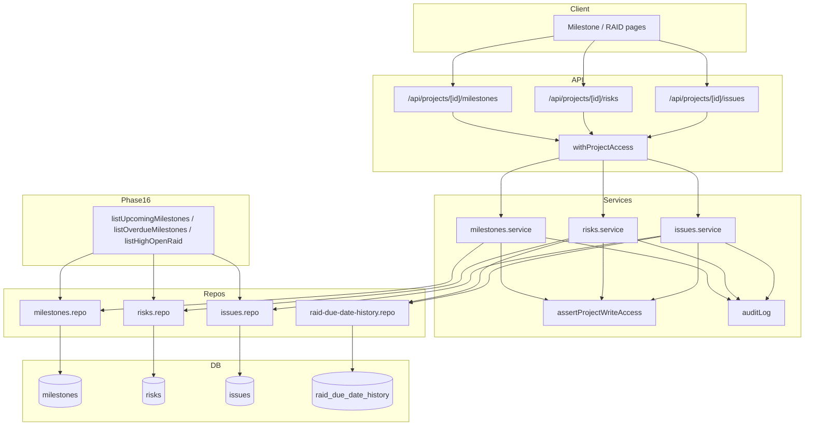

# Phase 12: Milestone & RAID Master Registers - Research

**Researched:** 2026-08-26
**Domain:** PostgreSQL schema migration, milestone lifecycle (cancel-only), RAID master registers (soft-deactivate, unique codes, due-date history), company-scoped list helpers for Phase 16 dashboards
**Confidence:** HIGH

## Summary

Phase 12 hardens the existing milestone and RAID surfaces into governed **master registers**: assigned PM and CPMO mutate via the established `assertProjectWriteAccess` gate (Phase 11 windows); Viewer gets 403. Milestones gain lifecycle columns and a cancel-only retire path — physical `DELETE FROM milestones` must be removed from repos, services, and the `[milestoneId]` route. RAID items gain a case-insensitive unique `code` per project, soft deactivation (`status = 'deactivated'`), append-only due-date history, and default list ordering (Open/In progress, severity High→Medium→Low, overdue first within severity).

The codebase already has the right seams: thin routes under `app/api/projects/[id]/…`, service→repo layering with allowlisted columns (`RISK_COLUMNS`, `ISSUE_COLUMNS`), `ConflictError`→409 via `lib/api-errors.ts`, `auditLog` append-only helper, and the `getDb()` migrate loop with settings-flag idempotency (`lib/db-project-master.ts`, `lib/db-roles.ts`). Phase 12 adds `lib/db-raid-masters.ts`, wires it into `getDb()` after `migrateProjectMaster`, extends existing repos/services (no new route families), and exports company/project list helpers consumed by Phase 16 — **no dashboard UI and no weekly snapshot tables** (Phase 13).

**Primary recommendation:** Add `lib/db-raid-masters.ts` (DDL + backfill + partial unique indexes), extend milestone/RAID repos and services in place, replace DELETE endpoints with cancel/deactivate mutations, append `raid_due_date_history` on due-date change, and ship Vitest unit tests as the gate (`workflow.ui_phase: false`).

<user_constraints>
## User Constraints (from CONTEXT.md)

### Locked Decisions

Decision IDs D-01..D-16.

#### Milestones (MS-01, MS-02, MS-03, MS-05)

- **D-01:** Keep existing `milestones` table. Add `status` (`planned` | `completed` | `cancelled`), `plan_end`, `adjusted_end` (nullable), `cancelled_at` / `cancelled_by`. Cancel is the only retire path. **Never `DELETE FROM milestones`** this phase (MS-05 pre-emptive: weekly reports do not exist yet).
- **D-02:** Mutate via `assertProjectWriteAccess` (Phase 11 windows). Viewer 403. Do not add a second wrapper family.
- **D-03:** Upcoming helper: status not completed/cancelled AND the earlier of plan_end/adjusted_end is within 7 days (inclusive) from today (UTC date). Overdue helper: today is after that date and status not completed/cancelled. Export `listUpcomingMilestones` / `listOverdueMilestones` for Phase 16; do not build dashboard UI here.
- **D-04:** Existing `linkEpic`/`unlinkEpic` stay write-gated (already Phase 10). No change to Jira sync semantics.

#### RAID (RAID-01, RAID-04, RAID-05, RAID-06)

- **D-05:** Keep `risks` and `issues` tables. Add `code` unique per project: `UNIQUE(project_id, LOWER(code))`. Auto-generate `R-nnn` / `I-nnn` if client omits code. Deactivate via `status = deactivated` (or `closed`) + `deactivated_at`; never physical DELETE.
- **D-06:** Due-date history table `raid_due_date_history` (`entity_type` risk|issue, `entity_id`, `old_due`, `new_due`, `changed_at`, `changed_by`). Append on due-date change only.
- **D-07:** Default list: Open / In progress first; order High, Medium, Low; within a severity overdue first. Overdue = due date < today and status open/in progress.
- **D-08:** `listHighOpenRaid(companyId)` counts **records** not projects. `technology_council` boolean on issues; `listTechnologyCouncilIssues(companyId)`. Phase 16 dashboards call these — no dashboard page this phase.
- **D-09:** Mutate via `assertProjectWriteAccess`. Unique code conflict → `ConflictError` 409.

#### Schema, UI, testing

- **D-10:** Schema in `getDb()` helper `lib/db-raid-masters.ts`. No Prisma. Incremental `auditLog` on cancel milestone, deactivate RAID, due-date change.
- **D-11:** `workflow.ui_phase` is false. Existing milestone/RAID screens may show status/code/overdue; server tests are the gate.
- **D-12:** MS-04 / RAID-02 / RAID-03 stay Phase 13. Do not create weekly snapshot tables.

### Claude's Discretion

- Exact status enum strings (`deactivated` vs `closed`), code prefix padding, whether overdue uses date-only vs datetime — planner locks: `deactivated`, zero-padded 3-digit codes, date-only UTC.

### Deferred Ideas (OUT OF SCOPE)

- MS-04, RAID-02, RAID-03 — Phase 13
- Dashboard UI for upcoming/overdue/High RAID — Phase 16 (must call this phase's list helpers)
- Full audit — Phase 18
</user_constraints>

<phase_requirements>
## Phase Requirements

| ID | Description | Research Support |
|----|-------------|------------------|
| MS-01 | PM (assigned) and CPMO create/update/cancel milestones; Viewer cannot mutate | Existing `assertProjectWriteAccess` on mutate paths [VERIFIED: lib/services/milestones.service.ts:18-48]; add `cancelMilestone` replacing `deleteMilestone` |
| MS-02 | Dashboard upcoming milestones (7 days before plan/adjusted end, exclude Completed/Cancelled) | Export `listUpcomingMilestones(companyId)` with D-03 date-only UTC rule; Phase 16 consumes |
| MS-03 | Overdue when today after plan/adjusted end and not Completed/Cancelled | Export `listOverdueMilestones(companyId)`; effective end = `COALESCE(adjusted_end, plan_end)` |
| MS-05 | Milestone in submitted weekly report cannot be physically deleted | Pre-emptive: remove all `DELETE FROM milestones` paths; cancel-only (D-01) |
| RAID-01 | PM/CPMO create/update/deactivate risks & issues with unique code; Viewer cannot mutate | `assertProjectWriteAccess` already on mutate [VERIFIED: lib/services/risks.service.ts:15-47]; add `code` column + deactivate replacing delete |
| RAID-04 | Overdue open RAID flagged; due-date change keeps history | `raid_due_date_history` append + `is_overdue` computed in list queries |
| RAID-05 | Default list Open/In progress, High→Medium→Low, overdue first within severity | Replace naive `ORDER BY priority` in `listOpenRisks`/`listOpenIssues` with CASE ordering |
| RAID-06 | Portfolio High RAID counts records; technology-council issues listable | `listHighOpenRaid(companyId)` + `listTechnologyCouncilIssues(companyId)` on `issues.technology_council` |
</phase_requirements>

## Architectural Responsibility Map

| Capability | Primary Tier | Secondary Tier | Rationale |
|------------|-------------|----------------|-----------|
| Milestone CRUD + cancel | API / Backend (service + repo) | Database (`milestones` columns) | Server enforces write gate; cancel is UPDATE not DELETE |
| Milestone upcoming/overdue queries | API / Backend (repo helpers) | Database (date columns) | Phase 16 dashboards call company-scoped lists; rules are SQL-friendly |
| RAID CRUD + deactivate | API / Backend (service + repo) | Database (`risks`, `issues`) | Same pattern as milestones; no physical delete |
| Unique RAID code enforcement | Database (partial unique index) | API / Backend (`ConflictError` pre-check) | Index is source of truth; service maps duplicate to 409 |
| Due-date history | API / Backend (service on update) | Database (`raid_due_date_history`) | Append-only on due_date change; audit complements |
| High RAID / tech-council portfolio lists | API / Backend (repo + optional portfolio.service export) | Database (JOIN projects for tenant scope) | Company-scoped like `listPortfolioMilestones` [VERIFIED: lib/repositories/portfolio.repo.ts:218-231] |
| Schema DDL + backfill | Database (migrate on boot via `getDb`) | — | `lib/db-raid-masters.ts` after `migrateProjectMaster` [VERIFIED: lib/db.ts:614-615] |
| Incremental audit | API / Backend (`auditLog`) | Database (`audit_logs`) | Cancel, deactivate, due-date change (D-10) |
| Epic link/unlink | API / Backend (existing) | — | Already write-gated; no change (D-04) |

## Standard Stack

### Core

| Library | Version | Purpose | Why Standard |
|---------|---------|---------|--------------|
| `pg` | ^8.20.0 [VERIFIED: package.json:26] | PostgreSQL pool | Already used by `getDb()` |
| `zod` | ^4.4.3 [VERIFIED: package.json:35] | Route body shape guards | Existing passthrough schemas on milestone/RAID routes |
| `vitest` | 4.1.10 [VERIFIED: package.json devDependencies] | Unit + access tests | Phase gate (D-11); pattern in `*.service.unit.test.ts` |

### Supporting

| Library | Version | Purpose | When to Use |
|---------|---------|---------|-------------|
| Existing `auditLog` | — | Mutation audit trail | Cancel milestone, deactivate RAID, due-date change (D-10) |
| Existing `withProjectAccess` | — | Project-scoped route auth | Keep existing `/api/projects/[id]/milestones`, `/risks`, `/issues` routes |
| Existing `ConflictError` | — | Duplicate code → 409 | Same as holidays/projects duplicate pattern [VERIFIED: lib/services/errors.ts:38-43] |

### Alternatives Considered

| Instead of | Could Use | Tradeoff |
|------------|-----------|----------|
| Extend existing tables | New `milestone_master` / `raid_master` tables | Rejected — CONTEXT locks keep `milestones`, `risks`, `issues` (D-01, D-05) |
| Physical DELETE + snapshot FK | Soft cancel/deactivate only | Required for MS-05 and Phase 13 immutability |
| Prisma migrations | `getDb()` DDL helper | Rejected — project convention (D-10) |

**Installation:** No new packages. Use existing dependencies only.

**Version verification:** No new external packages to install.

## Package Legitimacy Audit

> Phase 12 installs **no new external packages**. Existing stack verified in-repo.

| Package | Registry | Verdict | Disposition |
|---------|----------|---------|-------------|
| — | — | — | N/A — no new installs |

**Packages removed due to [SLOP] verdict:** none
**Packages flagged as suspicious [SUS]:** none

## Architecture Patterns

### System Architecture Diagram



### Recommended Project Structure

```
lib/
├── db-raid-masters.ts              # NEW: DDL, backfill, unique indexes (D-10)
├── db-raid-masters.ddl.unit.test.ts # NEW: hermetic DDL string assertions
├── db.ts                           # wire migrateRaidMasters after migrateProjectMaster
├── repositories/
│   ├── milestones.repo.ts          # extend: cancel, upcoming/overdue queries
│   ├── risks.repo.ts               # extend: code, deactivate, default list order
│   ├── issues.repo.ts              # extend: code, technology_council, deactivate
│   └── raid-due-date-history.repo.ts # NEW: append history rows
├── services/
│   ├── milestones.service.ts       # cancelMilestone; remove deleteMilestone export
│   ├── risks.service.ts            # deactivateRisk; code conflict; audit on due change
│   └── issues.service.ts           # deactivateIssue; same
app/api/projects/[id]/
├── milestones/[milestoneId]/route.ts  # DELETE → cancel PATCH or dedicated cancel action
├── risks/route.ts                     # DELETE → deactivate
└── issues/route.ts                    # DELETE → deactivate
```

### Pattern 1: Settings-flag idempotent DDL module

**What:** Export `RAID_MASTERS_DDL` string array + `migrateRaidMasters(pool)` invoked from `getDb()`, mirroring `lib/db-project-master.ts`.
**When to use:** Any new columns/tables/indexes this phase.
**Example:**

```typescript
// Source: lib/db-project-master.ts (Phase 11 pattern)
export const RAID_MASTERS_DDL_FLAG = 'raid_masters_ddl_v1';

export const RAID_MASTERS_DDL = [
  `ALTER TABLE milestones ADD COLUMN IF NOT EXISTS status TEXT NOT NULL DEFAULT 'planned'`,
  `ALTER TABLE milestones ADD COLUMN IF NOT EXISTS plan_end TEXT`,
  // ... cancelled_at, cancelled_by, adjusted_end
  `ALTER TABLE risks ADD COLUMN IF NOT EXISTS code TEXT`,
  `ALTER TABLE issues ADD COLUMN IF NOT EXISTS code TEXT`,
  `ALTER TABLE issues ADD COLUMN IF NOT EXISTS technology_council BOOLEAN DEFAULT FALSE`,
  `ALTER TABLE issues ADD COLUMN IF NOT EXISTS deactivated_at TIMESTAMPTZ`,
  // raid_due_date_history CREATE TABLE ...
];

export async function migrateRaidMasters(pool: Pool): Promise<void> {
  if (await settingsFlagExists(pool, RAID_MASTERS_DDL_FLAG)) return;
  for (const sql of RAID_MASTERS_DDL) await pool.query(sql);
  await writeSettingsFlag(pool, RAID_MASTERS_DDL_FLAG);
}
```

Wire in `getDb()`:

```typescript
// After migrateProjectMaster — [VERIFIED: lib/db.ts:614-615]
const { migrateRaidMasters } = await import('./db-raid-masters');
await migrateRaidMasters(pool);
```

### Pattern 2: Cancel / deactivate instead of DELETE

**What:** Service sets status + timestamp columns; repo runs scoped UPDATE; route removes DELETE handler or maps it to deactivate for backward compatibility (planner choice — prefer explicit PATCH/cancel to avoid accidental deletes).
**When to use:** All milestone retire and RAID retire paths (D-01, D-05, MS-05).

Current DELETE paths to eliminate:

```typescript
// [VERIFIED: lib/repositories/milestones.repo.ts:41-44]
return db.run('DELETE FROM milestones WHERE id = ? AND project_id = ?', milestoneId, projectId);

// [VERIFIED: lib/repositories/risks.repo.ts:52-55]
return db.run('DELETE FROM risks WHERE id = ? AND project_id = ?', rowId, projectId);

// [VERIFIED: lib/repositories/issues.repo.ts:51-54]
return db.run('DELETE FROM issues WHERE id = ? AND project_id = ?', rowId, projectId);
```

Replace with:

```typescript
// milestones.repo — cancelMilestone
await db.get(
  `UPDATE milestones SET status = 'cancelled', cancelled_at = now(), cancelled_by = ?
   WHERE id = ? AND project_id = ? AND status != 'cancelled' RETURNING *`,
  actorId, milestoneId, projectId,
);

// risks.repo — deactivateRisk
await db.get(
  `UPDATE risks SET status = 'deactivated', deactivated_at = now()
   WHERE id = ? AND project_id = ? RETURNING *`,
  rowId, projectId,
);
```

### Pattern 3: Unique code with ConflictError pre-check

**What:** Partial unique index + service pre-check before INSERT/UPDATE (holidays/projects analog).
**When to use:** RAID create and code change (D-05, D-09).

```sql
CREATE UNIQUE INDEX IF NOT EXISTS risks_project_code_lower_unique
  ON risks (project_id, LOWER(code))
  WHERE code IS NOT NULL AND TRIM(code) <> '';

CREATE UNIQUE INDEX IF NOT EXISTS issues_project_code_lower_unique
  ON issues (project_id, LOWER(code))
  WHERE code IS NOT NULL AND TRIM(code) <> '';
```

```typescript
// Source: lib/services/holidays.service.ts pattern
if (await findRiskByCode(projectId, code)) {
  throw new ConflictError('Risk code already exists');
}
```

Auto-generate when omitted (planner locks zero-padded 3-digit):

```typescript
const n = (await countRisks(projectId)) + 1;
const code = body.code?.trim() || `R-${String(n).padStart(3, '0')}`;
```

**Migration note:** Existing rows use `risk_id` / `issue_id` (e.g. `R1`) [VERIFIED: lib/repositories/risks.repo.ts:29]. Backfill `code` from `risk_id`/`issue_id` in `migrateRaidMasters` backfill step; keep legacy columns readable until UI migrates.

### Pattern 4: Due-date history append

**What:** On successful update when `due_date` changes, INSERT history row then `auditLog`.
**When to use:** Risk and issue update paths only (D-06).

```typescript
if (fields.due_date !== undefined && fields.due_date !== prior.due_date) {
  await appendDueDateHistory({
    entity_type: 'risk',
    entity_id: String(rowId),
    old_due: prior.due_date,
    new_due: fields.due_date,
    changed_by: actor.user_id,
  });
  await auditLog({
    actor_id: actor.user_id,
    company_id: actor.company_id,
    entity_type: 'risk',
    entity_id: String(rowId),
    action: 'due_date_change',
    before: { due_date: prior.due_date },
    after: { due_date: fields.due_date },
  });
}
```

Table DDL (D-06):

```sql
CREATE TABLE IF NOT EXISTS raid_due_date_history (
  id BIGSERIAL PRIMARY KEY,
  entity_type TEXT NOT NULL CHECK (entity_type IN ('risk', 'issue')),
  entity_id TEXT NOT NULL,
  old_due TEXT,
  new_due TEXT,
  changed_at TIMESTAMPTZ DEFAULT now(),
  changed_by INTEGER REFERENCES users(id)
);
```

### Pattern 5: Upcoming / overdue milestone helpers (Phase 16)

**Effective end date:** `effective_end = COALESCE(adjusted_end, plan_end)` — if both null, row is neither upcoming nor overdue.

**UTC date-only today:**

```typescript
const today = new Date().toISOString().slice(0, 10); // [VERIFIED: lib/services/project-report.service.ts:191-192]
```

**Upcoming (D-03):** status NOT IN (`'completed'`, `'cancelled'`) AND `effective_end >= today` AND `effective_end <= today + 7 days`.

**Overdue (D-03):** status NOT IN (`'completed'`, `'cancelled'`) AND `effective_end < today`.

Export company-scoped variants joining `projects` with the same tenant filter as `listPortfolioMilestones` [VERIFIED: lib/repositories/portfolio.repo.ts:224-227]:

```sql
WHERE (p.company_id = ? OR c.company_id = ?)
  AND m.status NOT IN ('completed', 'cancelled')
  AND COALESCE(m.adjusted_end, m.plan_end) IS NOT NULL
  AND COALESCE(m.adjusted_end, m.plan_end) < ?
```

### Pattern 6: Default RAID list ordering (D-07)

Replace current alphabetical priority sort [VERIFIED: lib/repositories/risks.repo.ts:60-63]:

```sql
SELECT *, (due_date < ? AND status IN ('Open', 'In Progress')) AS is_overdue
FROM risks
WHERE project_id = ? AND status IN ('Open', 'In Progress')
ORDER BY
  CASE priority WHEN 'High' THEN 1 WHEN 'Medium' THEN 2 WHEN 'Low' THEN 3 ELSE 4 END,
  CASE WHEN due_date < ? AND status IN ('Open', 'In Progress') THEN 0 ELSE 1 END,
  due_date NULLS LAST,
  id
```

Status strings match existing defaults: `'Open'`, `'In Progress'` [VERIFIED: lib/db.ts:203,219 — `status TEXT DEFAULT 'Open'`].

### Pattern 7: Portfolio High RAID count (D-08)

**Records not projects:**

```sql
SELECT COUNT(*) FROM risks r
JOIN projects p ON p.id = r.project_id
LEFT JOIN customers c ON p.customer_id = c.id
WHERE (p.company_id = ? OR c.company_id = ?)
  AND r.status IN ('Open', 'In Progress')
  AND r.priority = 'High'
```

Technology council issues:

```sql
SELECT i.*, p.name AS project_name FROM issues i
JOIN projects p ON p.id = i.project_id
...
WHERE i.technology_council = TRUE AND i.status IN ('Open', 'In Progress')
```

### Anti-Patterns to Avoid

- **Physical DELETE on masters:** Breaks MS-05 and Phase 13 snapshot referential integrity — use cancel/deactivate only.
- **Second auth wrapper:** Do not introduce parallel write gates; use `assertProjectWriteAccess` only (D-02).
- **Weekly snapshot tables:** MS-04 / RAID-02 / RAID-03 are Phase 13 (D-12).
- **Dashboard pages in Phase 12:** Export list helpers; Phase 16 owns UI (D-03, D-08).
- **Renaming `risk_id`/`issue_id` in place without backfill:** Breaks existing report consumers — add `code`, backfill, migrate create path, deprecate display field gradually.
- **Datetime overdue comparisons:** Planner locks date-only UTC strings (`TEXT` columns) — do not mix timezone-aware timestamps for due_date.

## Don't Hand-Roll

| Problem | Don't Build | Use Instead | Why |
|---------|-------------|-------------|-----|
| Idempotent schema migration | Ad-hoc ALTER on every request | `lib/db-raid-masters.ts` + settings flag | Matches Phase 11 `db-project-master.ts` |
| HTTP status mapping | Status codes in services | `ConflictError` + `serviceErrorResponse` | SVC-03 separation [VERIFIED: lib/services/errors.ts:2-4] |
| PM write scope | Custom milestone/RAID gate | `assertProjectWriteAccess` | Single assignment-window source (Phase 11) |
| Duplicate code detection | Application-only check | Partial unique index + pre-check | Race-safe; index survives concurrent inserts |
| Audit trail | Custom history tables for all fields | `auditLog` for mutations + `raid_due_date_history` for due dates | D-10 incremental scope |
| Auto code sequencing | Global sequence table | `COUNT(*)+1` per project (existing pattern) | Matches current `createRisk` [VERIFIED: lib/repositories/risks.repo.ts:27-29] — upgrade padding only |

**Key insight:** This phase extends proven Phase 10–11 patterns (service asserts, repo allowlists, DDL modules) rather than introducing parallel subsystems.

## Common Pitfalls

### Pitfall 1: Leaving DELETE routes active

**What goes wrong:** Clients can still hard-delete milestones/RAID despite master-register rules.
**Why it happens:** `[milestoneId]/route.ts` exports DELETE [VERIFIED: app/api/projects/[id]/milestones/[milestoneId]/route.ts:16-18]; risks/issues routes same pattern.
**How to avoid:** Remove or repurpose DELETE to deactivate; delete repo functions; update unit tests expecting delete.
**Warning signs:** `grep DELETE FROM milestones` returns any hit outside tests/migrations.

### Pitfall 2: `end_date` vs `plan_end` drift

**What goes wrong:** Upcoming/overdue helpers read empty `plan_end` while UI still writes `end_date`.
**Why it happens:** Baseline schema has `start_date`, `end_date` only [VERIFIED: lib/db.ts:363-369 — `start_date TEXT, end_date TEXT`].
**How to avoid:** Backfill `plan_end FROM end_date` in migration; update repo create/update to write `plan_end`; optionally sync `end_date` for legacy readers until Phase 16/report updates.
**Warning signs:** Portfolio milestone list still orders by `m.start_date, m.end_date` [VERIFIED: lib/repositories/portfolio.repo.ts:220-226].

### Pitfall 3: Status string mismatch

**What goes wrong:** Overdue filter excludes rows because DB has `'Closed'` but helper checks `'completed'`.
**Why it happens:** Milestones use new lowercase enum (`planned`|`completed`|`cancelled`) [VERIFIED: 12-CONTEXT.md D-01]; RAID keeps title-case `'Open'`, `'In Progress'`, `'Closed'` [VERIFIED: lib/db.ts:203].
**How to avoid:** Milestone status: lowercase only. RAID active set: `'Open'`, `'In Progress'`. Deactivate target: `'deactivated'` (planner lock). Do not conflate milestone `cancelled` with RAID `deactivated`.
**Warning signs:** Unit tests pass on mocks but SQL returns zero rows.

### Pitfall 4: Unique code collisions on backfill

**What goes wrong:** Backfill from `risk_id`/`issue_id` fails unique index when duplicates differ only by case.
**Why it happens:** Partial index uses `LOWER(code)` (D-05).
**How to avoid:** Backfill with `LOWER(TRIM(risk_id))`; resolve duplicates with suffix before creating index.
**Warning signs:** Migration aborts with PG 23505 during boot.

### Pitfall 5: Due-date history on non-changes

**What goes wrong:** History table noise when update payload repeats same due_date.
**Why it happens:** `buildUpdate` may include unchanged fields.
**How to avoid:** Compare normalized strings before append (D-06: "on due-date change only").
**Warning signs:** History row where `old_due = new_due`.

### Pitfall 6: High RAID counts projects instead of records

**What goes wrong:** Dashboard shows "3 projects" when 3 records across 1 project.
**Why it happens:** `COUNT(DISTINCT project_id)` vs `COUNT(*)`.
**How to avoid:** D-08 explicitly requires record count — use `COUNT(*)` or return row list length.
**Warning signs:** Test fixture with 2 risks on 1 project returns 1.

## Code Examples

### Existing baseline schema (pre-migration)

```sql
-- milestones [VERIFIED: lib/db.ts:363-369]
CREATE TABLE IF NOT EXISTS milestones (
  id SERIAL PRIMARY KEY,
  project_id INTEGER NOT NULL REFERENCES projects(id) ON DELETE CASCADE,
  name TEXT NOT NULL,
  start_date TEXT,
  end_date TEXT,
  created_at TIMESTAMP DEFAULT CURRENT_TIMESTAMP
);

-- risks [VERIFIED: lib/db.ts:193-207]
CREATE TABLE IF NOT EXISTS risks (
  id SERIAL PRIMARY KEY,
  project_id INTEGER NOT NULL REFERENCES projects(id) ON DELETE CASCADE,
  risk_id TEXT,
  ...
  due_date TEXT,
  status TEXT DEFAULT 'Open',
  priority TEXT DEFAULT 'Medium',
  ...
);

-- issues [VERIFIED: lib/db.ts:208-223] — same shape with issue_id, root_cause
```

### assertProjectWriteAccess (reuse, do not duplicate)

```typescript
// [VERIFIED: lib/services/access.ts:131-138]
export async function assertProjectWriteAccess(
  projectId: number | string,
  actor: AccessActor,
): Promise<void> {
  await assertProjectAccess(projectId, actor);
  assertCanMutate(actor);
  await assertPmWriteAccess(projectId, actor);
}
```

### auditLog call shape

```typescript
// [VERIFIED: lib/repositories/audit.repo.ts:3-11, lib/services/audit.service.ts:5-8]
await auditLog({
  actor_id: actor.user_id,
  company_id: actor.company_id,
  entity_type: 'milestone',
  entity_id: String(milestoneId),
  action: 'cancel',
  before: { status: prior.status },
  after: { status: 'cancelled', cancelled_at: '...' },
});
```

### Service unit test harness

```typescript
// [VERIFIED: lib/services/milestones.service.unit.test.ts:1-34]
vi.mock('@/lib/services/access', () => ({ assertProjectAccess, assertProjectWriteAccess }));
vi.mock('@/lib/repositories/milestones.repo', () => ({ ... }));
// Assert write gate called before repo; ForbiddenError when denied
```

## State of the Art

| Old Approach | Current Approach | When Changed | Impact |
|--------------|------------------|--------------|--------|
| Physical DELETE milestone/RAID | Cancel / deactivate UPDATE | Phase 12 (this) | Preserves master history for Phase 13 snapshots |
| Display id `R1` via COUNT | Unique `code` `R-001` per project | Phase 12 | Case-insensitive uniqueness; ConflictError on clash |
| `end_date` only | `plan_end` + nullable `adjusted_end` | Phase 12 | MS-02/MS-03 rules use effective end |
| Alphabetical priority sort | Severity + overdue-first | Phase 12 | RAID-05 default register order |
| No due-date history | `raid_due_date_history` append | Phase 12 | RAID-04 audit trail |

**Deprecated/outdated:**
- `deleteMilestone` / `deleteRisk` / `deleteIssue` service exports — replace with cancel/deactivate; remove DELETE route handlers.
- Bare `ORDER BY priority` on open RAID lists — replace with CASE ordering.

## Assumptions Log

| # | Claim | Section | Risk if Wrong |
|---|-------|---------|---------------|
| A1 | Legacy `end_date` can be backfilled into `plan_end` one-to-one | Pitfall 2 | Upcoming/overdue empty until manual fix |
| A2 | Existing RAID status `'Closed'` remains valid; deactivate adds `'deactivated'` as retire path | Pattern 2 | Closed items may need migration to deactivated |
| A3 | `risk_id`/`issue_id` columns remain for report backward compatibility after `code` added | Pattern 3 | Report UI shows stale ids |
| A4 | Milestone status values are lowercase `'planned'`, `'completed'`, `'cancelled'` only | D-01 | Filter mismatches if UI sends title case |

## Open Questions

1. **DELETE route backward compatibility**
   - What we know: Routes currently expose DELETE for milestones/risks/issues.
   - What's unclear: Whether any client depends on DELETE semantics vs deactivate.
   - Recommendation: Map DELETE to deactivate in risks/issues for minimal breakage; milestones DELETE → cancel or return 405 with cancel endpoint — planner should grep callers.

2. **Sync `end_date` when `plan_end` updates**
   - What we know: `project-report.service` reads `ms.end_date` [VERIFIED: lib/services/project-report.service.ts:204-205].
   - What's unclear: Whether to dual-write during transition.
   - Recommendation: Dual-write `end_date = plan_end` on milestone update until report service reads `plan_end` (small follow-up in same phase or Phase 16).

3. **Company-scoped helper placement**
   - What we know: `listPortfolioMilestones` lives in `portfolio.repo.ts` / `portfolio.service.ts`.
   - What's unclear: Whether upcoming/overdue/high-RAID helpers belong in portfolio module vs dedicated `raid-masters.repo.ts`.
   - Recommendation: Put SQL in `milestones.repo.ts` / `risks.repo.ts` / `issues.repo.ts`; thin re-exports from `portfolio.service.ts` if Phase 16 already uses portfolio API surface.

## Environment Availability

| Dependency | Required By | Available | Version | Fallback |
|------------|------------|-----------|---------|----------|
| Node.js | Vitest, Next build | ✓ | v24.14.0 | — |
| npm | test scripts | ✓ | 11.9.0 | — |
| PostgreSQL (`DATABASE_URL`) | Integration / manual UAT | ✗ (not set in shell) | — | Unit tests mock repos; DDL hermetic tests need no live DB |
| vitest | D-11 test gate | ✓ | 4.1.10 [VERIFIED: package.json] | — |

**Missing dependencies with no fallback:**
- None for unit-test gate (mocked repos pattern established).

**Missing dependencies with fallback:**
- Live PostgreSQL — optional for executor manual verification; not required for Vitest service/DDL tests.

## Validation Architecture

### Test Framework

| Property | Value |
|----------|-------|
| Framework | vitest 4.1.10 [VERIFIED: package.json] |
| Config file | vitest.config.ts |
| Quick run command | `npx vitest run lib/services/milestones.service.unit.test.ts lib/services/risks.service.unit.test.ts lib/services/issues.service.unit.test.ts -x` |
| Full suite command | `npm test` |

### Phase Requirements → Test Map

| Req ID | Behavior | Test Type | Automated Command | File Exists? |
|--------|----------|-----------|-------------------|-------------|
| MS-01 | Viewer 403 on create/update/cancel | unit | `npx vitest run lib/services/milestones.service.unit.test.ts -x` | ✅ extend |
| MS-01 | Cancel sets status cancelled, no delete repo call | unit | same | ❌ Wave 0 |
| MS-02 | listUpcomingMilestones 7-day window | unit | `npx vitest run lib/repositories/milestones.repo.test.ts -x` or new file | ❌ Wave 0 |
| MS-03 | listOverdueMilestones after effective end | unit | same | ❌ Wave 0 |
| MS-05 | deleteMilestone removed / never calls DELETE SQL | unit | milestones.service.unit.test.ts | ❌ Wave 0 |
| RAID-01 | Viewer 403; deactivate replaces delete | unit | `npx vitest run lib/services/risks.service.unit.test.ts lib/services/issues.service.unit.test.ts -x` | ✅ extend |
| RAID-01 | Duplicate code → ConflictError | unit | risks.service.unit.test.ts | ❌ Wave 0 |
| RAID-04 | Due-date change appends history + auditLog | unit | risks.service.unit.test.ts | ❌ Wave 0 |
| RAID-05 | Default list order High→Medium→Low, overdue first | unit | risks.repo.test.ts | ❌ Wave 0 |
| RAID-06 | listHighOpenRaid counts records; tech council filter | unit | new portfolio or issues service test | ❌ Wave 0 |
| D-10 | DDL exports flags and indexes | unit | `npx vitest run lib/db-raid-masters.ddl.unit.test.ts -x` | ❌ Wave 0 |

### Sampling Rate

- **Per task commit:** `npx vitest run lib/services/<changed>.service.unit.test.ts -x`
- **Per wave merge:** `npx vitest run lib/services/milestones.service.unit.test.ts lib/services/risks.service.unit.test.ts lib/services/issues.service.unit.test.ts lib/db-raid-masters.ddl.unit.test.ts -x`
- **Phase gate:** `npm test` green before `/gsd-verify-work`

### Wave 0 Gaps

- [ ] `lib/db-raid-masters.ts` + `lib/db-raid-masters.ddl.unit.test.ts` — DDL fragments, unique indexes, backfill flags
- [ ] `lib/repositories/raid-due-date-history.repo.ts` — append helper
- [ ] Cancel/deactivate repo functions — replace delete* in milestones/risks/issues repos
- [ ] `listUpcomingMilestones` / `listOverdueMilestones` repo queries + tests
- [ ] `listHighOpenRaid` / `listTechnologyCouncilIssues` repo queries + tests
- [ ] Extend service unit tests for ConflictError, auditLog mock, deactivate paths

## Security Domain

### Applicable ASVS Categories

| ASVS Category | Applies | Standard Control |
|---------------|---------|-----------------|
| V2 Authentication | no | Session already enforced by `withProjectAccess` upstream |
| V3 Session Management | no | Out of phase scope |
| V4 Access Control | yes | `assertProjectWriteAccess` on all mutations (D-02); Viewer → `ForbiddenError` [VERIFIED: lib/services/access.ts:58-61] |
| V5 Input Validation | yes | Allowlisted columns via `RISK_COLUMNS`/`ISSUE_COLUMNS` + `buildUpdate`; route zod passthrough unchanged |
| V6 Cryptography | no | No secrets in this phase |

### Known Threat Patterns for stack

| Pattern | STRIDE | Standard Mitigation |
|---------|--------|---------------------|
| IDOR on milestone/RAID row | Elevation of privilege | Scoped UPDATE `WHERE id = ? AND project_id = ?` [VERIFIED: lib/repositories/milestones.repo.ts:35-37] |
| Viewer mutating masters | Elevation of privilege | `assertCanMutate` rejects viewer-only [VERIFIED: lib/services/access.ts:58-61] |
| PM writing outside assignment window | Elevation of privilege | `assertPmWriteAccess` after tenant match [VERIFIED: lib/services/access.ts:115-122] |
| Duplicate RAID code injection | Tampering | Partial unique index + ConflictError (D-09) |
| Mass assignment on update | Tampering | `buildUpdate` allowlist [VERIFIED: lib/repositories/risks.repo.ts:8-11] |

## Sources

### Primary (HIGH confidence)

- Codebase: `lib/db.ts`, `lib/db-project-master.ts`, `lib/services/milestones.service.ts`, `lib/services/risks.service.ts`, `lib/services/issues.service.ts`, `lib/services/access.ts`, `lib/repositories/*.repo.ts` — read via codegraph this session
- `.planning/phases/12-milestone-raid-master-registers/12-CONTEXT.md` — locked decisions D-01..D-12

### Secondary (MEDIUM confidence)

- `.planning/phases/11-project-master-pm-assignment-stakeholders/11-RESEARCH.md` — migrate module pattern, test gate
- `.planning/codebase/CONVENTIONS.md` — ConflictError, service layering

### Tertiary (LOW confidence)

- None material — phase is in-repo extension, not new framework adoption

## Metadata

**Confidence breakdown:**
- Standard stack: HIGH — no new packages; patterns copied from Phase 11
- Architecture: HIGH — existing services/repos/routes verified verbatim
- Pitfalls: HIGH — DELETE paths and column naming conflicts identified in source

**Research date:** 2026-08-26
**Valid until:** 2026-09-26 (stable domain; schema locked by CONTEXT)
