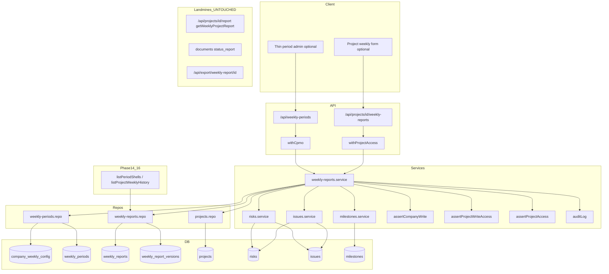

# Phase 13: Weekly Periods & PM Submit - Research

**Researched:** 2026-08-26
**Domain:** CPMO weekly-period configuration, PM draft/submit of versioned weekly reports with RAID/milestone snapshots — parallel product surface (not v1 activity reports)
**Confidence:** HIGH

## Summary

Phase 13 delivers a **new weekly-report pipeline** alongside the existing v1 surfaces: `getWeeklyProjectReport` (activity-weighted live data), `documents.type = status_report` diary on `/projects/[id]/reports`, and `/api/export/weekly-report/[id]`. The spec pipeline uses four new tables (`company_weekly_config`, `weekly_periods`, `weekly_reports`, `weekly_report_versions`), a DDL module `lib/db-weekly-reports.ts` wired in `getDb()` **after** `migrateRaidMasters`, and two route families: `/api/weekly-periods` (CPMO + `assertCompanyWrite`) and `/api/projects/[id]/weekly-reports` (read via `assertProjectAccess`, mutate via `assertProjectWriteAccess`).

Period creation is transactional: insert period row with frozen `display_name` (`YYYY-Wnn | start – end`), materialize `config_snapshot`, compute `due_at`, and insert **at most one shell per obligated project** (`UNIQUE(period_id, project_id)`). Obligation at create time mirrors Phase 11 flags: same `company_id`, `weekly_report_enabled = true`, `weekly_report_start_period <= iso_week` (lexicographic `YYYY-Wnn`), `stage <> 'L5'`, `status NOT IN ('Completed','Paused','Cancelled','Other')` — with **no backfill** when projects become obligated later.

PM draft lives on shell columns (planner discretion D-18); submit validates RAID proposals in draft JSON, writes masters through existing `createRisk`/`updateRisk`/`createIssue`/`updateIssue`, copies `projects.progress_pct` **without write-back**, syncs `this_week_rag` → `projects.rag` when different, stores immutable `weekly_report_versions.snapshot` (RAID + milestone locked copies), and freezes `first_submitted_at` / `first_lateness`. Overdue is computed (`now() > due_at` AND status `not_submitted`|`draft`); late submit allowed. Phase 14/16 consume export helpers only — no tracking grid or dashboards here.

**Primary recommendation:** Add `lib/db-weekly-reports.ts` + `lib/services/weekly-reports.service.ts` + thin repos, wire migrate after RAID masters, ship Vitest 4 service/repo tests as the gate (`workflow.ui_phase: false`), and treat v1 report routes/pages as read-only landmines — never store Phase 13 obligations in `documents` or call `getWeeklyProjectReport` for submit.

<user_constraints>
## User Constraints (from CONTEXT.md)

### Locked Decisions

Decision IDs D-01..D-18.

#### Parallel surface (not v1 activity reports)

- **D-01:** New tables and routes. Do **not** store Phase 13 obligations in `documents` (`type = status_report`) and do **not** extend `getWeeklyProjectReport`. Keep v1 activity-weighted report pages working unchanged. — **Reversibility:** costly — mixing stores would force a later data split.

#### Periods & obligation (PERD-01, PERD-02, PERD-03, WKRP-01)

- **D-02:** Table `weekly_periods`: `company_id`, `iso_week` (`YYYY-Wnn`), `start_date`, `end_date`, `due_at` (timestamptz), `display_name` (computed at create: `YYYY-Wnn | start – end`), `config_snapshot` JSON, `created_by`, `created_at`. Unique `(company_id, iso_week)`. ISO week and date bounds use UTC (Thursday rule). — **Reversibility:** one-way — unique week key and stored display names are a published contract.
- **D-03:** Company default due weekday/time lives in `company_weekly_config` (one row per company). Creating a period **copies** due rule + obligated-rule version into `config_snapshot` and materializes `due_at`. Later config edits do not UPDATE existing period rows or shells (PERD-02).
- **D-04:** Obligated project at period-create time: same `company_id` AND `weekly_report_enabled = true` AND `weekly_report_start_period <= iso_week` (lexicographic `YYYY-Wnn`) AND `stage <> 'L5'` AND `status` not in (`Completed`, `Paused`, `Cancelled`, `Other`). Create **at most one** shell per obligated project in the **same transaction** as the period. `UNIQUE(period_id, project_id)`. Projects that become obligated later are **not** backfilled onto already-created periods. Turning weekly off / L5 / terminal after the period exists does **not** delete the shell.
- **D-05:** Shell table `weekly_reports`: `period_id`, `project_id`, `status` (`not_submitted` | `draft` | `submitted`), `first_submitted_at` (null until first successful submit), `first_lateness` (`on_time` | `late` | null), `latest_version`. Overdue is **computed** (never a stored status): `now() > period.due_at` AND status in (`not_submitted`, `draft`). Late submit is allowed and sets `first_lateness = late` only on the first submit.

#### Draft, submit, versioning (WKRP-02..06)

- **D-06:** Structured draft fields: `highlights`, `completed_work`, `next_week_goals`, `nearest_milestone` (text + optional `milestone_id`), `raid_dependency`, `leadership_support`, `this_week_rag`. First successful save of any of these moves `not_submitted` → `draft`.
- **D-07:** Previous-week RAG is copied at draft-open time from the previous period's latest **submitted** version's `this_week_rag`, else `projects.rag`. Stored on the draft as `prev_week_rag` and returned read-only. Client cannot PATCH it.
- **D-08:** Submit creates an immutable row in `weekly_report_versions` (`report_id`, `version` int starting at 1, `snapshot` JSON, `submitted_at`, `submitted_by`, `rag`, `progress_pct`). Shell status → `submitted`; `latest_version` increments. PATCH of a submitted shell's snapshot is 409. Correction = POST that opens a new draft payload (or writes draft columns) and a later submit becomes version N+1. `first_submitted_at` and `first_lateness` never change after the first submit (WKRP-04).
- **D-09:** History list: one row per period for the project, newest `iso_week` first. Columns: period display name, status (plus computed overdue flag), latest RAG, submit time, submitter, on-time/late. Viewer may GET via `assertProjectAccess`; mutate via `assertProjectWriteAccess`.
- **D-10:** On submit, copy live `projects.progress_pct` into the version snapshot. **Never** UPDATE `projects.progress_pct` from a weekly report (Phase 11 D-09). If `this_week_rag` differs from `projects.rag`, UPDATE `projects.rag` (WKRP-03).

#### RAID & milestone snapshots (RAID-02, RAID-03, MS-04)

- **D-11:** RAID register remains the only durable RAID store. Draft may carry proposed creates/updates (by master `id` or `new`) in draft JSON only — no writes to `risks`/`issues` on draft save. Submit validates required RAID fields, applies writes through existing `risks.service` / `issues.service` (auto-codes, no physical DELETE, due-date history), then stores a **locked copy** of the referenced master rows in the version snapshot. Validation failure → 400 `{ error, fields: [...] }` and no version row. Later master edits do not UPDATE old snapshots.
- **D-12:** Submit also stores a milestone snapshot (nearest + any selected `milestone_id` row, including plan/adjusted end and status). Later milestone cancel/edit does not change old reports (MS-04). Do not `DELETE FROM milestones`.

#### Authz, schema, UI, testing

- **D-13:** Period + company config mutate: `withCpmo` and `assertCompanyWrite` (actor `company_id`). Period list is company-scoped. Project draft/submit: `assertProjectWriteAccess`. Reads: `assertProjectAccess`. Do not invent a second wrapper family. Do not gate D-23 leftover ops/admin routes.
- **D-14:** Schema helper `lib/db-weekly-reports.ts` invoked from `getDb()` **after** `migrateRaidMasters`. Settings-flag DDL. No Prisma. Incremental `auditLog` on period create, first submit, and correction submit.
- **D-15:** Routes: `/api/weekly-periods` (CPMO) and `/api/projects/[id]/weekly-reports` (+ `/[reportId]` draft/submit/correct). Do not reuse `/api/projects/[id]/report`.
- **D-16:** `workflow.ui_phase` is false. Existing screens may gain a thin period-admin list and a project weekly history/form so CPMO/PM can operate; server tests are the gate. Do not redesign portfolio report or v1 project report pages.
- **D-17:** Never physical DELETE period rows, shells, or submitted versions. Closing a period (optional `closed_at`) only prevents **new** shells on that period; existing shells remain.
- **D-18:** Phase 14 tracking counts/export and Phase 16 dashboards consume these tables — export list helpers (`listPeriodShells`, `listProjectWeeklyHistory`) from the weekly-report service. Do not build the CPMO tracking grid or consolidated pack here.

### Claude's Discretion

- Exact `snapshot` JSON shape, whether draft columns live on `weekly_reports` vs a `draft` version row, default due weekday (Friday 18:00 UTC recommended), and whether correction POST is `/correct` vs submit-again on a draft overlay — planner locks those names. Prefer draft columns on the shell + immutable version rows on submit.

### Deferred Ideas (OUT OF SCOPE)

- CPMO tracking counts, filters, tick-select, consolidated Excel/Word/PPT pack — Phase 14
- Portfolio / PM dashboards consuming overdue/RAG — Phase 16 (must call this phase's list helpers)
- Budget, value, ROI, bidirectional deps — Phase 15
- Document templates & Confluence checklist — Phase 17
- Full append-only audit coverage — Phase 18
</user_constraints>

<phase_requirements>
## Phase Requirements

| ID | Description | Research Support |
|----|-------------|------------------|
| PERD-01 | CPMO configures weekly periods with display name, due datetime, auto-create shells | `POST /api/weekly-periods` + transactional shell insert; `display_name` at create [D-02]; `withCpmo` + `assertCompanyWrite` |
| PERD-02 | Created period stores config snapshot; later config edits do not alter existing periods | `config_snapshot` JSON on `weekly_periods`; `company_weekly_config` separate table [D-03] |
| PERD-03 | Overdue when now > due and status Not submitted/Draft; late submit allowed | Computed flag in list queries [D-05]; `first_lateness` set once on first submit |
| WKRP-01 | At most one obligation per project per period when obligated | `UNIQUE(period_id, project_id)` + obligation SQL at period create [D-04] |
| WKRP-02 | PM draft + submit structured fields | Shell draft columns [D-06]; `assertProjectWriteAccess` on PATCH/submit |
| WKRP-03 | Previous-week RAG read-only prefilled; this-week RAG syncs to master on submit | `prev_week_rag` at draft-open [D-07]; conditional `UPDATE projects.rag` on submit [D-10] |
| WKRP-04 | First-submit timestamp and on-time/late immutable | `first_submitted_at`, `first_lateness` written once [D-08] |
| WKRP-05 | Submitted report immutable; correction = new version | `weekly_report_versions` append-only; 409 on PATCH submitted shell [D-08] |
| WKRP-06 | History one row per period, newest first | `listProjectWeeklyHistory` join period + latest version [D-09] |
| MS-04 | Submitted reports store milestone snapshot; later edits don't change old reports | Milestone rows copied into `snapshot.milestones` at submit [D-12] |
| RAID-02 | Register is master; reports reference masters and store snapshots | Draft JSON only until submit; snapshot holds locked copies [D-11] |
| RAID-03 | Draft RAID on draft until submit validates, writes master, locks snapshot, or 400 fields | Reuse `createRisk`/`updateRisk`/`createIssue`/`updateIssue`; aggregate validation error shape |
</phase_requirements>

## Architectural Responsibility Map

| Capability | Primary Tier | Secondary Tier | Rationale |
|------------|-------------|----------------|-----------|
| Company weekly config CRUD | API / Backend (`weekly-periods` route + service) | Database (`company_weekly_config`) | CPMO-only; `withCpmo` + `assertCompanyWrite` [VERIFIED: lib/http/with-role.ts:26-34, lib/services/access.ts:126-128] |
| Period create + shell materialization | API / Backend (service transaction) | Database (`weekly_periods`, `weekly_reports`) | Obligation rules + uniqueness enforced in one transaction [D-04] |
| Overdue / lateness computation | API / Backend (list query) | Database (read `due_at`, shell status) | Overdue is derived, not stored [D-05] |
| PM draft save | API / Backend (project weekly-reports route) | Database (shell columns) | `assertProjectWriteAccess`; no master writes on draft [D-06, D-11] |
| PM submit + versioning | API / Backend (submit orchestration) | Database (`weekly_report_versions`) | Validates RAID, writes masters, inserts immutable snapshot [D-08, D-11] |
| RAID master writes on submit | API / Backend (existing risks/issues services) | Database (`risks`, `issues`, due-date history) | Reuse Phase 12 services — codes, deactivate-not-delete [VERIFIED: lib/services/risks.service.ts:35-93] |
| Milestone snapshot | API / Backend (read master at submit) | Database (snapshot JSON only) | No milestone mutation on submit unless draft included updates — snapshot is copy [D-12] |
| `progress_pct` / `rag` sync | API / Backend (submit side effects) | Database (`projects` columns) | Copy-at-submit, RAG sync only; never write `progress_pct` back [D-10, VERIFIED: lib/services/project-governance.ts:50-51] |
| Phase 14/16 list helpers | API / Backend (exported service functions) | Database (joins) | `listPeriodShells`, `listProjectWeeklyHistory` [D-18] |
| Schema DDL | Database (migrate on boot) | — | `lib/db-weekly-reports.ts` after `migrateRaidMasters` [VERIFIED: lib/db.ts:616-617] |
| Incremental audit | API / Backend (`auditLog`) | Database (`audit_logs`) | Period create, first submit, correction submit [D-14] |

## Standard Stack

### Core

| Library | Version | Purpose | Why Standard |
|---------|---------|---------|--------------|
| `pg` | ^8.20.0 [VERIFIED: package.json] | PostgreSQL pool | Already used by `getDb()` |
| `zod` | ^4.4.3 [VERIFIED: package.json] | Route body validation | Existing route schema pattern (`pm-assignments`, `admin/users`) |
| `vitest` | 4.1.10 [VERIFIED: package.json:49] | Unit + repo tests | Phase gate (D-16); TDD mode enabled in config |

### Supporting

| Library | Version | Purpose | When to Use |
|---------|---------|---------|-------------|
| Existing `withCpmo` | — | CPMO route wrapper | Period/config routes [VERIFIED: lib/http/with-role.ts:26-34] |
| Existing `withProjectAccess` | — | Project-scoped routes | `/api/projects/[id]/weekly-reports` [VERIFIED: lib/http/with-project-access.ts:30-44] |
| Existing `auditLog` | — | Mutation audit | Period create, submit, correction [VERIFIED: lib/services/audit.service.ts:5-8] |
| Existing `ValidationError` / `ConflictError` | — | Business rule failures | Field validation; 409 on submitted-shell PATCH [VERIFIED: lib/services/errors.ts:28-43] |

### Alternatives Considered

| Instead of | Could Use | Tradeoff |
|------------|-----------|----------|
| New weekly tables | Extend `documents` / `getWeeklyProjectReport` | **Rejected** — D-01; v1 activity weighting breaks snapshot/immutability |
| Prisma migrations | `getDb()` DDL helper | **Rejected** — project convention (D-14) |
| Custom RAID submit path | Direct repo INSERT on submit | **Rejected** — must reuse services for codes, due-date history, deactivate semantics (D-11) |
| CASL / policy engine | New auth layer | **Rejected** — CONTEXT + REQUIREMENTS out of scope |

**Installation:** No new packages. Use existing dependencies only.

**Version verification:** No new external packages to install.

## Package Legitimacy Audit

> Phase 13 installs **no new external packages**. Existing stack verified in-repo.

| Package | Registry | Verdict | Disposition |
|---------|----------|---------|-------------|
| — | — | — | N/A — no new installs |

**Packages removed due to [SLOP] verdict:** none  
**Packages flagged as suspicious [SUS]:** none

## Architecture Patterns

### System Architecture Diagram



### Recommended Project Structure

```
lib/
├── db-weekly-reports.ts                    # NEW: DDL + settings flags (D-14)
├── db-weekly-reports.ddl.unit.test.ts      # NEW: hermetic DDL assertions
├── db.ts                                   # wire migrateWeeklyReports after migrateRaidMasters
├── repositories/
│   ├── weekly-periods.repo.ts              # NEW: config, periods, obligation query
│   └── weekly-reports.repo.ts              # NEW: shells, versions, history joins
├── services/
│   └── weekly-reports.service.ts           # NEW: createPeriod, draft, submit, list helpers
app/api/
├── weekly-periods/
│   ├── route.ts                            # GET list, POST create (withCpmo)
│   └── config/route.ts                     # GET/PUT company_weekly_config (withCpmo)
└── projects/[id]/weekly-reports/
    ├── route.ts                            # GET history (withProjectAccess)
    └── [reportId]/
        ├── route.ts                        # GET shell, PATCH draft
        ├── submit/route.ts                 # POST submit
        └── correct/route.ts                # POST correction draft (planner names)
```

### Pattern 1: Settings-flag idempotent DDL module (copy `db-raid-masters.ts`)

**What:** Export DDL string arrays + `migrateWeeklyReports(pool)` with `settings` flags for ddl / indexes.  
**When to use:** All new tables and constraints (D-14).

```typescript
// Wire in getDb() — after migrateRaidMasters [VERIFIED: lib/db.ts:616-617]
const { migrateRaidMasters } = await import('./db-raid-masters');
await migrateRaidMasters(pool);
const { migrateWeeklyReports } = await import('./db-weekly-reports');
await migrateWeeklyReports(pool);
```

Mirror flag helpers from raid masters [VERIFIED: lib/db-raid-masters.ts:46-59,130-137].

### Pattern 2: CPMO company-scoped mutators

**What:** Route uses `withCpmo`; service calls `assertCompanyWrite(actor)` before any company-scoped write.  
**When to use:** Period create, config update (D-13).

```typescript
// [VERIFIED: lib/http/with-role.ts:26-34]
export function withCpmo(handler, opts?) {
  return withRole('cpmo', handler, opts);
}

// [VERIFIED: lib/services/access.ts:126-128]
export function assertCompanyWrite(actor: AccessActor): void {
  if (!isCpmo(actor)) throw new ForbiddenError();
  if (actor.company_id === null) throw new ForbiddenError();
}

// Analog: pm-assignments [VERIFIED: lib/services/pm-assignments.service.ts:53-54]
await assertProjectAccess(projectId, actor);
assertCompanyWrite(actor);
```

Period routes use **only** `withCpmo` + `assertCompanyWrite` (no nested project assert).

### Pattern 3: Project draft/submit auth

**What:** `withProjectAccess` on routes; service calls `assertProjectWriteAccess` for PATCH/submit/correct, `assertProjectAccess` for GET history.  
**When to use:** All `/api/projects/[id]/weekly-reports` handlers (D-13).

```typescript
// [VERIFIED: lib/services/access.ts:131-138]
export async function assertProjectWriteAccess(projectId, actor) {
  await assertProjectAccess(projectId, actor);
  assertCanMutate(actor);
  await assertPmWriteAccess(projectId, actor);
}
```

### Pattern 4: Obligation query at period create

**What:** Single transaction: INSERT period → SELECT obligated projects → INSERT shells.  
**When to use:** PERD-01, WKRP-01 (D-04).

Project columns already exist [VERIFIED: lib/db-project-master.ts:15-16]:

```typescript
// verbatim from lib/db-project-master.ts:15-16
`ALTER TABLE projects ADD COLUMN IF NOT EXISTS weekly_report_enabled BOOLEAN DEFAULT FALSE`,
`ALTER TABLE projects ADD COLUMN IF NOT EXISTS weekly_report_start_period TEXT`,
```

Terminal status set for obligation exclusion [VERIFIED: lib/services/project-governance.ts:3]:

```typescript
const TERMINAL_STATUSES = new Set(['Completed', 'Paused', 'Cancelled', 'Other']);
```

Recommended obligation SQL (planner embeds in repo):

```sql
SELECT p.id
FROM projects p
WHERE p.company_id = $1
  AND p.weekly_report_enabled = TRUE
  AND p.weekly_report_start_period <= $2
  AND COALESCE(p.stage, '') <> 'L5'
  AND COALESCE(p.status, '') NOT IN ('Completed', 'Paused', 'Cancelled', 'Other')
```

Lexicographic `YYYY-Wnn` compare is valid when week zero-padded (Phase 11 pattern [VERIFIED: lib/services/project-governance.ts:5] `WEEKLY_PERIOD_PATTERN = /^\d{4}-W\d{2}$/`).

### Pattern 5: Draft on shell, immutable version on submit

**What:** Mutable columns on `weekly_reports`; append-only `weekly_report_versions` with JSON `snapshot`.  
**When to use:** WKRP-02, WKRP-05, MS-04, RAID-02 (D-06, D-08, D-11, D-12).

Submit side effects order (single transaction):

1. Validate structured fields + RAID draft JSON → on failure throw aggregated 400 `{ error, fields: [...] }` (D-11).
2. Apply RAID via `createRisk`/`updateRisk`/`createIssue`/`updateIssue` with same `actor`.
3. Read live `projects.progress_pct` and `projects.rag` — copy pct into snapshot; never UPDATE `progress_pct` [D-10].
4. If `this_week_rag !== projects.rag`, UPDATE `projects.rag` only.
5. Build milestone snapshot from master rows (nearest text + optional `milestone_id`).
6. INSERT `weekly_report_versions` with full snapshot (fields + raid copies + milestones + `prev_week_rag`).
7. UPDATE shell: `status = 'submitted'`, `latest_version++`, set `first_submitted_at` / `first_lateness` only if null.
8. `auditLog` — action `weekly_submit` or `weekly_correct` (D-14).

On first submit only:

```typescript
const onTime = new Date() <= period.due_at;
// first_lateness: null until first submit; then 'on_time' | 'late' — never updated on correction
```

### Pattern 6: RAID draft JSON → master on submit only

**What:** Draft column `draft_raid_json` (name planner-locked) holds `{ risks: [...], issues: [...] }` with entries `{ id: number | 'new', fields: {...} }`. No repo writes on PATCH draft.  
**When to use:** RAID-02, RAID-03 (D-11).

Reuse existing services [VERIFIED: lib/services/risks.service.ts:35-51, lib/services/issues.service.ts:35-50]:

- `id: 'new'` → `createRisk` / `createIssue` (auto-code when omitted).
- `id: number` → `updateRisk` / `updateIssue` (due-date history + audit on date change).
- Never call `deactivate*` from weekly submit unless spec requires — default: reject deactivated rows in validation.

Locked snapshot after successful writes: SELECT master rows by id and embed in `snapshot.raid`.

### Pattern 7: Previous-week RAG prefilled read-only

**What:** On first GET draft (or PATCH that initializes draft), compute `prev_week_rag`:

```sql
-- Prior period for same company: max iso_week where iso_week < current AND company_id match
-- Then latest submitted version's this_week_rag from snapshot or denormalized version.rag
-- Fallback: projects.rag
```

Store on shell; strip `prev_week_rag` from PATCH allowlist (D-07).

### Pattern 8: Export helpers for downstream phases

**What:** Service exports only — no UI (D-18):

```typescript
export async function listPeriodShells(companyId: number, periodId: number, actor: AccessActor);
export async function listProjectWeeklyHistory(projectId: number, actor: AccessActor);
```

`listProjectWeeklyHistory` implements WKRP-06: one row per period, newest `iso_week` first, columns from latest version join.

### Anti-Patterns to Avoid

- **Reusing `getWeeklyProjectReport`:** Activity-weighted live completion — violates snapshot/immutability [VERIFIED: lib/services/project-report.service.ts:70-161].
- **Storing obligations in `documents`:** Diary `status_report` inserts always [VERIFIED: lib/repositories/documents.repo.ts comment — type status_report always inserts].
- **Writing `progress_pct` from weekly submit:** Breaks PROJ-07 / Phase 11 D-09 contract [VERIFIED: lib/services/project-governance.ts:50-51].
- **Physical DELETE** on periods/shells/versions/masters: Forbidden (D-17, D-12, Phase 12 cancel/deactivate only).
- **Backfilling shells** when `weekly_report_enabled` flips later: Spec forbids (D-04).
- **Inventing CASL or gating ops/admin leftovers:** Explicitly out of scope (D-13).

## Standard vs This-Phase Approach

| Concern | Standard / v1 codebase today | Phase 13 approach |
|---------|-------------------------------|-------------------|
| Weekly data source | `GET /api/projects/[id]/report` → `getWeeklyProjectReport` — live activities, weighted `completion_pct` | New tables + `/api/projects/[id]/weekly-reports` — structured fields + frozen snapshots |
| Persistence | `documents` rows `type = 'status_report'` on `/projects/[id]/reports` | `weekly_reports` + `weekly_report_versions` |
| RAID | Live `listOpenRisks` / `listOpenIssues` at read time | Master register + draft JSON until submit; locked copy in snapshot |
| Milestones | Live list in project report | Snapshot subset at submit (MS-04) |
| Progress | Activity-weighted % in v1 report; `projects.progress_pct` for governance | Copy `projects.progress_pct` at submit only; never write back |
| RAG | Computed in `getProjectReport` via `calculateRAG` | PM picks `this_week_rag`; sync to `projects.rag` on submit when changed |
| Periods | None — `weekly_report_start_period` string on project only | CPMO `weekly_periods` + shells auto-created |
| Export | `/api/export/weekly-report/[id]` from document content | Deferred to Phase 14 consolidated pack from snapshots |
| Auth | `withProjectAccess` on v1 report route | Same wrappers; add `withCpmo` for period routes |

## Recommended Schema (planner-locked names)

### `company_weekly_config`

| Column | Type | Notes |
|--------|------|-------|
| `company_id` | INTEGER PK FK → companies | One row per company |
| `due_weekday` | SMALLINT | 0=Sun … 6=Sat; default 5 (Friday) [ASSUMED: discretion] |
| `due_time_utc` | TIME | Default `18:00:00` UTC [ASSUMED: discretion] |
| `updated_at` | TIMESTAMPTZ | |
| `updated_by` | INTEGER FK → users | |

### `weekly_periods`

| Column | Type | Notes |
|--------|------|-------|
| `id` | SERIAL PK | |
| `company_id` | INTEGER NOT NULL | |
| `iso_week` | TEXT NOT NULL | `YYYY-Wnn` |
| `start_date` | DATE NOT NULL | UTC ISO week bounds (Thursday rule) |
| `end_date` | DATE NOT NULL | |
| `due_at` | TIMESTAMPTZ NOT NULL | From config snapshot + week end |
| `display_name` | TEXT NOT NULL | `YYYY-Wnn \| start – end` frozen at create |
| `config_snapshot` | JSONB NOT NULL | Due rule + obligation rule version |
| `closed_at` | TIMESTAMPTZ NULL | Optional; blocks new shells only (D-17) |
| `created_by` | INTEGER | |
| `created_at` | TIMESTAMPTZ | |
| UNIQUE | `(company_id, iso_week)` | D-02 |

### `weekly_reports` (shell)

| Column | Type | Notes |
|--------|------|-------|
| `id` | SERIAL PK | |
| `period_id` | INTEGER FK | |
| `project_id` | INTEGER FK | |
| `status` | TEXT | `not_submitted`, `draft`, `submitted` |
| `first_submitted_at` | TIMESTAMPTZ NULL | Immutable after first submit |
| `first_lateness` | TEXT NULL | `on_time`, `late` |
| `latest_version` | INTEGER DEFAULT 0 | |
| Draft columns | TEXT / INTEGER | D-06 fields + `prev_week_rag` |
| `draft_raid_json` | JSONB NULL | Proposed RAID edits until submit |
| UNIQUE | `(period_id, project_id)` | D-04 |

### `weekly_report_versions`

| Column | Type | Notes |
|--------|------|-------|
| `id` | SERIAL PK | |
| `report_id` | INTEGER FK | |
| `version` | INTEGER NOT NULL | Starts at 1; UNIQUE `(report_id, version)` |
| `snapshot` | JSONB NOT NULL | Full immutable payload |
| `submitted_at` | TIMESTAMPTZ | |
| `submitted_by` | INTEGER FK → users | |
| `rag` | TEXT | Denormalized `this_week_rag` for history list |
| `progress_pct` | INTEGER | Copy at submit |

## Recommended API Surface

| Method | Path | Auth | Behavior |
|--------|------|------|----------|
| GET | `/api/weekly-periods` | `withCpmo` | List periods for `actor.company_id` |
| POST | `/api/weekly-periods` | `withCpmo` + `assertCompanyWrite` | Create period + shells (transaction) |
| GET | `/api/weekly-periods/config` | `withCpmo` | Read `company_weekly_config` |
| PUT | `/api/weekly-periods/config` | `withCpmo` + `assertCompanyWrite` | Upsert config (does not alter past periods) |
| GET | `/api/projects/[id]/weekly-reports` | `withProjectAccess` | History — one row per period (WKRP-06) |
| GET | `/api/projects/[id]/weekly-reports/[reportId]` | `withProjectAccess` | Shell + latest version summary |
| PATCH | `/api/projects/[id]/weekly-reports/[reportId]` | `withProjectAccess` + write in service | Save draft; 409 if `status === 'submitted'` |
| POST | `/api/projects/[id]/weekly-reports/[reportId]/submit` | write | Validate, RAID writes, version insert |
| POST | `/api/projects/[id]/weekly-reports/[reportId]/correct` | write | Reset draft overlay for correction (planner names) |

**Do not modify:** `/api/projects/[id]/report`, `/api/export/weekly-report/[id]`, documents upsert for `status_report`.

## Don't Hand-Roll

| Problem | Don't Build | Use Instead | Why |
|---------|-------------|-------------|-----|
| Idempotent schema | Ad-hoc ALTER each boot | `lib/db-weekly-reports.ts` + settings flags | Matches Phase 11–12 [VERIFIED: lib/db-raid-masters.ts:130-137] |
| HTTP status mapping | Codes in services | `serviceErrorResponse` / route catch | SVC-03 [VERIFIED: lib/api-errors.ts:41-58] |
| PM write scope | Custom weekly gate | `assertProjectWriteAccess` | Single assignment-window source |
| RAID codes / due history | Direct SQL on submit | `risks.service` / `issues.service` | Auto-code, ConflictError, due-date history |
| Multi-field submit validation | Single-field `ValidationError` only | New `SubmitValidationError` with `fields: string[]` mapped to `{ error, fields }` in route | D-11 requires array shape; existing mapper returns single `field` [VERIFIED: lib/api-errors.ts:49-52] |
| ISO week math | npm package (none approved) | Small UTC helper in `lib/iso-week.ts` or service-private fn | No new packages; test Thursday rule explicitly |
| Audit trail | Version table only | `auditLog` on create/submit/correct + immutable versions | D-14 incremental scope |

**Key insight:** Phase 13 orchestrates existing master services at submit time; the new code is period/shell/version lifecycle and snapshot assembly — not a second RAID store.

## Common Pitfalls

### Pitfall 1: Confusing v1 weekly report with Phase 13 pipeline

**What goes wrong:** Planner tasks extend `getWeeklyProjectReport` or `documents.status_report`.  
**Why it happens:** Similar naming — `/report`, `/reports`, `status_report`, export route.  
**Landmines [VERIFIED]:**

- `getWeeklyProjectReport` — [lib/services/project-report.service.ts:70]
- `GET /api/projects/[id]/report` — [app/api/projects/[id]/report/route.ts:10-19]
- `app/projects/[id]/reports/page.tsx` filters `type === 'status_report'`
- `POST /api/export/weekly-report/[id]` — export from documents

**How to avoid:** New routes only (D-15); grep CI for accidental imports of `getWeeklyProjectReport` in weekly-reports module.

### Pitfall 2: `progress_pct` write-back on submit

**What goes wrong:** Submit handler UPDATEs `projects.progress_pct` from snapshot.  
**Why it happens:** Symmetry with RAG sync.  
**How to avoid:** Only READ `progress_pct` at submit; RAG is the only project master field written [D-10].

### Pitfall 3: RAID written on draft save

**What goes wrong:** PATCH draft applies creates/updates to `risks`/`issues`.  
**Why it happens:** Reusing nested RAID endpoints from UI.  
**How to avoid:** Draft JSON only until submit transaction (D-11).

### Pitfall 4: Submit validation response shape

**What goes wrong:** Returns `{ error, field }` single field; PM cannot fix all RAID errors at once.  
**Why it happens:** Default `ValidationError` mapper [VERIFIED: lib/api-errors.ts:49-52].  
**How to avoid:** Introduce aggregated error class; route maps to `{ error, fields: [...] }` per D-11.

### Pitfall 5: Backfilling shells for newly obligated projects

**What goes wrong:** Cron or trigger adds shells to old periods when flag enabled.  
**Why it happens:** Helpful instinct vs spec.  
**How to avoid:** Shells only in period-create transaction (D-04); obligation uses lexicographic start period only.

### Pitfall 6: Storing overdue as status enum

**What goes wrong:** Background job sets `status = 'overdue'`.  
**Why it happens:** CPMO grid will show overdue in Phase 14.  
**How to avoid:** Compute in SQL/API: `now() > due_at AND status IN ('not_submitted','draft')` (D-05).

### Pitfall 7: Mutating submitted version rows

**What goes wrong:** Correction UPDATEs `weekly_report_versions.snapshot`.  
**Why it happens:** In-place edit UX from v1 documents.  
**How to avoid:** Correction = new version row only (WKRP-05); 409 on PATCH submitted shell.

### Pitfall 8: ISO week timezone drift

**What goes wrong:** Local-midnight bounds disagree with UTC Thursday rule.  
**Why it happens:** `Date` in local TZ.  
**How to avoid:** UTC-only week boundaries per D-02; unit-test edge weeks (W01, W53).

### Pitfall 9: Forgetting `migrateWeeklyReports` order

**What goes wrong:** Shell query joins projects before `weekly_report_enabled` column exists on fresh DB.  
**Why it happens:** Wrong import order in `getDb()`.  
**How to avoid:** After `migrateProjectMaster` and `migrateRaidMasters` [VERIFIED: lib/db.ts:614-617].

## Code Examples

### getDb migrate hook (insert after RAID masters)

```typescript
// [VERIFIED: lib/db.ts:614-617] — append immediately after migrateRaidMasters
const { migrateRaidMasters } = await import('./db-raid-masters');
await migrateRaidMasters(pool);
const { migrateWeeklyReports } = await import('./db-weekly-reports');
await migrateWeeklyReports(pool);
```

### withCpmo route skeleton

```typescript
// Pattern from [VERIFIED: app/api/admin/users/route.ts:7-17]
import { withCpmo } from '@/lib/http/with-role';
import { serviceErrorResponse } from '@/lib/api-errors';

export const POST = withCpmo(async (_req, { actor, body }) => {
  try {
    const period = await createWeeklyPeriod(actor, body);
    return NextResponse.json(period, { status: 201 });
  } catch (e) {
    return serviceErrorResponse(e);
  }
}, { schema: createPeriodSchema });
```

### Project weekly route skeleton

```typescript
// Pattern from [VERIFIED: app/api/projects/[id]/pm-assignments/route.ts:10-20]
import { withProjectAccess } from '@/lib/http/with-project-access';

export const GET = withProjectAccess(async (_req, { params, actor }) =>
  NextResponse.json(await listProjectWeeklyHistory(params.id, actor)),
);
```

### auditLog on submit

```typescript
// [VERIFIED: lib/repositories/audit.repo.ts:3-11]
await auditLog({
  actor_id: actor.user_id,
  company_id: actor.company_id,
  entity_type: 'weekly_report',
  entity_id: String(reportId),
  action: isFirstSubmit ? 'weekly_submit' : 'weekly_correct',
  before: { latest_version: priorVersion },
  after: { latest_version: priorVersion + 1, version_id: newVersionId },
});
```

### Obligation + shell insert (transaction sketch)

```typescript
await client.query('BEGIN');
const period = await insertPeriod(...);
const projectIds = await listObligatedProjectIds(companyId, isoWeek);
for (const projectId of projectIds) {
  await insertShell(period.id, projectId); // ON CONFLICT DO NOTHING
}
await client.query('COMMIT');
```

## State of the Art

| Old Approach | Current Approach | When Changed | Impact |
|--------------|------------------|--------------|--------|
| No period rows | `weekly_periods` + config snapshot | Phase 13 | PERD-01..03 |
| `weekly_report_start_period` only on project | Shells materialized at period create | Phase 13 | WKRP-01 |
| Live RAID in v1 report | Master + snapshot on submit | Phase 12 masters → Phase 13 snapshots | RAID-02, RAID-03 |
| `progress_pct` live only | Copy at submit, never write back | Phase 11 column → Phase 13 contract | PROJ-07 |
| Document diary edits | Immutable versions | Phase 13 | WKRP-05 |

**Deprecated/outdated for this pipeline:**

- Using `getWeeklyProjectReport` for CPMO/PM weekly obligations — parallel surface only (D-01).

## Assumptions Log

| # | Claim | Section | Risk if Wrong |
|---|-------|---------|---------------|
| A1 | Default due = Friday 18:00 UTC until config row exists | Schema | Wrong lateness if CPMO expects local TZ |
| A2 | `snapshot` JSON includes `this_week_rag`, structured text fields, `raid: { risks, issues }`, `milestones: [...]` | Pattern 5 | Phase 14 export must re-parse if shape differs |
| A3 | Correction flow clears draft columns on shell while keeping `status = 'submitted'` until resubmit OR sets interim `draft` overlay — planner picks | D-08 discretion | UX confusion if correction state unclear |
| A4 | RAG values on `projects.rag` are spec strings (Green/Amber/Red/Not applicable) not `calculateRAG` lowercase | WKRP-03 | Sync writes wrong enum |
| A5 | ISO week `YYYY-Wnn` zero-padding matches Phase 11 `WEEKLY_PERIOD_PATTERN` | Obligation compare | Lexicographic compare breaks if unpadded |

## Open Questions

1. **SubmitValidationError placement**
   - What we know: D-11 requires `{ error, fields: [...] }`; `ValidationError` is single-field [VERIFIED: lib/api-errors.ts:49-52].
   - Recommendation: Add `SubmitValidationError extends Error { fields: string[] }` in `lib/services/errors.ts`; extend `serviceErrorResponse` or handle in weekly-reports route only.

2. **Correction UX state machine**
   - What we know: D-08 allows POST correct vs draft overlay — planner discretion.
   - Recommendation: Keep shell `status = 'submitted'`; set `correction_draft` boolean or non-null draft columns; submit increments version — avoids re-opening `not_submitted`.

3. **Thin UI scope under `ui_phase: false`**
   - What we know: D-16 allows minimal period list + project form; tests are gate.
   - Recommendation: One plan task for optional pages only after API tests green; no UI-SPEC.

## Environment Availability

| Dependency | Required By | Available | Version | Fallback |
|------------|------------|-----------|---------|----------|
| Node.js | Vitest, Next | ✓ | (runtime) | — |
| vitest | D-16 test gate | ✓ | 4.1.10 [VERIFIED: package.json:49] | — |
| PostgreSQL (`TEST_DATABASE_URL`) | Repo integration tests | optional | — | `describe.skipIf(!hasTestDb)` [VERIFIED: test/db.ts:5-16] |
| PostgreSQL (`DATABASE_URL`) | App boot + migrate | env-dependent | — | Required for runtime |

**Missing dependencies with no fallback:**

- None for unit-test gate (mock repos pattern established).

**Missing dependencies with fallback:**

- Live Postgres — optional; repo tests skip without `_test` suffix DB [VERIFIED: test/db.ts:14-16].

## Validation Architecture

### Test Framework

| Property | Value |
|----------|-------|
| Framework | vitest 4.1.10 [VERIFIED: package.json:49] |
| Config file | vitest.config.ts |
| Quick run command | `npx vitest run lib/services/weekly-reports.service.unit.test.ts -x` |
| Full suite command | `npm test` |

### Phase Requirements → Test Map

| Req ID | Behavior | Test Type | Automated Command | File Exists? |
|--------|----------|-----------|-------------------|-------------|
| PERD-01 | Period create sets display_name, due_at, shells | unit + repo | `npx vitest run lib/services/weekly-reports.service.unit.test.ts lib/repositories/weekly-periods.repo.test.ts -x` | ❌ Wave 0 |
| PERD-02 | Config change does not UPDATE existing period | unit | weekly-reports.service.unit.test.ts | ❌ Wave 0 |
| PERD-03 | Overdue computed; late submit sets first_lateness | unit | weekly-reports.service.unit.test.ts | ❌ Wave 0 |
| WKRP-01 | UNIQUE shell; no backfill | repo | weekly-periods.repo.test.ts | ❌ Wave 0 |
| WKRP-02 | Draft fields; not_submitted→draft | unit | weekly-reports.service.unit.test.ts | ❌ Wave 0 |
| WKRP-03 | prev_week_rag read-only; rag sync not progress | unit | weekly-reports.service.unit.test.ts | ❌ Wave 0 |
| WKRP-04 | first_submitted_at/lateness immutable on correction | unit | weekly-reports.service.unit.test.ts | ❌ Wave 0 |
| WKRP-05 | Submit creates version; PATCH submitted → 409 | unit + route | service + `app/api/projects/[id]/weekly-reports/[reportId]/route.test.ts` | ❌ Wave 0 |
| WKRP-06 | History one row per period, newest iso_week first | unit | weekly-reports.service.unit.test.ts | ❌ Wave 0 |
| MS-04 | Milestone snapshot in version JSON | unit | weekly-reports.service.unit.test.ts | ❌ Wave 0 |
| RAID-02 | Draft JSON no master write until submit | unit | weekly-reports.service.unit.test.ts | ❌ Wave 0 |
| RAID-03 | Submit failure 400 `{ fields }`; success writes via services | unit | weekly-reports.service.unit.test.ts (mock risks/issues) | ❌ Wave 0 |
| D-13 | Viewer 403 mutate; CPMO period routes | access | `route.access.test.ts` or service mocks | ❌ Wave 0 |
| D-14 | DDL flags exported | unit | `lib/db-weekly-reports.ddl.unit.test.ts` | ❌ Wave 0 |

### Sampling Rate

- **Per task commit:** `npx vitest run lib/services/weekly-reports.service.unit.test.ts -x`
- **Per wave merge:** `npx vitest run lib/services/weekly-reports.service.unit.test.ts lib/repositories/weekly-*.repo.test.ts lib/db-weekly-reports.ddl.unit.test.ts -x`
- **Phase gate:** `npm test` green before `/gsd-verify-work`

### Wave 0 Gaps

- [ ] `lib/db-weekly-reports.ts` + `lib/db-weekly-reports.ddl.unit.test.ts` — tables, uniques, settings flags
- [ ] `lib/repositories/weekly-periods.repo.ts` — config, period create, obligation query
- [ ] `lib/repositories/weekly-reports.repo.ts` — shells, versions, history joins
- [ ] `lib/services/weekly-reports.service.ts` — orchestration, export helpers
- [ ] `SubmitValidationError` or equivalent multi-field validation
- [ ] `app/api/weekly-periods/route.test.ts` — CPMO gate
- [ ] `app/api/projects/[id]/weekly-reports/**/route.test.ts` — draft/submit/access
- [ ] Wire `migrateWeeklyReports` in `lib/db.ts` after `migrateRaidMasters`

## Security Domain

### Applicable ASVS Categories

| ASVS Category | Applies | Standard Control |
|---------------|---------|-----------------|
| V2 Authentication | no | Session enforced by `withAuth` upstream |
| V3 Session Management | no | Out of phase scope |
| V4 Access Control | yes | `withCpmo` + `assertCompanyWrite` for periods; `assertProjectWriteAccess` for PM submit; Viewer read-only via `assertProjectAccess` |
| V5 Input Validation | yes | Zod route schemas; draft field allowlist; RAID validation before master writes |
| V6 Cryptography | no | No secrets in this phase |

### Known Threat Patterns for stack

| Pattern | STRIDE | Standard Mitigation |
|---------|--------|---------------------|
| Cross-company period access | Elevation of privilege | All period queries filter `company_id = actor.company_id` |
| PM submit outside assignment window | Elevation of privilege | `assertProjectWriteAccess` [VERIFIED: lib/services/access.ts:131-138] |
| Viewer mutating draft/submit | Elevation of privilege | `assertCanMutate` rejects viewer-only |
| IDOR on report shell | Elevation of privilege | JOIN shell → project → `assertProjectAccess(project_id)` |
| Tampering submitted snapshot | Tampering | No UPDATE on `weekly_report_versions`; 409 on PATCH submitted shell |
| RAID injection bypassing validation | Tampering | Submit validates before calling risks/issues services |

## Sources

### Primary (HIGH confidence)

- Codebase via codegraph: `lib/db.ts`, `lib/db-project-master.ts`, `lib/db-raid-masters.ts`, `lib/services/access.ts`, `lib/services/project-governance.ts`, `lib/services/risks.service.ts`, `lib/services/issues.service.ts`, `lib/services/milestones.service.ts`, `lib/services/project-report.service.ts`, `lib/http/with-role.ts`, `lib/http/with-project-access.ts`, `lib/api-errors.ts`, `test/db.ts`
- `.planning/phases/13-weekly-periods-pm-submit/13-CONTEXT.md` — D-01..D-18 locked

### Secondary (MEDIUM confidence)

- `.planning/phases/12-milestone-raid-master-registers/12-RESEARCH.md` — RESEARCH shape, migrate pattern, validation architecture
- `.planning/phases/11-project-master-pm-assignment-stakeholders/11-CONTEXT.md` — D-09/D-10 progress_pct + weekly flag contract
- `.planning/codebase/TESTING.md` — Vitest 4 harness, `TEST_DATABASE_URL` `_test` suffix

### Tertiary (LOW confidence)

- Default Friday 18:00 UTC due time — planner discretion, not verified against GuiIT spec in git

## Metadata

**Confidence breakdown:**

- Standard stack: HIGH — no new packages; patterns copied from Phases 11–12
- Architecture: HIGH — auth, migrate, and master service seams verified verbatim
- Pitfalls: HIGH — v1 landmines located in source; D-11 validation shape gap identified

**Research date:** 2026-08-26  
**Valid until:** 2026-09-26 (stable domain); re-verify if `getWeeklyProjectReport` or documents flow changes

## RESEARCH COMPLETE

**Phase:** 13 - Weekly Periods & PM Submit  
**Confidence:** HIGH

### Key Findings

- Phase 13 is a **parallel pipeline** — four new tables, new routes; v1 `/report`, `documents.status_report`, and export routes are landmines, not extension points.
- Wire `lib/db-weekly-reports.ts` in `getDb()` **immediately after** `migrateRaidMasters`; obligation uses existing project columns `weekly_report_enabled`, `weekly_report_start_period`, `stage`, `status`.
- Submit orchestrates existing `risks.service` / `issues.service` / `milestones.service` reads — RAID draft stays JSON until submit; snapshot immutability is the core MS-04 / RAID-02 / WKRP-05 contract.
- Copy `projects.progress_pct` at submit, sync `this_week_rag` → `projects.rag` only; never write progress back (Phase 11 D-09).
- Multi-field submit validation needs a new error shape — current `ValidationError` maps to single `field` only.

### File Created

`.planning/phases/13-weekly-periods-pm-submit/13-RESEARCH.md`

### Confidence Assessment

| Area | Level | Reason |
|------|-------|--------|
| Standard Stack | HIGH | No new deps; verified package.json + existing patterns |
| Architecture | HIGH | Auth, migrate order, and service reuse verified in source |
| Pitfalls | HIGH | v1 weekly surfaces and validation gap explicitly traced |

### Open Questions

- Exact correction state machine (overlay vs `/correct` route naming)
- `SubmitValidationError` vs route-local aggregation for `{ fields: [...] }`

### Ready for Planning

Research complete. Planner can now create PLAN.md files.
