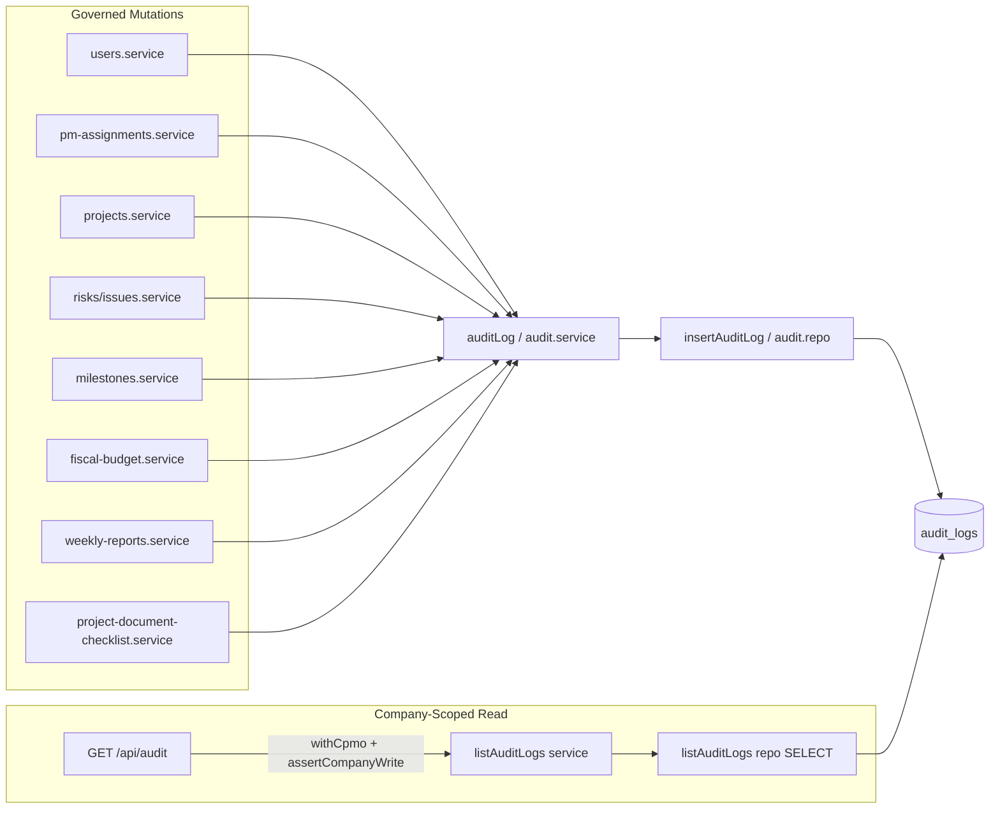

# Phase 18: Append-Only Audit Log - Research

**Researched:** 2026-08-26
**Domain:** Append-only audit trail, company-scoped read API, service-layer coverage gaps
**Confidence:** HIGH

## Summary

Phase 18 completes **AUDIT-01** by closing incremental `auditLog` coverage gaps against locked entity types (D-02), proving immutability of `audit_logs` rows (D-04/D-07), and adding **GET `/api/audit`** with CPMO + `assertCompanyWrite` scoping (D-05/D-06). The infrastructure already exists: table `audit_logs`, `auditLog()` → `insertAuditLog()` INSERT-only path, and `company_id` on every row [VERIFIED: lib/db-roles.ts:53-63] [VERIFIED: lib/repositories/audit.repo.ts:13-25].

Production codebase has **~32 `auditLog` call sites** across 16 service files (CONTEXT cited ~48 — likely included test mocks/expectations). **No GET `/api/audit` route exists** [VERIFIED: grep `/api/audit` — zero matches]. **`audit.repo.ts` exports INSERT only** — no SELECT, UPDATE, or DELETE helpers [VERIFIED: lib/repositories/audit.repo.ts:1-26].

**Primary recommendation:** Add `listAuditLogs` SELECT to `audit.repo.ts`, thin GET route + service, static immutability guard test on repo source, integration-style tests for company isolation and row persistence after second mutation — then fill the documented D-02 gaps in `milestones`, `risks`/`issues`, and `projects` services without introducing a second audit table or new npm packages.

## Architectural Responsibility Map

| Capability | Primary Tier | Secondary Tier | Rationale |
|------------|-------------|----------------|-----------|
| Append audit on governed mutation | API / Backend (service) | Database (`audit_logs`) | D-01/D-03: fire after successful write in service layer |
| Immutability enforcement | Database + repo contract | Service (`auditLog` INSERT-only) | No UPDATE/DELETE repo helpers; DB has no edit API |
| Company-scoped audit read | API / Backend (route + service) | Database (SELECT filtered by `company_id`) | D-05/D-06: CPMO-only GET; tenant filter in SQL |
| Cross-company denial | API / Backend (`withCpmo` + `assertCompanyWrite`) | — | Null-company seed admin 403; foreign company empty/403 |
| Coverage gap inventory | Service layer audit | — | D-02 entity types mapped to existing mutators |

<user_constraints>
## User Constraints (from CONTEXT.md)

### Locked Decisions

- **D-01:** Keep the existing `audit_logs` (or current table name) + `auditLog()` INSERT path. Do not invent a second audit table. — **Reversibility:** costly.
- **D-02:** Required entity_type coverage (must fire on mutators): `user`, `pm_assignment`, `project`, `raid` (risks+issues), `milestone`, `budget_adjustment` (already Phase 15), `weekly_report` (submit/correct), `document_checklist`. Planner inventories existing calls and fills gaps only.
- **D-03:** Payload must include actor id, timestamp, entity_type, entity_id, action, `before` and/or `after` JSON. Missing before on create is OK; missing after on soft-end is OK.
- **D-04:** Immutability: `audit.repo.ts` exports INSERT (and SELECT) only — no UPDATE/DELETE functions. Add a unit test that the module source does not contain `UPDATE audit` / `DELETE FROM audit`. Do not add PATCH/DELETE HTTP on `/api/audit`.
- **D-05:** `company_id` on each row (stamp from actor.company_id at insert; if column missing, add via settings-flag migrate). GET lists `WHERE company_id = actor.company_id`. Foreign-company actor never sees rows. Null-company CPMO/admin 403 via `assertCompanyWrite`.
- **D-06:** GET `/api/audit` withCpmo + optional filters entity_type, entity_id, from/to dates. Viewer/PM 403. Pagination: limit default 50 max 200.
- **D-07:** After a second mutation on the same entity, both audit rows remain; first row's actor/time/payload unchanged (repo+service test).
- **D-08:** `workflow.ui_phase` false. Server tests are the gate.
- **D-09:** No CASL. Do not re-gate D-23 leftover. Do not require audit on leftover ops/admin/config.
- **D-10:** Settings-flag only if a new column (`company_id`) or index is needed; wire after `migrateDocuments`.

### Claude's Discretion

- Exact table name (use existing). Whether to backfill `company_id` on old rows from actor snapshot JSON or leave NULL (NULLs hidden from company GET — OK).
- Whether RAID is one entity_type `raid` with subtype in payload vs `risk`/`issue`.

### Deferred Ideas (OUT OF SCOPE)

None in-milestone after this phase. Lifecycle: audit-milestone → complete-milestone → cleanup.
</user_constraints>

<phase_requirements>
## Phase Requirements

| ID | Description | Research Support |
|----|-------------|------------------|
| AUDIT-01 | Mutations to users, assignments, project master, RAID, milestones, budget adjustments, weekly submissions, and document checklist status append an audit record (actor, time, entity, before/after) that cannot be edited in place | Gap inventory below; existing INSERT path; immutability tests; no UPDATE/DELETE helpers |
| AUDIT-01 (read) | Audit history company-scoped — another company cannot read records | GET `/api/audit` + `WHERE company_id = actor.company_id`; cross-company route tests |
| AUDIT-01 (immutability) | After later business edit, original actor/time/payload still visible unchanged | D-07 repo/service test; append-only repo contract |
</phase_requirements>

## D-02 Coverage Inventory

> Entity types in code are quoted verbatim from `auditLog` call sites [VERIFIED: service files this session].

| D-02 entity | Service file(s) | entity_type values in code | Mutations with audit | Gaps (no audit today) |
|-------------|-----------------|---------------------------|----------------------|------------------------|
| **user** | `lib/services/users.service.ts` | `'user'` | create, update, lock, unlock, deactivate (5 calls) | None |
| **pm_assignment** | `lib/services/pm-assignments.service.ts` | `'pm_assignment'` | create, end (2 calls) | None |
| **project** | `lib/services/projects.service.ts` | `'project'` | update: `code_change`, `stage_change_ack` only | `createProject` — no audit; `deleteProject` — no audit; general `updateProject` field changes (name, status, rag, program, etc.) — no audit unless code or ack stage change |
| **raid** (risks+issues) | `lib/services/risks.service.ts`, `lib/services/issues.service.ts` | `'risk'`, `'issue'` (not `'raid'`) | `due_date_change`, `deactivate` | `createRisk`/`createIssue` — no audit; `updateRisk`/`updateIssue` for non-due_date fields — no audit |
| **milestone** | `lib/services/milestones.service.ts` | `'milestone'` | `cancel` only | `createMilestone`, `updateMilestone` — no audit |
| **budget_adjustment** | `lib/services/fiscal-budget.service.ts` | `'budget_adjustment'` | `create` on `addBudgetAdjustment` | None for D-02 scope |
| **weekly_report** | `lib/services/weekly-reports.service.ts` | `'weekly_report'` | `weekly_submit`, `weekly_correct` on `submitWeeklyReport` | `openWeeklyReportCorrection` — no audit (opens overlay only; submit path already audited) |
| **document_checklist** | `lib/services/project-document-checklist.service.ts` | `'document_checklist'` | `status_change` when status or confluence_url changes | PATCH changing only `approved_at`, `approved_by`, `na_reason`, or `notes` without status/url — no audit |

**Out of D-02 scope (already audited, do not remove):** `document_catalog`, `document_template`, `fiscal_budget`, `weekly_period`, `project_stakeholder`, `project_dependency`, `financial_benefit`, `nonfinancial_benefit`, `dashboard` — incremental from Phases 13–17; D-09 excludes ops/admin leftovers.

**RAID naming (discretion):** Code uses separate `'risk'` / `'issue'` entity types. Recommend **keep existing names** for filter compatibility; document in plan that D-02 "raid" = union of `risk` + `issue` filters on GET.

## Existing Schema & Repo Contract

### Table DDL [VERIFIED: lib/db-roles.ts:53-63]

```sql
CREATE TABLE IF NOT EXISTS audit_logs (
  id BIGSERIAL PRIMARY KEY,
  company_id INTEGER REFERENCES companies(id),
  actor_id INTEGER REFERENCES users(id),
  entity_type TEXT,
  entity_id TEXT,
  action TEXT,
  before JSONB,
  after JSONB,
  created_at TIMESTAMPTZ DEFAULT now()
)
```

Test harness mirror: [VERIFIED: test/repo-db.ts:140-150] — same columns.

### Insert path [VERIFIED: lib/repositories/audit.repo.ts:3-25]

```typescript
export type AuditLogInput = {
  actor_id: number;
  company_id: number | null;
  entity_type: string;
  entity_id: string;
  action: string;
  before: unknown;
  after: unknown;
};

export async function insertAuditLog(input: AuditLogInput): Promise<void> {
  // INSERT INTO audit_logs (...) VALUES (...)
}
```

### Service wrapper [VERIFIED: lib/services/audit.service.ts:5-8]

```typescript
/** Append-only audit log INSERT (D-08). No update or delete helpers. */
export async function auditLog(input: AuditLogInput): Promise<void> {
  await insertAuditLog(input);
}
```

**UPDATE/DELETE helpers:** None in `audit.repo.ts` [VERIFIED: lib/repositories/audit.repo.ts — only `insertAuditLog` exported].

**SELECT helpers:** None yet — Phase 18 adds read path per D-04/D-06.

**GET `/api/audit`:** Does not exist [VERIFIED: no `app/api/audit/` directory; grep zero matches for `/api/audit`].

**`company_id` column:** Present in DDL and INSERT — **no migration needed** unless planner adds index (D-10 discretion: optional `CREATE INDEX ... ON audit_logs (company_id, created_at DESC)` via settings flag after `migrateDocuments`).

## Standard Stack

### Core

| Library | Version | Purpose | Why Standard |
|---------|---------|---------|--------------|
| Existing `pg` pool via `getDb()` | ^8.20.0 [VERIFIED: package.json] | INSERT + new SELECT | Already used by `insertAuditLog` |
| Vitest | 4.1.10 [VERIFIED: package.json] | Unit + route tests | Project test gate (D-08) |
| `withCpmo` / `assertCompanyWrite` | in-repo | GET auth | Same pattern as `app/api/admin/users/route.ts`, `app/api/weekly-periods/route.ts` |

### Supporting

| Library | Version | Purpose | When to Use |
|---------|---------|---------|-------------|
| Zod | ^4.4.3 | Query param validation for GET filters | Optional on route; match existing route schemas |

### Alternatives Considered

| Instead of | Could Use | Tradeoff |
|------------|-----------|----------|
| Service-layer `auditLog` | DB triggers | D-01 locks service path; triggers harder to test and bypass audit on direct SQL |
| Separate audit read service file | Extend `audit.service.ts` | Either OK — keep repo thin |

**Installation:** None — no new npm packages (D-09).

## Package Legitimacy Audit

> N/A — this phase installs no external packages.

## Architecture Patterns

### System Architecture Diagram



### Recommended Project Structure

```
lib/
├── repositories/audit.repo.ts      # add listAuditLogs SELECT; keep INSERT only
├── services/audit.service.ts       # auditLog (existing) + listAuditLogs (new)
app/
└── api/audit/route.ts              # GET only; no PATCH/DELETE
lib/services/*.service.ts           # gap-fill auditLog calls only where inventory shows gaps
```

### Pattern 1: Gap-fill audit after successful write

**What:** Load `before` snapshot, mutate, `auditLog({ actor_id, company_id, entity_type, entity_id, action, before, after })`.

**When to use:** Every D-02 mutator missing from inventory table.

**Example:**

```typescript
// Pattern from lib/services/pm-assignments.service.ts:113-121
await auditLog({
  actor_id: actor.user_id,
  company_id: actor.company_id,
  entity_type: 'pm_assignment',
  entity_id: String(created.id),
  action: 'create',
  before: null,
  after: auditSnapshot(created),
});
```

### Pattern 2: Company-scoped GET

**What:** `withCpmo` handler → `assertCompanyWrite(actor)` → repo `WHERE company_id = $1` + optional filters + `LIMIT`.

**When to use:** D-06 read API.

**Example route shape (mirror admin/users):**

```typescript
export const GET = withCpmo(async (req, { actor }) => {
  assertCompanyWrite(actor);
  const { searchParams } = new URL(req.url);
  const rows = await listAuditLogs(actor, {
    entity_type: searchParams.get('entity_type') ?? undefined,
    entity_id: searchParams.get('entity_id') ?? undefined,
    from: searchParams.get('from') ?? undefined,
    to: searchParams.get('to') ?? undefined,
    limit: parseLimit(searchParams.get('limit')),
  });
  return NextResponse.json(rows);
});
```

### Anti-Patterns to Avoid

- **Second audit table:** Violates D-01.
- **UPDATE audit_logs from app code:** Violates D-04; no repo helpers.
- **PM/Viewer GET access:** D-06 requires 403.
- **Auditing D-23 ops/admin leftovers:** Explicitly out (D-09).

## Don't Hand-Roll

| Problem | Don't Build | Use Instead | Why |
|---------|-------------|-------------|-----|
| Append-only persistence | Custom event store | Existing `audit_logs` + INSERT | Schema and callers already exist |
| Auth on read | CASL policies | `withCpmo` + `assertCompanyWrite` | D-09; matches Phase 10–17 routes |
| Diff engine for before/after | JSON diff library | Hand-built snapshots in services | D-03 allows partial before/after; existing pattern |
| Immutability via triggers only | PG rules without repo guard | Repo contract + static source test | Testable in Vitest without DB trigger setup |

**Key insight:** Phase 18 is a **coverage + read + proof** capstone, not a new audit framework.

## Common Pitfalls

### Pitfall 1: Auditing only "interesting" field changes on project/RAID

**What goes wrong:** General `updateProject` / `updateRisk` mutations skip audit while code/stage/due_date paths are covered.

**Why it happens:** Incremental phases added audit for high-risk fields only.

**How to avoid:** Map each D-02 mutator function; add audit on create + update + soft-end/cancel.

**Warning signs:** Service unit tests mock `auditLog` zero times on update paths.

### Pitfall 2: Cross-company leak via missing company_id filter

**What goes wrong:** GET returns other tenants' rows when `company_id` filter omitted.

**How to avoid:** Required `WHERE company_id = $actorCompanyId` in repo; route test with two companies.

### Pitfall 3: Accidental mutating API on audit rows

**What goes wrong:** Future PATCH `/api/audit` breaks immutability story.

**How to avoid:** GET-only route; static test scanning `audit.repo.ts` for UPDATE/DELETE SQL.

### Pitfall 4: NULL company_id rows visible to wrong actor

**What goes wrong:** Legacy rows with NULL `company_id` appear in GET.

**How to avoid:** Filter `company_id IS NOT DISTINCT FROM $1` or `= $1` only; NULL rows excluded from company GET (D-05 discretion OK).

## Code Examples

### INSERT (existing — do not change contract)

```typescript
// lib/repositories/audit.repo.ts:13-25
await db.run(
  `INSERT INTO audit_logs (actor_id, company_id, entity_type, entity_id, action, before, after)
   VALUES (?, ?, ?, ?, ?, ?::jsonb, ?::jsonb)`,
  input.actor_id,
  input.company_id,
  input.entity_type,
  input.entity_id,
  input.action,
  input.before === null ? null : JSON.stringify(input.before),
  input.after === null ? null : JSON.stringify(input.after),
);
```

### Immutability source guard (new test pattern)

```typescript
import { readFileSync } from 'node:fs';
import { describe, expect, it } from 'vitest';

describe('audit.repo immutability contract', () => {
  it('exports no UPDATE/DELETE on audit_logs (D-04)', () => {
    const src = readFileSync('lib/repositories/audit.repo.ts', 'utf8');
    expect(src).not.toMatch(/UPDATE\s+audit_logs/i);
    expect(src).not.toMatch(/DELETE\s+FROM\s+audit_logs/i);
  });
});
```

## State of the Art

| Old Approach | Current Approach | When Changed | Impact |
|--------------|------------------|--------------|--------|
| No audit | Incremental `auditLog` per phase | Phases 10–17 | 32 production call sites |
| No read API | GET `/api/audit` (this phase) | Phase 18 | CPMO compliance review |
| Partial RAID/milestone coverage | Full mutator coverage | Phase 18 gaps | AUDIT-01 complete |

**Deprecated/outdated:** None — extend existing path only.

## Assumptions Log

| # | Claim | Section | Risk if Wrong |
|---|-------|---------|---------------|
| A1 | Keep `'risk'`/`issue'` instead of unified `'raid'` entity_type | D-02 inventory | GET filters need two entity_type values or alias |
| A2 | `openWeeklyReportCorrection` need not audit separately | weekly_report gaps | User may want correction-open event — submit already audited |
| A3 | General `updateProject` should audit as single `update` action | project gaps | Over-audit vs under-audit tradeoff |
| A4 | Optional index on `(company_id, created_at)` sufficient for GET perf | Schema | Slow lists at scale without index |

## Open Questions (RESOLVED)

1. **Project master audit granularity** — RESOLVED: Single `update` action with full before/after snapshots (matches `users.service`). Keep specialized `code_change` and `stage_change_ack`. Locked in 18-03-PLAN.md.

2. **Document checklist partial patches** — RESOLVED: Audit any PATCH that changes `status`, `confluence_url`, `approved_at`, `approved_by`, `na_reason`, or `notes`. Action stays `status_change` when status or confluence_url differs; otherwise `update`. Locked in 18-03-PLAN.md.

## Environment Availability

Step 2.6: SKIPPED for external tools — phase uses existing Node/pg/Vitest stack only.

| Dependency | Required By | Available | Version | Fallback |
|------------|------------|-----------|---------|----------|
| Node.js | Vitest, Next.js | ✓ | (host) | — |
| PostgreSQL | audit_logs INSERT/SELECT tests | ✓ | (project DB) | repo unit tests with mocks for pure logic |
| Vitest | D-08 gate | ✓ | 4.1.10 | — |

## Validation Architecture

### Test Framework

| Property | Value |
|----------|-------|
| Framework | Vitest 4.1.10 |
| Config file | `vitest.config.ts` |
| Quick run command | `npx vitest run lib/repositories/audit.repo.test.ts lib/services/audit.service.unit.test.ts app/api/audit/route.test.ts` |
| Full suite command | `npm test` |

### Phase Requirements → Test Map

| Req ID | Behavior | Test Type | Automated Command | File Exists? |
|--------|----------|-----------|-------------------|-------------|
| AUDIT-01 | user mutations audit | unit | `npx vitest run lib/services/users.service.unit.test.ts` | ✅ |
| AUDIT-01 | pm_assignment create/end audit | unit | `npx vitest run lib/services/pm-assignments.service.unit.test.ts` | ✅ |
| AUDIT-01 | project gaps filled | unit | `npx vitest run lib/services/projects.service.unit.test.ts` | ✅ extend |
| AUDIT-01 | risk/issue create+update audit | unit | `npx vitest run lib/services/risks.service.unit.test.ts lib/services/issues.service.unit.test.ts` | ✅ extend |
| AUDIT-01 | milestone create/update audit | unit | `npx vitest run lib/services/milestones.service.unit.test.ts` | ✅ extend |
| AUDIT-01 | budget_adjustment audit | unit | `npx vitest run lib/services/fiscal-budget.service.unit.test.ts` | ✅ |
| AUDIT-01 | weekly submit/correct audit | unit | `npx vitest run lib/services/weekly-reports.service.unit.test.ts` | ✅ |
| AUDIT-01 | document_checklist audit | unit | `npx vitest run lib/services/project-document-checklist.service.unit.test.ts` | ✅ extend |
| AUDIT-01 | immutability — no UPDATE/DELETE in repo | unit | `npx vitest run lib/repositories/audit.repo.test.ts` | ❌ Wave 0 |
| AUDIT-01 | two mutations preserve first row | unit/repo | `npx vitest run lib/repositories/audit.repo.test.ts` | ❌ Wave 0 |
| AUDIT-01 | GET company-scoped | route | `npx vitest run app/api/audit/route.test.ts` | ❌ Wave 0 |
| AUDIT-01 | cross-company GET 403/empty | route | `npx vitest run app/api/audit/route.test.ts` | ❌ Wave 0 |
| AUDIT-01 | PM/Viewer GET 403 | route | `npx vitest run app/api/audit/route.test.ts` | ❌ Wave 0 |
| AUDIT-01 | null-company CPMO GET 403 | route | `npx vitest run app/api/audit/route.test.ts` | ❌ Wave 0 |

### Sampling Rate

- **Per task commit:** task-specific vitest file(s) from plan `<verify>`
- **Per wave merge:** `npx vitest run lib/repositories/audit.repo.test.ts lib/services/audit.service.unit.test.ts app/api/audit/route.test.ts` + touched service unit tests
- **Phase gate:** `npm test` green before `/gsd-verify-work`

### Wave 0 Gaps

- [ ] `lib/repositories/audit.repo.ts` — add `listAuditLogs`; keep INSERT-only exports
- [ ] `lib/repositories/audit.repo.test.ts` — immutability source scan + SELECT filter tests
- [ ] `lib/services/audit.service.ts` — add `listAuditLogs` wrapper
- [ ] `app/api/audit/route.ts` + `route.test.ts` — GET only, auth matrix, pagination
- [ ] Gap-fill tests in `projects`, `risks`, `issues`, `milestones`, `project-document-checklist` service unit tests

## Security Domain

### Applicable ASVS Categories

| ASVS Category | Applies | Standard Control |
|---------------|---------|-----------------|
| V2 Authentication | yes | `withCpmo` session via `withAuth` |
| V3 Session Management | no | Read-only audit list |
| V4 Access Control | yes | `assertCompanyWrite`; PM/Viewer 403; SQL tenant filter |
| V5 Input Validation | yes | Limit cap 200; parse dates for from/to filters |
| V6 Cryptography | no | No secrets in audit payload |

### Known Threat Patterns

| Pattern | STRIDE | Standard Mitigation |
|---------|--------|---------------------|
| Cross-tenant audit read (IDOR) | Information disclosure | `WHERE company_id = actor.company_id` + route tests |
| Audit tampering | Tampering | No UPDATE/DELETE repo helpers; append-only INSERT |
| Over-broad list (DoS) | Denial of service | LIMIT default 50 max 200 |
| PII in before/after JSON | Information disclosure | Reuse existing snapshot minimization pattern from users/pm-assignments |

## Sources

### Primary (HIGH confidence)

- `lib/db-roles.ts:53-63` — audit_logs DDL
- `lib/repositories/audit.repo.ts` — INSERT contract, AuditLogInput
- `lib/services/audit.service.ts` — auditLog wrapper
- `18-CONTEXT.md` — D-01..D-10 locked decisions
- `.planning/REQUIREMENTS.md` — AUDIT-01

### Secondary (MEDIUM confidence)

- Phase 10–17 incremental audit notes in prior CONTEXT/RESEARCH files
- `app/api/admin/users/route.ts` — withCpmo GET list pattern

## Metadata

**Confidence breakdown:**
- Standard stack: HIGH — no new packages; existing pg/Vitest/withCpmo
- Architecture: HIGH — schema and INSERT path verified in source
- Pitfalls/gaps: HIGH — per-service grep and file read this session

**Research date:** 2026-08-26
**Valid until:** 2026-09-26
