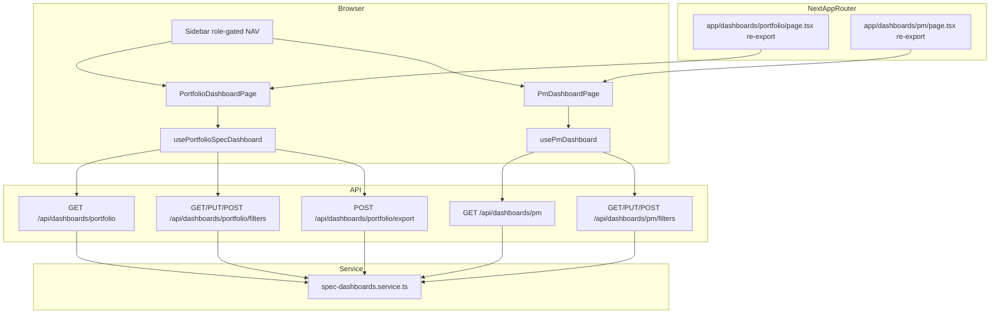

# Phase 21: Portfolio & PM Dashboard Pages - Research

**Researched:** 2026-08-28
**Domain:** Next.js 16 client UI consuming Phase 16 spec dashboard APIs
**Confidence:** HIGH

## Summary

Phase 21 is the first v2.1 **UI consumer** phase: React pages that wire CPMO and assigned PMs to the already-shipped `/api/dashboards/portfolio` and `/api/dashboards/pm` APIs (Phase 16). No backend rewrites, no new npm packages, no fiscal KPI tiles (NIT-04 locked). Implementation lands under `modules/dashboards/ui/` with thin `'use client'` re-exports at `app/dashboards/portfolio/page.tsx` and `app/dashboards/pm/page.tsx` (D-01).

The API contract is stable and fully tested at the route/service layer. UI work is fetch-driven client pages matching existing patterns (`Sidebar` + `main`, shadcn `Card`/`Button`/`Table`, `sonner` toasts, mocked `fetch` in Vitest jsdom). **`recharts` is already installed** (`^3.8.1` in `package.json`) and used on v1 portfolio and project budget pages — use it for `charts.by_stage` / `charts.by_rag` bar charts rather than adding a chart library or hand-rolling complex visuals (Claude's discretion, aligned with in-repo precedent).

Critical planner note: **`modules/` is not in `vitest.config.ts` include globs today.** Component tests for module pages require a Wave 0 config extension or tests will never run in CI.

**Primary recommendation:** Build two thin module page trees with dedicated hooks (`usePortfolioSpecDashboard`, `usePmDashboard`) that mirror the Phase 16 GET/filter/export/PM-queue JSON shapes verbatim; extend Vitest jsdom includes for `modules/**`; add role-gated Sidebar links; record NIT-04 omission in UI-SPEC and a portfolio-page comment.

<user_constraints>
## User Constraints (from CONTEXT.md)

### Locked Decisions

#### Routes and module layout
- **D-01:** Implement page trees under `modules/dashboards/ui/` (portfolio + PM). Thin App Router re-exports at `app/dashboards/portfolio/page.tsx` and `app/dashboards/pm/page.tsx` (`'use client'` re-export of the module page). Do not wait for Phase 24 to move existing API/service files.
- **D-02:** URLs are `/dashboards/portfolio` and `/dashboards/pm`. Do **not** reuse `/dashboard` (existing per-project dashboard) or overwrite `/`.
- **D-03:** Add Sidebar NAV links: "Spec dashboard" → `/dashboards/portfolio` (visible when `roles` includes `cpmo`); "My dashboard" → `/dashboards/pm` (visible when `roles` includes `pm` or `cpmo`). Keep v1 Portfolio `/` and Project Dashboard `/dashboard` as they are.
- **D-04:** Consume existing APIs only. No new dashboard endpoints. No changes to `computePortfolioKpis` / `getPortfolioDashboard` / `getPmDashboard` except if a UI-only type export is needed.

#### Portfolio page (PDSH-07)
- **D-05:** One GET `/api/dashboards/portfolio` loads `filters`, `kpis`, `charts`, `list`, `drilldowns`. Render KPI tiles (active, on-track, watch/act, overdue-milestone project count, High open RAID, technology-council), stage + RAG charts, filtered project list, and drill-down tables from that payload.
- **D-06:** Filter chrome binds to the existing AND keys (`portfolio_year`, `program`, `unit`, `pm_user_id`, `stage`, `status`, `rag`, `type`, `weekly_report_enabled`). Persist via existing GET/PUT/POST `/api/dashboards/portfolio/filters` (clear/defaults). Changing filters refetches the dashboard GET.
- **D-07:** Tile click opens the matching `drilldowns` list (overdue_milestones, high_raid, technology_council). List rows deep-link to existing project/milestone/RAID screens when an id is present.
- **D-08:** Export buttons call existing POST `/api/dashboards/portfolio/export` with `format: 'xlsx' | 'pdf'` and download the blob. Do not add a client-side Excel/PDF library.
- **D-09:** Portfolio page is CPMO-only. Non-CPMO 403 from the API → show existing forbidden/empty pattern (do not invent a second authz layer). Viewer never sees the NAV link.

#### PM page (MDSH-06)
- **D-10:** GET `/api/dashboards/pm` loads assigned projects plus `actions.weekly|milestones|raid` (or the shipped JSON shape). Render three queues; each row uses the server-provided `href` (weekly report, `/projects/:id/milestones`, RAID). Do not invent new mutator pages.
- **D-11:** Completing an action is the existing destination page. Returning to the dashboard refetches GET (live, no cache) so resolved rows drop (MDSH-05 already on the API).
- **D-12:** CPMO visiting `/dashboards/pm` still sees only their own assignment window (API D-09). Viewer 403.
- **D-13:** PM filters use existing `/api/dashboards/pm/filters` with the same AND keys as portfolio, scoped to assigned projects.

#### NIT-04 fiscal KPIs
- **D-14:** **Omit** fiscal budget / ROI / benefit KPIs from the spec portfolio dashboard. Phase 16 D-14 already excluded `computeFiscalBudgetMetrics` from spec tiles. Record this in UI-SPEC and a short comment in the portfolio page module: fiscal numbers live on `/portfolio/budget`, not on spec KPIs.
- **D-15:** Do not add fiscal fields to `PortfolioKpis`. Do not embed `/api/portfolio/budgets` on this page.

#### Auth, chrome, testing
- **D-16:** Reuse `Sidebar`, shadcn `Card`/`Button`/`Badge`/`Table` (or existing table markup), `sonner` toasts. Match current density (compact, Vietnamese+English labels as neighboring pages do).
- **D-17:** `workflow.ui_phase` is true — UI-SPEC is a planning gate. Automated tests: hook/component tests with mocked `fetch` for 200/401/403, filter persist, export POST, and fiscal-KPI omission (no budget numbers in the spec KPI row).

### Claude's Discretion
- Chart library: prefer existing in-repo chart usage; if none, CSS/simple bars from `charts.by_stage` / `charts.by_rag` counts — do not `npm install` a chart package.
- Exact file split inside `modules/dashboards/ui/` (hooks vs components).
- Empty/loading/error copy.
- Whether NAV labels are Vietnamese, English, or bilingual — match Sidebar neighbors (`Portfolio` is English today).

### Deferred Ideas (OUT OF SCOPE)
- Repo-wide `modules/<feature>/{backend,ui}` for other areas — Phase 24
- Weekly period / report UI — Phase 22
- Document checklist and audit viewer — Phase 23
- Grid virtualization — PERF-01 / Phase 22
</user_constraints>

<phase_requirements>
## Phase Requirements

| ID | Description | Research Support |
|----|-------------|------------------|
| PDSH-07 | CPMO can open a portfolio dashboard page with spec KPIs, AND filters, drill-downs, and export | GET `/api/dashboards/portfolio` payload verified in `spec-dashboards.service.ts`; filter/export routes shipped; UI hook + page pattern documented below |
| MDSH-06 | Assigned PM can open a PM dashboard page with weekly, milestone, and RAID action queues and deep links | GET `/api/dashboards/pm` returns `actions.weekly\|milestones\|raid` with `href` strings; PM filter routes mirror portfolio |
| NIT-04 | Fiscal KPIs omitted from spec portfolio dashboard with decision recorded | `PortfolioKpis` has no fiscal fields [VERIFIED: lib/dashboards/kpi.ts:10-17]; D-14 locks omission + UI-SPEC note |
</phase_requirements>

## Project Constraints (from CLAUDE.md)

- **Stack:** Next.js 16.2.4, React 19.2.4, TypeScript strict, PostgreSQL — no framework swap [VERIFIED: package.json:25-30]
- **Layers:** Route → service → repository; tenant isolation mandatory on APIs (already enforced on dashboard routes)
- **Testing:** Vitest 4 is the gate; capabilities need tests before done [VERIFIED: package.json:52, vitest.config.ts]
- **Import convention:** `@/` alias maps to repo root [VERIFIED: vitest.config.ts:4]
- **Deployment:** Preserve `output: 'standalone'` and `serverExternalPackages` for exceljs/pptxgenjs
- **No CASL / second policy engine** — three fixed roles via existing wrappers
- **Module layout (v2.1):** New v2 UI lands in `modules/<feature>/ui/` first; Phase 24 completes repo-wide split

## Architectural Responsibility Map

| Capability | Primary Tier | Secondary Tier | Rationale |
|------------|-------------|----------------|-----------|
| Spec KPI computation & drill-down filtering | API / Backend | — | Already in `getPortfolioDashboard`; UI only renders |
| Filter persistence (user+surface) | API / Backend | Browser (form state) | `dashboard_filter_state` table; PUT/POST filters routes |
| Portfolio xlsx/pdf export generation | API / Backend | Browser (blob download) | `exportPortfolioDashboard` + exceljs/jspdf server-side |
| PM action queue assembly & href strings | API / Backend | — | `getPmDashboard` scopes to assignment window |
| KPI tiles, charts, lists, drill-down panels | Browser / Client | — | Interactive UI; no SSR requirement this phase (PERF-02 deferred) |
| Role-gated navigation links | Browser / Client | — | Hide links by `roles`; authz truth remains API 403 |
| Sidebar chrome | Browser / Client | — | Existing client component |
| Authorization enforcement | API / Backend | — | `withCpmo` / `withAuth` + service asserts; UI must not duplicate policy |

## Standard Stack

### Core (already installed — no new packages)

| Library | Version | Purpose | Why Standard |
|---------|---------|---------|--------------|
| next | 16.2.4 | App Router pages + API proxy | Project stack [VERIFIED: package.json:25] |
| react / react-dom | 19.2.4 | Client pages | Project stack [VERIFIED: package.json:29-30] |
| recharts | ^3.8.1 (lock); npm latest 3.10.1 | Stage/RAG bar charts | Already used in `app/_components/AnalyticsMiddleRow.tsx`, `app/projects/[id]/budget/page.tsx` |
| sonner | ^2.0.7 | Error/success toasts | Used across app pages |
| lucide-react | ^1.14.0 | Sidebar + page icons | Sidebar convention |
| shadcn / @base-ui/react | ^1.4.1 | Card, Button, Badge, Table, Dialog | `components/ui/*` |
| vitest + @testing-library/react | 4.1.10 / 16.3.2 | Component/hook tests | Existing jsdom project |
| zod | ^4.4.3 | Filter/export body validation (API) | Already on filter/export routes |

### Supporting

| Library | Version | Purpose | When to Use |
|---------|---------|---------|-------------|
| exceljs | ^4.4.0 | Server xlsx export | API only — UI POSTs and downloads blob |
| jspdf | ^2.5.1 | Server pdf export | API only — UI must not import |

### Alternatives Considered

| Instead of | Could Use | Tradeoff |
|------------|-----------|----------|
| recharts | CSS progress bars | Valid per discretion if charts stay minimal; recharts is already in repo and matches budget page |
| Module hooks | Reuse `app/usePortfolioDashboard.ts` | **Forbidden** — hits v1 `/api/portfolio`, wrong KPI semantics (D-04) |
| Client-side xlsx/pdf | POST export + blob | **Forbidden** — D-08 requires server export |

**Installation:** None — phase installs zero new packages (D-01, D-17).

## Package Legitimacy Audit

> Phase constraint: **no new npm packages.** Existing dependencies only.

| Package | Registry | Verdict | Disposition |
|---------|----------|---------|-------------|
| *(none to install)* | — | — | N/A |

**Packages removed due to [SLOP] verdict:** none
**Packages flagged as suspicious [SUS]:** none

## Architecture Patterns

### System Architecture Diagram



### Recommended Project Structure

```
modules/dashboards/ui/
├── portfolio/
│   ├── PortfolioDashboardPage.tsx      # page shell: Sidebar + layout
│   ├── usePortfolioSpecDashboard.ts    # fetch GET, filters PUT, export POST
│   ├── PortfolioKpiTiles.tsx           # 6 KPI tiles + drill-down selection
│   ├── PortfolioFiltersBar.tsx         # AND filter controls
│   ├── PortfolioCharts.tsx             # by_stage / by_rag (recharts)
│   ├── PortfolioProjectTable.tsx       # filtered list
│   ├── PortfolioDrilldownTable.tsx     # overdue_milestones | high_raid | technology_council
│   └── portfolio.fixture.ts            # test payload
├── pm/
│   ├── PmDashboardPage.tsx
│   ├── usePmDashboard.ts
│   ├── PmActionQueues.tsx              # weekly | milestones | raid tabs/sections
│   └── pm.fixture.ts
└── shared/
    ├── downloadBlob.ts                 # blob → anchor click (from app/projects/[id]/page.tsx pattern)
    └── types.ts                        # re-export JSON shapes from service types if needed

app/dashboards/portfolio/page.tsx       # 'use client'; export { default } from '@/modules/...'
app/dashboards/pm/page.tsx              # thin re-export

components/layout/Sidebar.tsx           # add Spec dashboard + My dashboard links (D-03)
```

### Pattern 1: Thin App Router re-export

**What:** Module owns the page; `app/` only satisfies Next.js routing.
**When to use:** All new v2 UI until Phase 24 repo-wide split (D-01).

```typescript
'use client';
export { default } from '@/modules/dashboards/ui/portfolio/PortfolioDashboardPage';
```

### Pattern 2: Client fetch hook (portfolio)

**What:** One hook owns dashboard GET, filter persist, export download, refetch on focus return.
**When to use:** Portfolio and PM pages (D-06, D-11).

```typescript
// Source: analog app/portfolio/report/page.component.test.tsx + app/projects/[id]/page.tsx exportExcel
export function usePortfolioSpecDashboard() {
  const [data, setData] = useState<PortfolioPayload | null>(null);
  const [loading, setLoading] = useState(true);
  const [error, setError] = useState<string | null>(null);

  const load = useCallback(async () => {
    const res = await fetch('/api/dashboards/portfolio');
    if (res.status === 401) { window.location.href = '/login'; return; }
    if (res.status === 403) { setError('forbidden'); setData(null); return; }
    if (!res.ok) { setError('load_failed'); return; }
    setData(await res.json());
    setError(null);
  }, []);

  const saveFilters = async (filters: Record<string, unknown>) => {
    await fetch('/api/dashboards/portfolio/filters', {
      method: 'PUT',
      headers: { 'Content-Type': 'application/json' },
      body: JSON.stringify(filters),
    });
    await load();
  };

  const exportDashboard = async (format: 'xlsx' | 'pdf') => {
    const res = await fetch('/api/dashboards/portfolio/export', {
      method: 'POST',
      headers: { 'Content-Type': 'application/json' },
      body: JSON.stringify({ format }),
    });
    if (!res.ok) throw new Error('Export failed');
    const blob = await res.blob();
    // downloadBlob(blob, format === 'xlsx' ? 'portfolio-dashboard.xlsx' : 'portfolio-dashboard.pdf')
  };

  useEffect(() => { load().finally(() => setLoading(false)); }, [load]);
  return { data, loading, error, load, saveFilters, exportDashboard };
}
```

### Pattern 3: Verified API JSON shapes

**Portfolio GET response** [VERIFIED: lib/services/spec-dashboards.service.ts:100-109]:

```typescript
{
  filters: DashboardFilters,
  kpis: PortfolioKpis,  // see kpi.ts quote below
  charts: PortfolioCharts,
  list: PortfolioDashboardListRow[],
  drilldowns: {
    overdue_milestones: /* Phase 12 rows */,
    high_raid: /* records */,
    technology_council: /* rows */,
  },
}
```

**PortfolioKpis fields** [VERIFIED: lib/dashboards/kpi.ts:10-17]:

```typescript
export type PortfolioKpis = {
  active_count: number;
  on_track_count: number;
  watch_act_count: number;
  overdue_milestone_project_count: number;
  high_open_raid_count: number;
  technology_council_count: number;
};
```

**Filter keys** [VERIFIED: lib/dashboards/filters.ts:4-14]:

```typescript
export const DASHBOARD_FILTER_KEYS = [
  'portfolio_year',
  'program',
  'unit',
  'pm_user_id',
  'stage',
  'status',
  'rag',
  'type',
  'weekly_report_enabled',
] as const;
```

**PM GET response** [VERIFIED: lib/services/spec-dashboards.service.ts:259-266]:

```typescript
{
  filters: DashboardFilters,
  projects: PortfolioDashboardListRow[],
  actions: {
    weekly: { project_id, report_id, period_id, period_display_name, due_at, status, overdue, href }[],
    milestones: { project_id, milestone_id, name, plan_end, adjusted_end, kind, href }[],
    raid: { project_id, entity_type, id, code, due_date, has_technology_council, href }[],
  },
}
```

**PM weekly href** [VERIFIED: lib/services/spec-dashboards.service.ts:213]:

```typescript
href: `/projects/${s.project_id}/weekly-reports/${s.report_id}`,
```

**Export filenames** [VERIFIED: lib/export/dashboard-portfolio.ts:240-243]:

```typescript
export const PORTFOLIO_EXPORT_FILENAME = {
  xlsx: 'portfolio-dashboard.xlsx',
  pdf: 'portfolio-dashboard.pdf',
} as const;
```

### Pattern 4: Sidebar role-gated NAV (D-03)

**What:** Conditionally render links after existing `NAV` entries; CPMO sees Spec dashboard; PM and CPMO see My dashboard.
**Analog:** Admin Panel link at `Sidebar.tsx:220-234` uses `me?.roles?.includes('cpmo')`.

```typescript
{me?.roles?.includes('cpmo') && (
  <Link href="/dashboards/portfolio">Spec dashboard</Link>
)}
{(me?.roles?.includes('pm') || me?.roles?.includes('cpmo')) && (
  <Link href="/dashboards/pm">My dashboard</Link>
)}
```

### Pattern 5: Component tests with mocked fetch

**Analog:** `app/portfolio/report/page.component.test.tsx` — mock `fetch`, `Sidebar`, `next/navigation`; assert render after load, interactions, 403 path.

### Anti-Patterns to Avoid

- **Reusing `usePortfolioDashboard` / `GET /api/portfolio`:** v1 inline-RAG home; spec uses L0–L5 + live master RAG (Phase 16 D-01, D-16).
- **Client-side role assert before fetch on portfolio page:** D-09 — rely on API 403; NAV hide is sufficient UX gate.
- **Embedding `/api/portfolio/budgets` or fiscal KPI labels:** NIT-04 / D-14, D-15.
- **Inventing action URLs:** use server `href` only (D-10).
- **Caching PM dashboard across navigation:** refetch on mount/focus (D-11).
- **Importing exceljs/jspdf in UI:** export is server-only (D-08).

## Don't Hand-Roll

| Problem | Don't Build | Use Instead | Why |
|---------|-------------|-------------|-----|
| KPI / drill-down logic | Client-side recomputation | GET `/api/dashboards/portfolio` payload | Filters applied once in service; tiles match drilldowns |
| Filter persistence | localStorage | PUT `/api/dashboards/portfolio/filters` | Session-scoped per user+surface in DB |
| xlsx/pdf generation | Client libraries | POST `/api/dashboards/portfolio/export` | exceljs/jspdf already server-side |
| PM assignment scoping | Client-side project filter | `getPmDashboard` service | Assignment windows + company scope |
| Auth policy | CASL or duplicate checks | Existing `withCpmo` / `withAuth` | Three-role model locked |
| Chart scaling | New chart npm package | `recharts` (installed) or CSS bars | D-17 no new packages |

**Key insight:** Phase 16 did the hard work — UI is a typed consumer of stable JSON, not a second dashboard engine.

## Common Pitfalls

### Pitfall 1: Vitest ignores `modules/` tests

**What goes wrong:** Tests added under `modules/dashboards/ui/**/*.component.test.tsx` never run.
**Why it happens:** `vitest.config.ts` jsdom `include` is only `{components,app}/**/*` [VERIFIED: vitest.config.ts:23-26].
**How to avoid:** Wave 0 — add `modules` to both jsdom and node include globs before writing tests.
**Warning signs:** `npm test` passes but new test files not listed in Vitest output.

### Pitfall 2: Confusing v1 `/` with spec `/dashboards/portfolio`

**What goes wrong:** Wrong KPI definitions (Initiation/Planning vs L0–L5), wrong API.
**Why it happens:** Similar "portfolio dashboard" naming.
**How to avoid:** New hook name `usePortfolioSpecDashboard`; never import from `app/usePortfolioDashboard.ts`.
**Warning signs:** `fetch('/api/portfolio')` in new code.

### Pitfall 3: `unit` filter appears broken

**What goes wrong:** UI sends `unit` filter but list unchanged.
**Why it happens:** `matchesFilter` for `unit` always returns `true` (no column wired) [VERIFIED: lib/dashboards/filters.ts:49-50].
**How to avoid:** Omit `unit` control from v1 UI or show disabled hint; do not block phase on unit dimension.
**Warning signs:** QA reports unit filter ineffective.

### Pitfall 4: Fiscal KPI leakage (NIT-04)

**What goes wrong:** Budget/ROI numbers appear on spec dashboard.
**Why it happens:** Copy-paste from `/portfolio/budget` or v1 home analytics.
**How to avoid:** Assert test that rendered KPI labels exclude budget/ROI/benefit; comment + UI-SPEC record D-14.
**Warning signs:** Any reference to `computeFiscalBudgetMetrics` or `/api/portfolio/budgets` in module UI.

### Pitfall 5: Export without blob cleanup

**What goes wrong:** Memory leak or silent download failure.
**Why it happens:** Missing `URL.revokeObjectURL` after click.
**How to avoid:** Copy `exportExcel` from `app/projects/[id]/page.tsx:275-287`.
**Warning signs:** Export toast success but no file.

## Code Examples

### Blob download (export)

```typescript
// Source: app/projects/[id]/page.tsx:275-287
const res = await fetch('/api/dashboards/portfolio/export', {
  method: 'POST',
  headers: { 'Content-Type': 'application/json' },
  body: JSON.stringify({ format: 'xlsx' }),
});
if (!res.ok) throw new Error('Export failed');
const blob = await res.blob();
const url = URL.createObjectURL(blob);
const a = document.createElement('a');
a.href = url;
a.download = 'portfolio-dashboard.xlsx';
a.click();
URL.revokeObjectURL(url);
```

### Filter clear / defaults

```typescript
// Source: app/api/dashboards/portfolio/filters/route.ts:22-30
await fetch('/api/dashboards/portfolio/filters', {
  method: 'POST',
  headers: { 'Content-Type': 'application/json' },
  body: JSON.stringify({ action: 'clear' }), // or 'defaults'
});
```

### recharts stage bar (existing pattern)

```typescript
// Source: app/_components/AnalyticsMiddleRow.tsx:53-67
<ResponsiveContainer width="100%" height={120}>
  <BarChart data={stageData}>
    <XAxis dataKey="stage" tick={{ fontSize: 10 }} />
    <YAxis hide allowDecimals={false} />
    <Tooltip />
    <Bar dataKey="count" radius={[4, 4, 0, 0]} />
  </BarChart>
</ResponsiveContainer>
// stageData: STAGE_BUCKETS.map(s => ({ stage: s, count: charts.by_stage[s] ?? 0 }))
```

### Component test skeleton

```typescript
// Source: app/portfolio/report/page.component.test.tsx
vi.mock('@/components/layout/Sidebar', () => ({ default: () => <nav data-testid="sidebar" /> }));
vi.mock('next/navigation', () => ({ usePathname: () => '/dashboards/portfolio' }));

beforeEach(() => {
  vi.stubGlobal('fetch', vi.fn((url: string) => {
    if (url === '/api/dashboards/portfolio') {
      return Promise.resolve({ ok: true, json: () => Promise.resolve(portfolioFixture) });
    }
    return Promise.reject(new Error(`unexpected: ${url}`));
  }) as typeof fetch);
});
```

## State of the Art

| Old Approach | Current Approach | When Changed | Impact |
|--------------|------------------|--------------|--------|
| Phase 16 API-only dashboards | Phase 21 React consumers | v2.1 Phase 21 | Success criterion moves to UI |
| `workflow.ui_phase: false` (Phase 16) | `workflow.ui_phase: true` (Phase 21) | config.json | UI-SPEC required before execute |
| Pages only under `app/` | `modules/dashboards/ui/` + thin re-export | v2.1 MOD partial | First module UI landing |

**Deprecated/outdated:**
- Treating Phase 16 thin pages as optional — Phase 21 makes pages the deliverable (21-CONTEXT specifics).

## Assumptions Log

| # | Claim | Section | Risk if Wrong |
|---|-------|---------|---------------|
| A1 | No dedicated 403 UI component exists; pages use error state + toast like failed fetch | Architecture | Planner may need to define minimal forbidden view |
| A2 | English NAV labels match Sidebar neighbors | User Constraints | Low — cosmetic |
| A3 | `recharts` is acceptable for spec charts (already in repo) | Standard Stack | Low — CSS fallback remains valid per discretion |

**If fiscal omission is wrong:** NIT-04 is **RESOLVED** by D-14 in CONTEXT — not an assumption.

## Open Questions

1. **UI-SPEC file location and template**
   - What we know: `workflow.ui_phase=true` requires UI-SPEC before execution; no prior UI-SPEC in repo.
   - What's unclear: Exact filename (likely `21-UI-SPEC.md` in phase dir).
   - Recommendation: Planner creates UI-SPEC with KPI tile layout, filter bar fields (excluding `unit` or marking disabled), drill-down interaction, PM queue tabs, NIT-04 omission note.
   - **Status:** RESOLVED by process — UI-SPEC is mandatory gate; content follows D-05..D-17.

2. **Should `unit` filter appear in UI?**
   - What we know: Key exists in API schema but filter is no-op server-side.
   - Recommendation: Omit from v1 UI or show disabled with tooltip; do not block PDSH-07.
   - **Status:** Planner discretion — not user-blocking.

3. **Vitest include glob for `modules/`**
   - What we know: Current config excludes `modules/**`.
   - Recommendation: Wave 0 task to extend `vitest.config.ts`.
   - **Status:** RESOLVED — must fix in Wave 0 (documented above).

## Environment Availability

Step 2.6: **SKIPPED** — no external dependencies beyond existing Node/npm stack already used for development and CI.

## Validation Architecture

### Test Framework

| Property | Value |
|----------|-------|
| Framework | Vitest 4.1.10 [VERIFIED: package.json:52] |
| Config file | `vitest.config.ts` |
| Quick run command | `npm test -- --project jsdom modules/dashboards` (after Wave 0 glob fix) |
| Full suite command | `npm test` |

### Phase Requirements → Test Map

| Req ID | Behavior | Test Type | Automated Command | File Exists? |
|--------|----------|-----------|-------------------|-------------|
| PDSH-07 | Portfolio page renders KPI tiles from GET | component | `npm test -- --project jsdom modules/dashboards/ui/portfolio` | ❌ Wave 0 |
| PDSH-07 | Filter change triggers PUT + refetch | component/hook | same | ❌ Wave 0 |
| PDSH-07 | Export POST downloads blob | hook unit | `npm test -- modules/dashboards/ui/shared/downloadBlob.test.ts` | ❌ Wave 0 |
| PDSH-07 | 403 shows forbidden state | component | portfolio page test | ❌ Wave 0 |
| MDSH-06 | PM queues render with Link href | component | `npm test -- --project jsdom modules/dashboards/ui/pm` | ❌ Wave 0 |
| MDSH-06 | 401/403 handling | component | pm page test | ❌ Wave 0 |
| NIT-04 | No fiscal/budget KPI text in portfolio UI | component | assert absence of budget/ROI labels | ❌ Wave 0 |

### Sampling Rate

- **Per task commit:** `npm test -- --project jsdom <module-test-path>`
- **Per wave merge:** `npm test`
- **Phase gate:** Full suite green before `/gsd-verify-work`

### Wave 0 Gaps

- [ ] Extend `vitest.config.ts` jsdom include to `{components,app,modules}/**/*.component.test.tsx` and node include to `{lib,app,eslint,modules}/**/*.test.ts`
- [ ] Create `modules/dashboards/ui/` tree (greenfield — directory does not exist yet)
- [ ] Create `app/dashboards/portfolio/page.tsx` and `app/dashboards/pm/page.tsx` re-exports
- [ ] Portfolio + PM component tests with mocked `fetch`
- [ ] UI-SPEC (`21-UI-SPEC.md`) before execute — workflow gate

*(Existing API route/service tests cover backend; no new API tests required for Phase 21 scope.)*

## Security Domain

### Applicable ASVS Categories

| ASVS Category | Applies | Standard Control |
|---------------|---------|-----------------|
| V2 Authentication | yes | Session cookie; 401 → redirect login (existing proxy) |
| V3 Session Management | no (UI consume only) | — |
| V4 Access Control | yes | Server `withCpmo` / `withAuth`; UI hides NAV only (D-09) |
| V5 Input Validation | yes | Filter/export bodies validated by Zod on API routes |
| V6 Cryptography | no | — |

### Known Threat Patterns for Next.js dashboard UI

| Pattern | STRIDE | Standard Mitigation |
|---------|--------|---------------------|
| IDOR via client-side project ids in drill-down links | Elevation | Links use server-filtered ids only; destination routes enforce project access |
| Hiding UI as sole authz | Elevation | API 403 on direct URL access; no sensitive data in client bundle |
| XSS via unsanitized API strings | Tampering | React default escaping; no `dangerouslySetInnerHTML` on dashboard rows |
| CSRF on state-changing filter PUT | Spoofing | Same-origin cookie session (existing app pattern) |

## Sources

### Primary (HIGH confidence)
- `lib/services/spec-dashboards.service.ts` — GET portfolio/PM payload assembly (read this session)
- `lib/dashboards/kpi.ts` — PortfolioKpis shape, no fiscal fields
- `lib/dashboards/filters.ts` — filter keys and AND semantics
- `app/api/dashboards/portfolio/route.ts`, `filters/route.ts`, `export/route.ts` — route wrappers
- `app/api/dashboards/pm/route.ts` — PM GET auth gate
- `.planning/phases/21-portfolio-pm-dashboard-pages/21-CONTEXT.md` — locked D-01..D-17
- `.planning/milestones/v2.0-phases/16-portfolio-pm-dashboards/16-PATTERNS.md` — API analogs

### Secondary (MEDIUM confidence)
- `app/portfolio/report/page.component.test.tsx` — component test pattern
- `app/_components/AnalyticsMiddleRow.tsx` — recharts usage
- `app/projects/[id]/page.tsx` — blob export download
- `components/layout/Sidebar.tsx` — NAV role gating analog

### Tertiary (LOW confidence)
- None material — phase is in-repo consumption of verified APIs

## Metadata

**Confidence breakdown:**
- Standard stack: HIGH — no new packages; recharts and shadcn verified in repo
- Architecture: HIGH — API contracts read from source; CONTEXT locks all major decisions
- Pitfalls: HIGH — vitest glob gap verified in config file

**Research date:** 2026-08-28
**Valid until:** 2026-09-28 (stable stack; API frozen since Phase 16)
