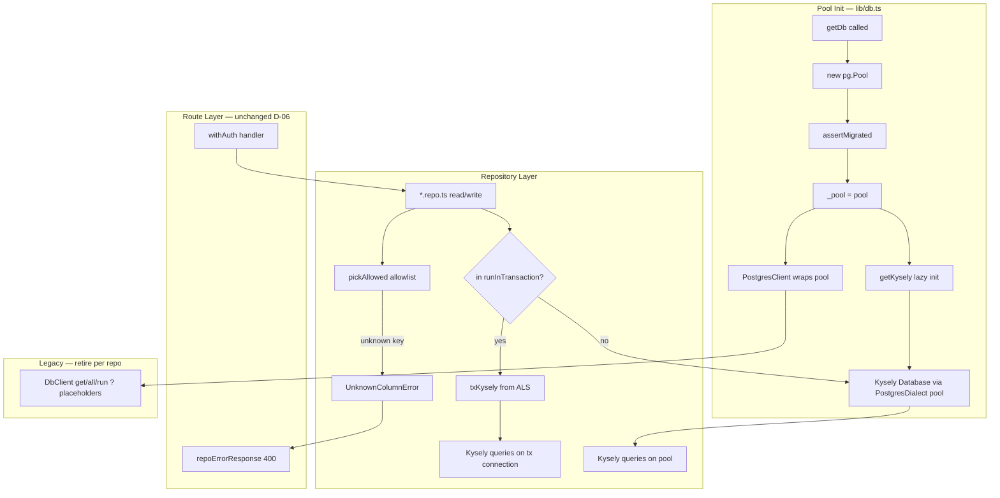

# Phase 25: Kysely Repositories - Research

**Researched:** 2026-08-28
**Domain:** Kysely query builder on existing `pg.Pool`; repository migration from raw SQL
**Confidence:** HIGH

## Summary

Phase 25 converts all 40 production `*.repo.ts` files from `getDb()` string SQL to typed Kysely queries on the **same** singleton `pg.Pool`. The codebase already has strong runtime mass-assignment guards (`buildUpdate` + `UnknownColumnError`) and route-level 400 mapping via `repoErrorResponse` / `withAuth` — these must survive migration (Pitfall 3). Kysely compile-time types add column safety at build time; they do **not** replace runtime allowlists (D-04).

**Critical gap today:** `_pool` in `lib/db.ts` is module-private — there is no exported `getPool()`. Phase must add `getPool()` (or equivalent) so `PostgresDialect({ pool })` shares the exact pool `PostgresClient` uses. [VERIFIED: lib/db.ts:113-136]

**Transaction gap today:** `lib/db-tx.ts` uses `AsyncLocalStorage<PoolClient>` so `PostgresClient` queries inside `runInTransaction()` join the active transaction via `txQueryTarget()`. Kysely does not read this ALS — a parallel `txKyselyTarget()` (or transactional Kysely factory) is required before converting `weekly-periods.repo.ts` / `weekly-reports.repo.ts`. [VERIFIED: lib/db-tx.ts:6-11, lib/db.ts:36-38]

**Primary recommendation:** Add `kysely@0.29.5` + dev `kysely-codegen@0.20.0`; export `getPool()` + `getKysely()` from `lib/db/`; generate `Database` from migrated schema; tracer on `audit.repo.ts`; keep `pickAllowed()` helper that throws `UnknownColumnError` for writes; extend `db-tx` ALS for transactional Kysely; migrate repos in sequential module waves.

<user_constraints>
## User Constraints (from CONTEXT.md)

### Locked Decisions

- **D-01:** Add npm package `kysely` only as a runtime dependency. Use `PostgresDialect` with the **existing** `pg.Pool` from `getDb()`. No Prisma, Drizzle, or second pool.
- **D-02:** One `Kysely<Database>` factory in `lib/` (e.g. `lib/db/kysely.ts`) obtained after `getDb()` so migrate-assert + seed still run first. Repos must not construct their own Pool.
- **D-03:** Schema types live in `lib/db/database.ts` (or generated sibling). Prefer `kysely-codegen` as a **devDependency** to generate types from a migrated DB; check the generated file into git. If codegen cannot run in this environment, hand-author `Database` from `migrations/0001-baseline-schema.sql` with the same table/column names.
- **D-04:** Compile-time types do **not** replace runtime mass-assignment guards. Per-repo writes use a **narrow** `Pick` / existing allowlist const (same columns as today's `buildUpdate` arrays). Keep `UnknownColumnError` (or equivalent) tests: extra body keys still 400. Do not pass wholesale `Updateable<T>` that includes `id` / `company_id` unless that table already allowed those columns.
- **D-05:** Convert **all** production `*.repo.ts` files (module repos + `lib/repositories/auth.repo.ts` and `settings.repo.ts`). Leave `lib/auth.ts` session SQL and migrate/seed SQL on `DbClient` unless a file is already a repository. Delete `buildUpdate` usage only when that table's repo writes are fully on Kysely.
- **D-06:** Do not rewrite service/route logic. Do not restyle UI. Do not change ENF-01 wrappers or D-23 ops/admin companies auth.
- **D-07:** No `as any` / `as unknown as` to silence Kysely in repos. Isolation none: sequential waves. TDD: RED then GREEN per task. No second test DB pool.
- **D-08:** Tracer first: factory + `Database` types + one small repo (audit or dashboard-filter-state) proving (a) typed query compiles, (b) existing mass-assignment test still rejects extra fields, (c) `getDb()` still a single Pool.

### Claude's Discretion

Grey areas auto-accepted: Kysely on existing pool, keep runtime allowlists, convert all repos, codegen-or-hand types, tracer then sequential module waves, no second ORM.

### Deferred Ideas (OUT OF SCOPE)

- RSC chrome / cold-start — Phase 26
- Nits, Nyquist remainder, operator HYG-02 — Phase 27
</user_constraints>

<phase_requirements>
## Phase Requirements

| ID | Description | Research Support |
|----|-------------|------------------|
| ENF-02 | Repository queries go through Kysely on existing `pg.Pool`; invalid columns fail at compile time; runtime mass-assignment tests stay | Standard stack (`kysely` + `PostgresDialect` on shared pool); `pickAllowed()` bridge; wave plan for all 40 repos; test map preserves `UnknownColumnError` → 400 chain |
</phase_requirements>

## Architectural Responsibility Map

| Capability | Primary Tier | Secondary Tier | Rationale |
|------------|-------------|----------------|-----------|
| Typed SQL queries | API / Backend (repositories) | — | Repos are sole SQL layer per REPO-01; Kysely lives in `lib/db/` factory, consumed by repos |
| Runtime column allowlists | API / Backend (repositories) | — | `pickAllowed()` / `UnknownColumnError` before Kysely `.set()` — not route or client concern |
| Connection pool lifecycle | API / Backend (`lib/db.ts`) | — | Single `_pool` singleton; migrate-assert + seed run once at init |
| Transaction coordination | API / Backend (`lib/db-tx.ts`) | Repositories | ALS bridges `runInTransaction` to both `PostgresClient` and Kysely during mixed migration |
| Mass-assignment HTTP 400 | Frontend Server (route wrappers) | — | `withAuth` catch → `repoErrorResponse(UnknownColumnError)` — repos throw, routes map |
| Schema type generation | Build/dev tooling | — | `kysely-codegen` against migrated DB; checked-in types, not runtime |

## Standard Stack

### Core

| Library | Version | Purpose | Why Standard |
|---------|---------|---------|--------------|
| `kysely` | **0.29.5** | Type-safe query builder over `pg.Pool` | Official `PostgresDialect({ pool })` accepts existing `pg.Pool`; compile-time column checks; zero runtime ORM [VERIFIED: npm registry] [CITED: github.com/kysely-org/kysely] |
| `pg` | ^8.20.0 (existing) | PostgreSQL driver | Already owns singleton pool; Kysely dialect wraps it — no second pool [VERIFIED: package.json:27] |

### Supporting

| Library | Version | Purpose | When to Use |
|---------|---------|---------|-------------|
| `kysely-codegen` | **0.20.0** | Generate `Database` interface from live schema | After `npm run migrate`; output to `lib/db/database.ts` (D-03) [VERIFIED: npm registry] |

### Alternatives Considered

| Instead of | Could Use | Tradeoff |
|------------|-----------|----------|
| Kysely on shared pool | Prisma / Drizzle | **Rejected** — D-01 forbids second ORM |
| kysely-codegen | Hand-authored `Database` | Acceptable fallback from `migrations/0001-baseline-schema.sql` if codegen blocked in env |
| `db.transaction().execute()` | Extend existing `runInTransaction` ALS | **Required for D-06** — services already call `runInTransaction`; cannot rewrite services |

**Installation:**

```bash
npm install kysely@0.29.5
npm install -D kysely-codegen@0.20.0
```

**Version verification:**

```bash
npm view kysely version          # → 0.29.5
npm view kysely-codegen version  # → 0.20.0
```

## Package Legitimacy Audit

| Package | Registry | Age | Downloads | Source Repo | Verdict | Disposition |
|---------|----------|-----|-----------|-------------|---------|-------------|
| `kysely` | npm | ~18 days (published 2026-08-10) | ~15.3M/wk | github.com/kysely-org/kysely | SUS (`too-new`) | Flagged — planner must add `checkpoint:human-verify` before install; official org repo + high downloads; no postinstall script |
| `kysely-codegen` | npm | ~6 mo | ~1.3M/wk | github.com/RobinBlomberg/kysely-codegen | OK | Approved |

**Packages removed due to [SLOP] verdict:** none

**Packages flagged as suspicious [SUS]:** `kysely` — seam flags `too-new` (0.29.5 published 2026-08-10); human should confirm intentional pin before install

**Postinstall check:** Both packages return empty `scripts.postinstall` from `npm view` [VERIFIED: npm registry]

## Architecture Patterns

### System Architecture Diagram



### Recommended Project Structure

```
lib/
├── db.ts                    # getDb, getPool (new), runInTransaction — pool singleton
├── db-tx.ts                 # ALS: txQueryTarget + txKyselyTarget (new)
├── db/
│   ├── kysely.ts            # getKysely(): Kysely<Database>
│   └── database.ts          # Database interface (codegen or hand-authored)
└── repositories/
    ├── _helpers.ts          # UnknownColumnError, buildUpdate (retire buildUpdate last)
    └── _kysely-helpers.ts   # pickAllowed() — runtime allowlist for Kysely .set()

modules/*/backend/repositories/*.repo.ts   # convert in waves
lib/repositories/auth.repo.ts              # wave 2
lib/repositories/settings.repo.ts          # wave 2
```

### Pattern 1: Shared Pool via PostgresDialect

**What:** Kysely uses the same `pg.Pool` instance as `PostgresClient` — pass pool directly to dialect config.

**When to use:** Always — D-01.

**Example:**

```typescript
// Source: https://github.com/kysely-org/kysely (Context7 /kysely-org/kysely)
import { Kysely, PostgresDialect } from 'kysely';
import type { Database } from '@/lib/db/database';

export async function getKysely(): Promise<Kysely<Database>> {
  const pool = await getPool(); // must export from lib/db.ts after getDb() init
  return new Kysely<Database>({
    dialect: new PostgresDialect({ pool }),
  });
}
```

[CITED: github.com/kysely-org/kysely — PostgresDialectConfig `pool: PostgresPool`]

### Pattern 2: Export getPool After getDb Init

**What:** `getDb()` creates pool, runs `assertMigrated`, seeds; `getPool()` returns `_pool` (throws if uninitialized).

**When to use:** Kysely factory, transaction bridge, any code needing raw `Pool` without `DbClient`.

**Example:**

```typescript
// lib/db.ts — extend existing singleton block [VERIFIED: lib/db.ts:112-143]
let _pool: Pool | null = null;

export async function getPool(): Promise<Pool> {
  await getDb(); // ensures migrate-assert + seed
  if (!_pool) throw new Error('Database pool is not initialized');
  return _pool;
}
```

### Pattern 3: Runtime Allowlist Bridge (pickAllowed)

**What:** Validate caller keys against existing `*_COLUMNS` const arrays **before** Kysely `.set()`. Throw `UnknownColumnError` on unknown keys — identical semantics to `buildUpdate`.

**When to use:** Every UPDATE/INSERT path that accepts caller-supplied field maps (D-04, Pitfall 3).

**Example:**

```typescript
// lib/repositories/_kysely-helpers.ts
import { UnknownColumnError } from './_helpers';

export function pickAllowed<T extends Record<string, unknown>>(
  allowlist: readonly string[],
  fields: Record<string, unknown>,
): Partial<T> {
  const keys = Object.keys(fields);
  const unknown = keys.filter(k => !allowlist.includes(k));
  if (unknown.length) throw new UnknownColumnError(unknown);
  const columns = allowlist.filter(c => keys.includes(c));
  if (!columns.length) throw new UnknownColumnError([]);
  return Object.fromEntries(columns.map(c => [c, fields[c]])) as Partial<T>;
}

// In projects.repo.ts (after migration):
const picked = pickAllowed<ProjectUpdate>(PROJECT_COLUMNS, fields);
await db.updateTable('projects').set(picked).where('id', '=', projectId).execute();
```

**Compile-time narrow type (D-04):**

```typescript
type ProjectUpdate = Pick<
  Updateable<Database['projects']>,
  typeof PROJECT_COLUMNS[number]
>;
```

Values in `PROJECT_COLUMNS` must match verbatim from source:

```typescript
// [VERIFIED: modules/projects/backend/repositories/projects.repo.ts:12-41]
export const PROJECT_COLUMNS = [
  'name', 'client', 'pm_name', 'pm_email', 'start_date', 'end_date', 'status',
  'current_phase', 'description', 'objective', 'project_owner', 'budget',
  'budget_currency', 'headcount_quota', 'budget_status', 'project_code',
  'portfolio_year', 'stage', 'status_reason', 'rag', 'progress_pct',
  'weekly_report_enabled', 'weekly_report_start_period', 'plan_end',
  'adjusted_end', 'actual_end', 'classification', 'governance',
] as const;
```

### Pattern 4: Transaction Bridge (db-tx + Kysely)

**What:** Extend ALS so Kysely queries inside `runInTransaction()` use the same `PoolClient` that already has `BEGIN` open.

**When to use:** Before converting weekly repos (Wave 8). Only two production call sites today: `weekly-periods.repo.ts` and `weekly-reports.service.ts`. [VERIFIED: grep runInTransaction]

**Approach (recommended — no service rewrite):**

1. In `runInTransactionOnPool`, after `BEGIN`, create ephemeral `Kysely<Database>` with `PostgresDialect` backed by a minimal pool adapter returning the active `PoolClient` (no-op `release`).
2. Store in ALS alongside `PoolClient` via new `txKyselyTarget()`.
3. `getKysely()` returns ALS transactional instance when present, else lazy singleton on shared pool.

**Alternative for greenfield transactional code:** Kysely native `db.transaction().execute(async trx => …)` [CITED: github.com/kysely-org/kysely — simple transaction docs]. Do **not** replace existing `runInTransaction` call sites (D-06).

**Kysely `connection().execute()`** binds one connection without transaction — useful for serializing queries, not for joining existing `BEGIN` block. [CITED: github.com/kysely-org/kysely — ConnectionBuilder.execute]

### Pattern 5: Tracer Repo (D-08)

**What:** Convert `audit.repo.ts` first — read-heavy + append-only insert, no `buildUpdate`, small surface.

**Why audit over dashboard-filter-state:** Audit proves typed SELECT + JSONB insert; dashboard-filter-state requires `migrateDashboards()` in tests and upsert semantics — slightly more setup. Either satisfies D-08; audit is lower coupling.

**Tracer acceptance criteria:**
- `insertAuditLog` / `listAuditLogs` use Kysely typed columns
- `audit.repo.test.ts` green without second pool
- `getDb()` still returns same `DbClient` on same pool (dual-path during migration)

### Anti-Patterns to Avoid

- **Wholesale `Updateable<T>` on `.set()`:** Includes `id`, `company_id` — tenant escape (Pitfall 3)
- **Removing `UnknownColumnError` because types exist:** Runtime body keys exceed compile-time picks
- **Per-repo Pool construction:** Violates D-02
- **`as any` on Kysely:** Violates D-07
- **Dual `buildUpdate` + Kysely for same table:** Delete `buildUpdate` only when all writes migrated (D-05)

## Repository Inventory & Migration Waves

**Total production repos:** 40 files — all use `getDb()` today [VERIFIED: glob + grep 2026-08-28]

**Repos with `buildUpdate` (runtime allowlist critical):** 7 — all in `modules/projects/` [VERIFIED: grep buildUpdate]

| File | buildUpdate table |
|------|-------------------|
| `activities.repo.ts` | `activities` |
| `escalations.repo.ts` | `escalation_levels` |
| `issues.repo.ts` | `issues` |
| `meetings.repo.ts` | `meetings` |
| `projects.repo.ts` | `projects` |
| `risks.repo.ts` | `risks` |
| `team.repo.ts` | `team_members` |

### Sequential Waves (by module)

| Wave | Module / scope | Files (count) | Repos |
|------|----------------|---------------|-------|
| **W0** | Infrastructure + tracer | 3 + 2 lib | `lib/db/kysely.ts`, `lib/db/database.ts`, `lib/repositories/_kysely-helpers.ts`, `lib/db.ts` (`getPool`), `lib/db-tx.ts` (tx Kysely ALS), **`audit.repo.ts`** (1) |
| **W1** | dashboards | 1 | `dashboard-filter-state.repo.ts` |
| **W2** | lib cross-cutting | 2 | `auth.repo.ts`, `settings.repo.ts` |
| **W3** | admin | 5 | `admin.repo.ts`, `demo-requests.repo.ts`, `jira-config.repo.ts`, `rag-config.repo.ts`, `users.repo.ts` |
| **W4** | documents | 3 | `document-catalog.repo.ts`, `document-templates.repo.ts`, `project-document-checklist.repo.ts` |
| **W5** | jira | 1 | `import-mapping.repo.ts` |
| **W6** | operations | 1 | `operations.repo.ts` |
| **W7** | portfolio | 4 | `fiscal-budget.repo.ts`, `portfolio.repo.ts`, `programs.repo.ts`, `resources.repo.ts` |
| **W8** | weekly | 3 | `weekly-export.repo.ts`, `weekly-periods.repo.ts`, `weekly-reports.repo.ts` — **requires tx bridge from W0** |
| **W9a** | projects (non-buildUpdate) | 15 | `budget-adjustments`, `budget`, `bugs`, `documents`, `financial-benefits`, `holidays`, `milestones`, `nonfinancial-benefits`, `pm-assignments`, `project-dependencies`, `raid-due-date-history`, `stakeholders` |
| **W9b** | projects (buildUpdate / mass-assignment) | 7 | `activities`, `escalations`, `issues`, `meetings`, `projects`, `risks`, `team` — keep `*.repo.test.ts` UnknownColumnError tests green |
| **W10** | Cleanup | — | Remove `buildUpdate` from `_helpers.ts` when no callers; grep confirms zero `getDb()` in `*.repo.ts` |

**Leave on DbClient (not in scope):** `lib/auth.ts` session SQL, migrate runner, seed SQL per D-05.

## Don't Hand-Roll

| Problem | Don't Build | Use Instead | Why |
|---------|-------------|-------------|-----|
| SQL query builder | Custom typed wrapper over `pg` | `kysely` | Joins, subqueries, RETURNING, dialect edge cases |
| Schema types | Manual maintenance of 40+ tables forever | `kysely-codegen` from migrated DB | Drift causes Pitfall 3 compile-time false confidence |
| Second connection pool | New Pool for Kysely | `PostgresDialect({ pool: _pool })` | Connection exhaustion, transaction isolation breaks |
| Runtime column guard | Trust Kysely types alone | `pickAllowed()` + `UnknownColumnError` | Client body keys are runtime input; types are dev-time |
| Transaction ALS | Rewrite all services to Kysely `.transaction()` | Extend `db-tx` ALS | D-06 forbids service rewrites |

**Key insight:** Kysely solves **developer mistakes** (typos in column names). `pickAllowed` solves ** attacker mistakes** (extra JSON keys). Both layers required (D-04, Pitfall 3).

## Mass-Assignment Test Chain (must stay green)

### Repository layer

Repo tests call update helpers with forbidden keys (e.g. `company_id`, `project_id`) and expect `UnknownColumnError`:

```typescript
// [VERIFIED: modules/projects/backend/repositories/projects.repo.test.ts:38-39]
await expect(updateProject(projectId, { company_id: 99 })).rejects.toThrow(UnknownColumnError);
```

Same pattern in: `activities`, `escalations`, `issues`, `meetings`, `risks`, `team` repo tests [VERIFIED: grep UnknownColumnError in modules/projects/backend/repositories/*.test.ts]

Unit tests for `buildUpdate` itself: `lib/repositories/_helpers.test.ts` [VERIFIED: grep]

### Route / wrapper layer

`withAuth` maps `UnknownColumnError` → 400 with column names:

```typescript
// [VERIFIED: lib/http/with-auth.ts:124-126]
if (e instanceof UnknownColumnError) return repoErrorResponse(e);
```

```typescript
// [VERIFIED: lib/api-errors.ts:24-25]
if (e instanceof UnknownColumnError) {
  return NextResponse.json({ error: e.message, columns: e.columns }, { status: 400 });
}
```

Route access tests mock repo throwing `UnknownColumnError` → expect 400:
- `app/api/projects/[id]/route.access.test.ts`
- `app/api/projects/[id]/risks/route.test.ts`
- `lib/http/with-auth.test.ts` (T-04-25)

**Migration rule:** Kysely write paths must still `throw new UnknownColumnError([...])` via `pickAllowed()` — do not switch to Kysely-only validation or Zod at repo layer.

### Test harness note

Repo integration tests mock `getDb` → `testDb()` from `test/repo-db.ts` (same pool, no migrate-assert/seed). After migration, add parallel mock for `getKysely()` → test Kysely on `testPool()`, or unified factory that reads `DATABASE_URL` test pool. **No second test pool** (D-07). [VERIFIED: test/repo-db.ts:6-13]

## Common Pitfalls

### Pitfall 1: Types drift from schema (Pitfall 3)

**What goes wrong:** Migration adds column; `database.ts` not regenerated; Kysely accepts stale shape.

**How to avoid:** Regenerate types when `migrations/*.sql` changes; CI `codegen:db` diff check.

**Warning signs:** TS errors suppressed with casts; grep shows raw SQL fallback alongside Kysely for same table.

### Pitfall 2: Transaction split-brain

**What goes wrong:** `weekly-reports.service.ts` calls `runInTransaction`; inner Kysely queries use pool connection outside BEGIN → partial commits.

**How to avoid:** Ship tx ALS bridge in W0 before W8; integration test in `weekly-reports.repo.test.ts` asserting rollback.

**Warning signs:** Intermittent duplicate rows; data visible before commit.

### Pitfall 3: BIGINT / JSONB typing

**What goes wrong:** Global `parseInt8` breaks VND precision; JSONB columns typed as `string` vs `JsonValue`.

**How to avoid:** Do **not** set global int8 parser (STACK.md); use `sql\`?::jsonb\`` or Kysely `json` helper for audit `before`/`after`.

### Pitfall 4: Partial module migration

**What goes wrong:** Same table queried via Kysely in one repo, `buildUpdate` in another.

**How to avoid:** Wave-per-module; delete `buildUpdate` for table only when all writers converted (D-05).

## Code Examples

### PostgresDialect with existing Pool

```typescript
// Source: https://github.com/kysely-org/kysely (Context7)
import { Kysely, PostgresDialect } from 'kysely';
import { Pool } from 'pg';

const db = new Kysely<Database>({
  dialect: new PostgresDialect({
    pool: new Pool(config), // existing pool instance — not a new connection layer
  }),
});
```

### Simple Kysely transaction (new code only — not for replacing runInTransaction)

```typescript
// Source: https://github.com/kysely-org/kysely — transactions/0010-simple-transaction
await db.transaction().execute(async (trx) => {
  await trx.insertInto('audit_logs').values({ ... }).execute();
});
```

### Audit tracer — typed insert + select

```typescript
// Target shape for audit.repo.ts post-migration
const db = await getKysely();
await db.insertInto('audit_logs').values({
  actor_id: input.actor_id,
  company_id: input.company_id,
  entity_type: input.entity_type,
  entity_id: input.entity_id,
  action: input.action,
  before: input.before === null ? null : JSON.stringify(input.before),
  after: input.after === null ? null : JSON.stringify(input.after),
}).execute();

const rows = await db
  .selectFrom('audit_logs')
  .select(['id', 'company_id', 'actor_id', 'entity_type', 'entity_id', 'action', 'before', 'after', 'created_at'])
  .where('company_id', '=', companyId)
  .orderBy('created_at', 'desc')
  .limit(limit)
  .execute();
```

## State of the Art

| Old Approach | Current Approach | When Changed | Impact |
|--------------|------------------|--------------|--------|
| `getDb().all('SELECT … ?', …)` | `getKysely().selectFrom(…)` | Phase 25 | Compile-time column validation |
| `buildUpdate(TABLE, COLS, body)` | `pickAllowed(COLS, body)` + `.set()` | Phase 25 | Same runtime 400 semantics |
| Private `_pool` | Exported `getPool()` | Phase 25 W0 | Enables dialect sharing |

**Deprecated/outdated:**
- `buildUpdate` — retire in W10 when zero callers
- Per-repo `?` placeholder SQL — retire repo-by-repo

## Project Constraints (from CLAUDE.md)

- **Tech stack:** Next.js 16.2.4 / React 19.2.4 / TypeScript strict / PostgreSQL via `pg` — no framework swaps
- **Behavior freeze:** Existing endpoints keep working; mass-assignment 400 is intentional security behavior
- **Import convention:** `@/` alias for app-root imports
- **Deployment:** Docker/Railway/K8s; `output: 'standalone'` preserved
- **Security:** Multi-tenant — repos stay company-scoped; do not expose `company_id` in update allowlists unless already allowed
- **Testing:** Vitest; layer not done until tests green

## Assumptions Log

| # | Claim | Section | Risk if Wrong |
|---|-------|---------|---------------|
| A1 | `getPool()` export is acceptable minimal change to `lib/db.ts` | Pattern 2 | Kysely cannot share pool without exposing `_pool` |
| A2 | Ephemeral Kysely on ALS `PoolClient` works for tx bridge | Pattern 4 | Weekly wave blocked; need service rewrite (violates D-06) |
| A3 | `kysely-codegen` can run against test/dev DATABASE_URL post-migrate | Standard Stack | Fall back to hand-authored types from `0001-baseline-schema.sql` (D-03) |
| A4 | Audit repo chosen as tracer (vs dashboard-filter-state) | W0 | Either satisfies D-08 — planner may swap if preferred |

## Open Questions

1. **Singleton vs per-call Kysely instance**
   - What we know: Kysely is lightweight; dialect holds pool reference
   - Recommendation: Lazy singleton `_kysely` invalidated never (pool lives for process lifetime) — matches `_client` pattern

2. **codegen output path**
   - What we know: D-03 suggests `lib/db/database.ts`
   - Recommendation: `kysely-codegen --out-file lib/db/database.ts`; add `"codegen:db"` script per STACK.md

## Environment Availability

| Dependency | Required By | Available | Version | Fallback |
|------------|------------|-----------|---------|----------|
| Node.js | vitest, kysely | ✓ | 20+ (Docker pin) | — |
| PostgreSQL | repo integration tests, codegen | ✓/✗ | — | Tests skip via `hasTestDb`; hand-author types if no DB |
| npm | package install | ✓ | — | — |
| `DATABASE_URL` | getDb, codegen | ✓ (dev) | — | Required for runtime; codegen needs migrated schema |

**Missing dependencies with no fallback:**
- None for code-only migration (types can be hand-authored)

**Missing dependencies with fallback:**
- PostgreSQL unavailable in CI agent → hand-author `Database` from `migrations/0001-baseline-schema.sql` (D-03)

## Validation Architecture

### Test Framework

| Property | Value |
|----------|-------|
| Framework | Vitest 4.1.10 [VERIFIED: package.json:52] |
| Config file | `vitest.config.ts` |
| Quick run command | `npx vitest run modules/audit/backend/repositories/audit.repo.test.ts` |
| Full suite command | `npm test` |

### Phase Requirements → Test Map

| Req ID | Behavior | Test Type | Automated Command | File Exists? |
|--------|----------|-----------|-------------------|-------------|
| ENF-02 | Typed repo queries compile | unit/integration | `npm test -- modules/audit/backend/repositories` | ✅ audit.repo.test.ts |
| ENF-02 | Unknown key → UnknownColumnError | integration | `npm test -- modules/projects/backend/repositories/projects.repo.test.ts` | ✅ |
| ENF-02 | UnknownColumnError → HTTP 400 | unit | `npm test -- lib/http/with-auth.test.ts` | ✅ |
| ENF-02 | Route 400 on bad column | integration | `npm test -- app/api/projects/[id]/route.access.test.ts` | ✅ |
| ENF-02 | Transaction rollback (weekly) | integration | `npm test -- modules/weekly/backend/repositories` | ✅ |

### Sampling Rate

- **Per task commit:** Target repo test file(s) for converted module
- **Per wave merge:** `npm test -- modules/<module>/backend/repositories`
- **Phase gate:** `npm test` full suite green before `/gsd-verify-work`

### Wave 0 Gaps

- [ ] `lib/db/kysely.ts` — factory
- [ ] `lib/db/database.ts` — Database interface
- [ ] `lib/repositories/_kysely-helpers.ts` — `pickAllowed`
- [ ] `lib/db.ts` — `getPool()` export
- [ ] `lib/db-tx.ts` — transactional Kysely ALS
- [ ] `package.json` — add `kysely`, `kysely-codegen`, `codegen:db` script
- [ ] Repo test helper — mock `getKysely()` alongside `getDb()` in `test/repo-db.ts` or shared vi.mock pattern

## Security Domain

### Applicable ASVS Categories

| ASVS Category | Applies | Standard Control |
|---------------|---------|-----------------|
| V2 Authentication | no | Unchanged — repos not auth boundary |
| V3 Session Management | no | Session SQL stays on DbClient |
| V4 Access Control | no (repo layer) | Company scoping unchanged in WHERE clauses |
| V5 Input Validation | yes | `pickAllowed()` + `UnknownColumnError`; no wholesale Updateable |
| V6 Cryptography | no | — |

### Known Threat Patterns

| Pattern | STRIDE | Standard Mitigation |
|---------|--------|---------------------|
| Mass assignment (`company_id` in PATCH body) | Elevation of privilege | Runtime allowlist → UnknownColumnError → 400 |
| Cross-tenant UPDATE | Tampering | Narrow update types; exclude tenancy keys from allowlists |
| SQL injection via column names | Tampering | Kysely identifier quoting + allowlist (no dynamic column names from client) |

## Sources

### Primary (HIGH confidence)

- Context7 `/kysely-org/kysely` — PostgresDialect pool config, transactions, connection.execute
- `lib/db.ts`, `lib/db-tx.ts`, `lib/repositories/_helpers.ts` — read this session
- `modules/audit/backend/repositories/audit.repo.ts` — tracer candidate
- `npm view kysely version` → 0.29.5

### Secondary (MEDIUM confidence)

- `.planning/research/STACK.md` — ENF-02 integration patterns
- `.planning/research/PITFALLS.md` — Pitfall 3
- `.planning/research/ARCHITECTURE.md` — Kysely bridge sketch

### Tertiary (LOW confidence)

- None requiring validation before plan

## Metadata

**Confidence breakdown:**
- Standard stack: HIGH — official Kysely PostgresDialect docs + npm versions verified
- Architecture: HIGH — codebase patterns read directly; pool/tx gaps identified with line citations
- Pitfalls: HIGH — Pitfall 3 + existing test chain verified

**Research date:** 2026-08-28
**Valid until:** 2026-09-28 (Kysely stable; 0.29.x recently published — recheck patch releases)
