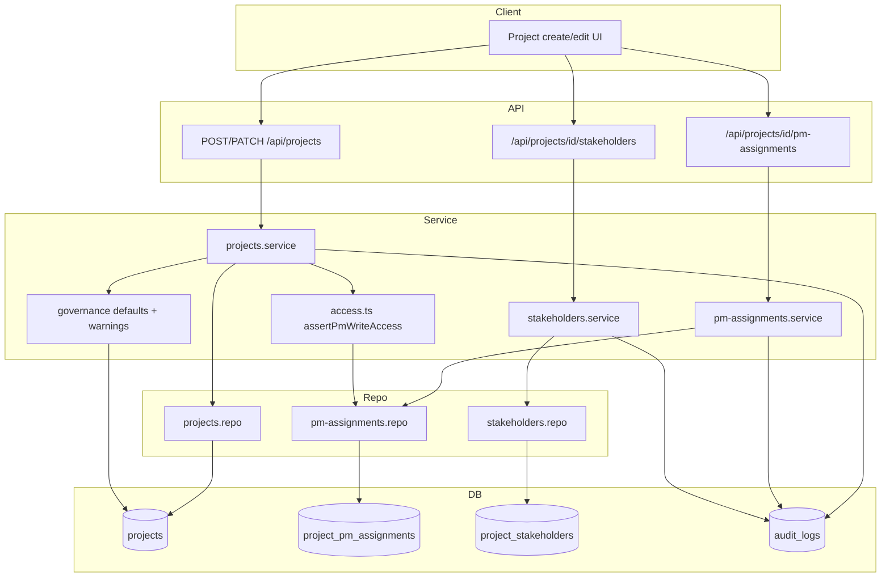

# Phase 11: Project Master, PM Assignment & Stakeholders - Research

**Researched:** 2026-08-26
**Domain:** PostgreSQL schema migration, project master governance (L0–L5), PM assignment windows, stakeholder history, server-side authz rewire
**Confidence:** HIGH

## Summary

Phase 11 extends the existing `projects` row model and adds two history tables (`project_pm_assignments`, `project_stakeholders`) while rewiring the Phase 10 interim PM lookup (`getProjectPmIdentity` + `matchesPmAssignment`) to time-bounded assignment windows. The codebase already has the right seams: `assertPmWriteAccess` (keep the name), `assertProjectWriteAccess`, `listProjects` PM filter, `PROJECT_COLUMNS` allowlist, `withProjectAccess` nested routes, `auditLog`, and the `getDb()` migrate loop with settings-flag backfills (`lib/db-roles.ts`, `lib/db-mapping-tenant.ts`).

Implementation should follow the established three-tier pattern (route → service → repository), add a dedicated `lib/db-project-master.ts` helper invoked from `getDb()` (D-19), extend `PROJECT_COLUMNS` and `createProject` INSERT for new identity/governance fields, and ship Vitest unit tests as the gate (D-20, `workflow.ui_phase: false`). L5/terminal governance defaults apply server-side and return a **`warnings: string[]`** array in the JSON response body — never a blocking 400 when the client sent overrides (D-07, D-08). PROJ-07 is satisfied by a new `progress_pct` column on `projects`; no weekly snapshot table in this phase.

**Primary recommendation:** Add `lib/db-project-master.ts` (DDL + D-14 backfill + unique index), two new repos/services with nested `/api/projects/[id]/pm-assignments` and `/api/projects/[id]/stakeholders` routes, rewire `assertPmWriteAccess` + `assertProjectAccess` PM branch + `listProjects` to a shared `hasActivePmWindow(projectId, userId)` query in one plan wave, and extend `updateProject`/`createProject` with governance validation + warning payload.

<user_constraints>
## User Constraints (from CONTEXT.md)

### Locked Decisions

Decision IDs below are the locked set for plan coverage (D-01..D-20).

#### Identity & code (PROJ-01, PROJ-02)

- **D-01:** Unique project code is **per company**: `UNIQUE(company_id, code)` (case-insensitive). Not global across tenants.
- **D-02:** Changing code is an in-place `UPDATE` of `projects.code` (or dedicated column). Linked child rows stay on `project_id`. Never drop/recreate the project.
- **D-03:** Only CPMO can set or change `code`. Assigned PM can maintain other identity fields they already have write access to (name, classification, etc.) but not the code.
- **D-04:** Portfolio year is a required integer column (`portfolio_year`). Program remains the existing `customers` row (`customer_id`) — do not invent a second program table.

#### Governance, L0–L5, RAG, weekly flag (PROJ-03..08)

- **D-05:** Persist spec stage as `stage` with values `L0`..`L5`. Keep `current_phase` as a free-text/legacy display field; do not break existing Jira/report readers. New UI/API use `stage`.
- **D-06:** Status Other requires non-empty `status_reason`. Weekly-report Yes requires `weekly_report_start_period` (string `YYYY-Wnn` until Phase 13 owns period rows).
- **D-07:** Stage L5 defaults: status Completed, RAG Not applicable, progress 100%. Persist the applied defaults; return a **warning list** in the JSON body (not a blocking 400) if the client sent overrides or prior progress was below 100%.
- **D-08:** Stage L5 or status Completed/Paused/Cancelled/Other defaults RAG to Not applicable; same warning-not-block pattern if the client sends another RAG.
- **D-09:** PROJ-07: there is no weekly-report snapshot table yet. Add `progress_pct` on `projects` for live progress. Do **not** invent a snapshot overwrite. Document the contract: Phase 13 snapshot copy must read `progress_pct` at submit time and never write back. No Phase 13 tables in this phase.
- **D-10:** `weekly_report_enabled` boolean. Turning it off (or L5/terminal status) does not delete history (none yet) and is the flag Phase 13 will use to skip future shells.

#### PM assignment windows (PMAS-01..04) — replaces Phase 10 D-14 lookup

- **D-11:** New table `project_pm_assignments`: `project_id`, `user_id`, `role` (`primary` | `collaborator`), `effective_from`, `effective_to` (null = open), `created_at`. Soft-end by setting `effective_to`; never physical DELETE of a window that existed.
- **D-12:** Exactly one **active** primary (today in `[effective_from, effective_to)` or open). Zero primaries allowed. Collaborators only while a primary is active. A user cannot hold both roles on the same project in overlapping windows.
- **D-13:** Replace `getProjectPmIdentity` / `matchesPmAssignment` inside `assertPmWriteAccess` (keep the **function name**). Lookup: actor `user_id` has an active primary **or collaborator** window. CPMO unchanged. Do not keep email/name match as a fallback after backfill.
- **D-14:** Backfill: for each project with non-empty `pm_email` or `pm_name`, if a company user matches Phase 10 D-14 rules, insert one open primary window. Leave `pm_name`/`pm_email` as denormalized display updated from the active primary (not an access source).
- **D-15:** Only CPMO mutates assignment windows. Assigned PM does not self-assign.

#### Stakeholders (STKH-01..03)

- **D-16:** Table `project_stakeholders`: `project_id`, `stakeholder_role` (`sponsor` | `psc_chair` | `psc_member` | `project_director` | `key_stakeholder`), `user_id` nullable, `external_name`/`external_email` when no user, `effective_from`, `effective_to` (null = open). End a role by setting `effective_to`. Never physical DELETE.
- **D-17:** Write access: `assertProjectWriteAccess` (CPMO or assigned PM). Same rows are the source for later dashboards/reports (STKH-03) — export a list helper, do not duplicate columns on `projects`.
- **D-18:** Multiple PSC members and key stakeholders allowed. At most one **active** sponsor, PSC chair, and project director at a time (end the previous window first).

#### Schema, authz, UI, testing

- **D-19:** Schema stays in the `getDb()` migrate loop (dedicated helper, settings-flag backfill). No Prisma. Incremental `auditLog` on code change, assignment window mutations, and stakeholder mutations.
- **D-20:** `workflow.ui_phase` is false — no UI-SPEC. Existing project create/edit screens may gain fields enough that CPMO can set code/year/stage and manage assignments/stakeholders; server tests are the gate. Viewer remains read-only via Phase 10 asserts.

### Claude's Discretion

- Column names (`code` vs `project_code`), whether `progress_pct` replaces parsing `budget` fields, and whether assignment API is nested `/api/projects/[id]/pm-assignments` vs `/api/admin/...` — planner locks: `project_code`, `progress_pct` new column, nested under `/api/projects/[id]/...` with CPMO for assignments and write-access for stakeholders.

### Deferred Ideas (OUT OF SCOPE)

- Weekly period shells and snapshot progress copy — Phase 13
- RAID/milestone masters — Phase 12
- Dashboards consuming stakeholders — Phase 16 (must call the same list helper)
- Full append-only audit coverage — Phase 18
</user_constraints>

<phase_requirements>
## Phase Requirements

| ID | Description | Research Support |
|----|-------------|------------------|
| PROJ-01 | CPMO create with portfolio year, name, unique code, program; CPMO-only code change | `project_code` + `portfolio_year` columns; partial unique index `(company_id, LOWER(project_code))`; CPMO gate on code in service |
| PROJ-02 | Code change does not drop linked records | In-place UPDATE on `projects.id`; FK children unchanged |
| PROJ-03 | Write access maintains classification, governance, stage L0–L5, status, RAG, progress, timeline | Extend `PROJECT_COLUMNS`; validation in `projects.service` |
| PROJ-04 | Status Other requires reason; weekly Yes requires start period | `status_reason`, `weekly_report_enabled`, `weekly_report_start_period`; ValidationError on missing |
| PROJ-05 | L5 defaults Completed / N/A RAG / 100% progress with warning on override | Governance helper applies defaults + `warnings[]` in response |
| PROJ-06 | L5 or terminal status defaults RAG N/A with warning | Same helper; terminal statuses from CONTEXT |
| PROJ-07 | Live progress must not clobber weekly snapshots | `progress_pct` on `projects` only; documented Phase 13 read-only copy contract |
| PROJ-08 | Weekly flag + L5/terminal stop future obligations | `weekly_report_enabled` boolean; no snapshot tables |
| PMAS-01 | One active primary or none | `project_pm_assignments` + service invariant checks |
| PMAS-02 | Collaborators only with active primary; no dual role overlap | Overlap validation in assignment service |
| PMAS-03 | Assignment history by period | Soft-end `effective_to`; list includes history |
| PMAS-04 | Write access follows window | Rewire `assertPmWriteAccess` + `listProjects` + `assertProjectAccess` PM branch |
| STKH-01 | Record sponsor, PSC, director, key parties (user or external) | `project_stakeholders` table + create validation |
| STKH-02 | Effective ranges; end without delete | Soft-end `effective_to` |
| STKH-03 | Single source for info/dashboards/reports | `listProjectStakeholders(projectId)` exported helper |
</phase_requirements>

## Architectural Responsibility Map

| Capability | Primary Tier | Secondary Tier | Rationale |
|------------|-------------|----------------|-----------|
| Project identity & governance fields | API / Backend (service + repo) | Database (columns on `projects`) | Server validates, persists, enforces CPMO-only code |
| L5/terminal defaults + warnings | API / Backend (service) | — | Business rules belong in service layer, not client |
| PM assignment windows | API / Backend (service + repo) | Database (`project_pm_assignments`) | CPMO mutates; access derived from DB windows |
| PM write/read scope (`assertPmWriteAccess`, list filter) | API / Backend (`access.ts`) | Database (window query) | AUTH-05: server enforces; never UI-only |
| Stakeholder CRUD + history | API / Backend (nested routes + service) | Database (`project_stakeholders`) | Write access via `assertProjectWriteAccess` |
| Schema DDL + backfill | Database (migrate on boot) | — | `getDb()` loop pattern; not in request path |
| Incremental audit | API / Backend (`audit.service`) | Database (`audit_logs`) | Append-only on governed mutations |
| Live `progress_pct` | Database (`projects.progress_pct`) | — | Phase 13 reads at submit; no write-back |

## Standard Stack

### Core

| Library | Version | Purpose | Why Standard |
|---------|---------|---------|--------------|
| `pg` | ^8.20.0 [VERIFIED: package.json:26] | PostgreSQL pool | Already used by `getDb()` |
| `zod` | ^4.4.3 [VERIFIED: package.json:35] | Route body shape guards | Existing pattern on nested project routes |
| `vitest` | 4.1.10 [VERIFIED: package.json:49] | Unit + access tests | Phase 10 TDD gate (D-20) |

### Supporting

| Library | Version | Purpose | When to Use |
|---------|---------|---------|-------------|
| Existing `auditLog` | — | Mutation audit trail | Code change, assignment, stakeholder mutations (D-19) |
| Existing `withProjectAccess` | — | Nested route auth | `/api/projects/[id]/pm-assignments`, `/stakeholders` |

### Alternatives Considered

| Instead of | Could Use | Tradeoff |
|------------|-----------|----------|
| In-code migrate helper | Prisma / Flyway | Locked out by D-19 and project convention |
| Email/name PM match (Phase 10) | Keep as fallback | Locked out by D-13 after backfill |
| Denormalized stakeholders on `projects` | Duplicate columns | Locked out by D-17/STKH-03 |

**Installation:** No new packages required.

**Version verification:** All dependencies already in `package.json`; no additions.

## Package Legitimacy Audit

> Phase 11 is code/config-only against existing stack — no new external packages.

| Package | Registry | Verdict | Disposition |
|---------|----------|---------|-------------|
| — | — | — | No new packages |

**Packages removed due to [SLOP] verdict:** none
**Packages flagged as suspicious [SUS]:** none

## Architecture Patterns

### System Architecture Diagram



### Recommended Project Structure

```
lib/
├── db-project-master.ts          # DDL, unique index, D-14 backfill (settings flag)
├── db.ts                       # import migrateProjectMaster in getDb loop
├── services/
│   ├── access.ts               # rewire assertPmWriteAccess + assertProjectAccess PM branch
│   ├── projects.service.ts     # governance validation, warnings payload, CPMO code gate
│   ├── pm-assignments.service.ts
│   ├── stakeholders.service.ts
│   └── project-governance.ts   # L5/terminal defaults + warning builder (optional split)
├── repositories/
│   ├── projects.repo.ts        # PROJECT_COLUMNS, listProjects window filter, createProject INSERT
│   ├── pm-assignments.repo.ts
│   └── stakeholders.repo.ts
app/api/projects/
├── route.ts                    # POST create (CPMO) — required fields
├── [id]/route.ts               # PATCH identity/governance
├── [id]/pm-assignments/route.ts
└── [id]/stakeholders/route.ts
```

### Pattern 1: Dedicated migrate helper with settings flag

**What:** Idempotent DDL + one-time backfill guarded by `settings` key, imported from `getDb()`.
**When to use:** Any new tables/columns (D-19).
**Example:**

```typescript
// Source: lib/db-roles.ts:22-73, lib/db-mapping-tenant.ts:59-64
const DDL_FLAG = 'project_master_ddl_v1';
const BACKFILL_FLAG = 'pm_assignment_backfill_v1';

export async function migrateProjectMaster(pool: Pool): Promise<void> {
  if (!(await settingsFlagExists(pool, DDL_FLAG))) {
    await pool.query(`ALTER TABLE projects ADD COLUMN IF NOT EXISTS project_code TEXT`);
    // ... other columns, CREATE TABLE project_pm_assignments, project_stakeholders
    await pool.query(`
      CREATE UNIQUE INDEX IF NOT EXISTS projects_company_code_lower_unique
      ON projects (company_id, LOWER(project_code))
      WHERE project_code IS NOT NULL AND TRIM(project_code) <> ''
    `);
    await writeSettingsFlag(pool, DDL_FLAG);
  }
  if (!(await settingsFlagExists(pool, BACKFILL_FLAG))) {
    // D-14 backfill INSERT ... SELECT using Phase 10 email-first match
    await writeSettingsFlag(pool, BACKFILL_FLAG);
  }
}
```

Wire in `getDb()` after existing migrators [VERIFIED: lib/db.ts:608-613]:

```typescript
await migratePostgresSchema(pool);
await migrateMappingTableTenancy(pool);
await migrateUsersRolesAndAudit(pool);
const { migrateProjectMaster } = await import('./db-project-master');
await migrateProjectMaster(pool);
```

### Pattern 2: Keep `assertPmWriteAccess` seam — replace lookup only

**What:** Phase 10 contract: function name stays; implementation switches from `pm_email`/`pm_name` to assignment windows.
**When to use:** All PM write gates and PM-only read gates.
**Example:**

```typescript
// Source: lib/services/access.ts:130-140 (current); D-13 replacement sketch
export async function assertPmWriteAccess(projectId: number | string, actor: AccessActor): Promise<void> {
  if (isCpmo(actor)) return;
  const active = await hasActivePmAssignment(Number(projectId), actor.user_id);
  if (!active) throw new ForbiddenError();
}

// assertProjectAccess PM-only branch (lines 120-125) must call the same helper — not getProjectPmIdentity
```

Shared repo query for active window [ASSUMED] — planner should use one function consumed by access + listProjects:

```sql
SELECT 1 FROM project_pm_assignments
WHERE project_id = ?
  AND user_id = ?
  AND effective_from <= CURRENT_DATE
  AND (effective_to IS NULL OR effective_to > CURRENT_DATE)
LIMIT 1
```

### Pattern 3: L5 warning-not-block JSON response

**What:** Apply server-side defaults, persist merged row, return `{ ...project, warnings: string[] }`.
**When to use:** PATCH/POST when `stage === 'L5'` or terminal status (D-07, D-08).
**Example:**

```typescript
// Service layer — ValidationError only for hard requirements (D-06), not L5 overrides
const warnings: string[] = [];
if (input.stage === 'L5') {
  if (input.status && input.status !== 'Completed') {
    warnings.push('Stage L5 defaults status to Completed; override persisted.');
  }
  fields.status = 'Completed';
  fields.rag = 'Not applicable';
  if (prior.progress_pct < 100) warnings.push('Progress was below 100%; set to 100% for L5.');
  fields.progress_pct = 100;
}
return { project: await updateProjectRepo(id, fields), warnings };
```

Route returns 200 with warnings array — do not map to 400 [VERIFIED: 11-CONTEXT.md D-07, D-08].

### Pattern 4: Nested project routes with role split

**What:** `withProjectAccess` for tenancy + read; service enforces CPMO vs write-access.
**When to use:** Assignments (CPMO only D-15) vs stakeholders (write access D-17).
**Example:**

```typescript
// Source: app/api/projects/[id]/milestones/route.ts:1-14
export const GET = withProjectAccess(async (_req, { params, actor }) =>
  NextResponse.json(await listPmAssignments(params.id, actor)),
);
export const POST = withProjectAccess(
  async (_req, { params, actor, body }) =>
    NextResponse.json(await createPmAssignment(params.id, actor, body), { status: 201 }),
  { schema: pmAssignmentSchema },
);
// createPmAssignment: assertCompanyWrite(actor) or isCpmo check at service top
```

### Anti-Patterns to Avoid

- **Dual PM access sources:** Do not keep `matchesPmAssignment` as fallback after backfill (D-13).
- **DELETE assignment/stakeholder rows:** Use `effective_to` soft-end only (D-11, D-16).
- **Recreate project on code change:** Never DELETE+INSERT; breaks PROJ-02 and all FK children.
- **Blocking 400 on L5 RAG override:** Spec requires warning list, not rejection (D-07, D-08).
- **Snapshot table for PROJ-07:** No weekly report tables in Phase 11 (D-09).
- **PM self-assign:** Assignment mutations CPMO-only (D-15).

## Don't Hand-Roll

| Problem | Don't Build | Use Instead | Why |
|---------|-------------|-------------|-----|
| Column allowlist enforcement | Ad-hoc SET clauses | `PROJECT_COLUMNS` + `buildUpdate` | UnknownColumnError contract (REPO-03) |
| Route auth composition | Per-route session checks | `withProjectAccess` + service asserts | Phase 10 pattern; shadow mode aware |
| Case-insensitive unique code | App-only dedup | Partial unique index on `LOWER(project_code)` | Race-safe; matches D-01 |
| Overlapping window detection | Client-side only | Service validation + SQL overlap query | PMAS-02 invariants |
| Audit trail | Custom log table | Existing `auditLog` / `audit_logs` | D-19 incremental; Phase 18 expands |
| User picker for assignments | New user API | `users.repo` `findUserById` + company scope | Users already company-scoped |

**Key insight:** Phase 11 is mostly schema + rewiring existing seams — the risk is inconsistent PM lookup across `assertPmWriteAccess`, `assertProjectAccess`, and `listProjects`, not missing abstractions.

## Runtime State Inventory

| Category | Items Found | Action Required |
|----------|-------------|------------------|
| Stored data | `projects.pm_name`, `projects.pm_email` on every existing project; no `project_code` yet; child rows keyed by `project_id` | Backfill assignment windows (D-14); keep `pm_*` as display denormalized from active primary; add columns via migrate |
| Live service config | None — all state in PostgreSQL | — |
| OS-registered state | None | — |
| Secrets/env vars | `DATABASE_URL` unchanged | None |
| Build artifacts | None tied to project master shape | — |

**Nothing found in category:** Live service config, OS-registered state, build artifacts — verified by codebase inspection (no external PM assignment store).

## Common Pitfalls

### Pitfall 1: Inconsistent PM lookup across three call sites

**What goes wrong:** PM can PATCH via `assertPmWriteAccess` but not see project in list, or GET nested resource while write fails.
**Why it happens:** Phase 10 split lookup across `assertPmWriteAccess`, `assertProjectAccess` (lines 120-125), and `listProjects` SQL filter [VERIFIED: lib/services/access.ts:120-125, lib/repositories/projects.repo.ts:77-86].
**How to avoid:** Single repo function `hasActivePmAssignment` / `listProjectsForPm(userId)`; update all three in same plan wave.
**Warning signs:** `getProjectPmIdentity` still imported anywhere after Phase 11.

### Pitfall 2: Overlapping assignment windows

**What goes wrong:** Two active primaries, collaborator without primary, same user primary+collaborator overlapping.
**Why it happens:** Insert-only API without overlap checks.
**How to avoid:** Before INSERT/open window: (1) end prior primary when adding new primary; (2) reject collaborator if no active primary; (3) reject if user has overlapping window in opposite role. Use transaction.
**Warning signs:** Integration tests pass individually but concurrent POST creates dual primary.

### Pitfall 3: Code rename implemented as delete/recreate

**What goes wrong:** Linked milestones, risks, activities orphaned or CASCADE-deleted.
**Why it happens:** Treating code change as new project row.
**How to avoid:** `UPDATE projects SET project_code = ? WHERE id = ?`; audit before/after; never `DELETE FROM projects` for code change [VERIFIED: 11-CONTEXT.md D-02].
**Warning signs:** Service calls `deleteProject` + `createProject` on code change path.

### Pitfall 4: PROJ-07 confusion — writing progress to nonexistent snapshot

**What goes wrong:** Planner adds `weekly_report_snapshots` table or UPDATE path from master to submitted reports.
**Why it happens:** Requirement wording implies two progress stores.
**How to avoid:** Only `projects.progress_pct`; document in service comment + ALLOWLIST-DIFF that Phase 13 copies at submit time only (D-09).
**Warning signs:** Any UPDATE touching a `weekly_report_*` table in Phase 11 plans.

### Pitfall 5: `PROJECT_COLUMNS` / test DDL drift

**What goes wrong:** New columns accepted in production migrate but rejected in tests or vice versa.
**Why it happens:** `test/repo-db.ts` DDL must mirror migration-added columns [VERIFIED: test/repo-db.ts:68-73 comment].
**How to avoid:** Update `PROJECT_COLUMNS`, `ALLOWLIST-DIFF.md`, and `test/repo-db.ts` projects CREATE in Wave 0.
**Warning signs:** UnknownColumnError in PATCH tests for valid spec fields.

### Pitfall 6: CPMO code change allowed through PM PATCH

**What goes wrong:** PM updates `project_code` via passthrough PATCH body.
**Why it happens:** `projectUpdateSchema` is `z.object({}).passthrough()` [VERIFIED: app/api/projects/[id]/route.ts:9].
**How to avoid:** Strip `project_code` from non-CPMO actors in `projects.service.updateProject`; CPMO-only branch for code changes with ConflictError on duplicate.
**Warning signs:** PM PATCH test with `project_code` succeeds.

### Pitfall 7: Backfill creates duplicate windows on restart

**What goes wrong:** Multiple open primary rows per project.
**Why it happens:** Backfill runs without settings flag or NOT EXISTS guard.
**How to avoid:** Settings flag `pm_assignment_backfill_v1` + `NOT EXISTS (SELECT 1 FROM project_pm_assignments WHERE project_id = p.id)`.
**Warning signs:** `getDb()` second boot increases assignment row count.

## Code Examples

Verified patterns from codebase and locked CONTEXT:

### Active PM window check (replacement for D-14)

```typescript
// lib/repositories/pm-assignments.repo.ts — new
export async function hasActivePmAssignment(projectId: number, userId: number): Promise<boolean> {
  const db = await getDb();
  const row = await db.get<{ ok: number }>(
    `SELECT 1 AS ok FROM project_pm_assignments
     WHERE project_id = ? AND user_id = ?
       AND effective_from <= CURRENT_DATE
       AND (effective_to IS NULL OR effective_to > CURRENT_DATE)
     LIMIT 1`,
    projectId,
    userId,
  );
  return !!row;
}
```

### listProjects PM filter rewrite

```typescript
// lib/repositories/projects.repo.ts — replace D-14 email/name SQL (lines 77-86)
export async function listProjects(companyId: number | null, opts?: { pmUserId?: number }) {
  const db = await getDb();
  if (companyId !== null) {
    let sql = `${LIST_SELECT} WHERE (p.company_id = ? OR c.company_id = ?)`;
    const params: unknown[] = [companyId, companyId];
    if (opts?.pmUserId != null) {
      sql += ` AND EXISTS (
        SELECT 1 FROM project_pm_assignments a
        WHERE a.project_id = p.id AND a.user_id = ?
          AND a.effective_from <= CURRENT_DATE
          AND (a.effective_to IS NULL OR a.effective_to > CURRENT_DATE)
      )`;
      params.push(opts.pmUserId);
    }
    sql += ' ORDER BY p.created_at DESC';
    return db.all(sql, ...params);
  }
  // ... null-company branch unchanged
}
```

```typescript
// lib/services/projects.service.ts — listProjects (lines 28-38)
if (pmOnly) {
  return listProjectsRepo(actor.company_id, { pmUserId: actor.user_id });
}
```

### Partial unique index for project_code (D-01)

```sql
-- Source: pattern from lib/db-roles.ts:66-70
CREATE UNIQUE INDEX IF NOT EXISTS projects_company_code_lower_unique
ON projects (company_id, LOWER(project_code))
WHERE project_code IS NOT NULL AND TRIM(project_code) <> '';
```

### auditLog on code change

```typescript
// Source: lib/services/users.service.ts:111-119 pattern
await auditLog({
  actor_id: actor.user_id,
  company_id: actor.company_id,
  entity_type: 'project',
  entity_id: String(projectId),
  action: 'code_change',
  before: { project_code: before.project_code },
  after: { project_code: after.project_code },
});
```

### New columns on projects (planner DDL reference)

Locked column names from discretion + CONTEXT [VERIFIED: 11-CONTEXT.md D-01, D-04, D-05, D-09, D-10]:

```sql
ALTER TABLE projects ADD COLUMN IF NOT EXISTS project_code TEXT;
ALTER TABLE projects ADD COLUMN IF NOT EXISTS portfolio_year INTEGER;
ALTER TABLE projects ADD COLUMN IF NOT EXISTS stage TEXT;
ALTER TABLE projects ADD COLUMN IF NOT EXISTS status_reason TEXT;
ALTER TABLE projects ADD COLUMN IF NOT EXISTS rag TEXT;
ALTER TABLE projects ADD COLUMN IF NOT EXISTS progress_pct INTEGER DEFAULT 0;
ALTER TABLE projects ADD COLUMN IF NOT EXISTS weekly_report_enabled BOOLEAN DEFAULT FALSE;
ALTER TABLE projects ADD COLUMN IF NOT EXISTS weekly_report_start_period TEXT;
ALTER TABLE projects ADD COLUMN IF NOT EXISTS plan_end TEXT;
ALTER TABLE projects ADD COLUMN IF NOT EXISTS adjusted_end TEXT;
ALTER TABLE projects ADD COLUMN IF NOT EXISTS actual_end TEXT;
-- classification/governance: TEXT columns per spec field names from PROJ-03 [ASSUMED until spec column names confirmed]
```

Enum literals for CHECK constraints [VERIFIED: 11-CONTEXT.md D-05, D-11, D-16]:

```
stage: 'L0' | 'L1' | 'L2' | 'L3' | 'L4' | 'L5'
assignment role: 'primary' | 'collaborator'
stakeholder_role: 'sponsor' | 'psc_chair' | 'psc_member' | 'project_director' | 'key_stakeholder'
```

### D-14 backfill match (Phase 10 rules)

```typescript
// Email-first when pm_email non-empty; else trim+lower pm_name vs display_name then username
// Source: lib/services/access.ts:43-57, 10-CONTEXT.md D-14
// Insert: role='primary', effective_from=CURRENT_DATE, effective_to=NULL
// Skip if NOT EXISTS assignment for project_id
```

## State of the Art

| Old Approach | Current Approach | When Changed | Impact |
|--------------|------------------|--------------|--------|
| Global admin project list | Company-scoped CPMO list | Phase 10 D-13 | `listProjects(companyId)` only |
| PM match via `pm_email`/`pm_name` | Assignment windows table | Phase 11 D-11–D-14 | Rewire access + list filter |
| Activity-derived completion only | Explicit `projects.progress_pct` | Phase 11 D-09 | Live master progress; Phase 13 snapshots |
| No project code / portfolio year | Required identity fields | Phase 11 PROJ-01 | CPMO create validation |

**Deprecated/outdated:**
- `getProjectPmIdentity` / `matchesPmAssignment` for access — replace after backfill (D-13); may remain temporarily for backfill script only.
- `listProjects` opts `{ pmEmail, pmName, username }` — replace with `{ pmUserId }`.

## Assumptions Log

| # | Claim | Section | Risk if Wrong |
|---|-------|---------|---------------|
| A1 | PROJ-03 classification/governance are TEXT columns with spec names not yet in repo | Code Examples | Wrong column names in DDL |
| A2 | Terminal statuses = `Completed`, `Paused`, `Cancelled`, `Other` (plus L5) for RAG N/A default | Pattern 3 | Wrong status set in governance helper |
| A3 | RAG values include `Green`, `Amber`, `Red`, `Not applicable` | Pattern 3 | CHECK constraint mismatch with UI |
| A4 | `effective_from`/`effective_to` use DATE (not TIMESTAMPTZ) consistent with `start_date` TEXT/DATE style on projects | Pattern 2 | Window boundary bugs |
| A5 | `YYYY-Wnn` regex validation sufficient until Phase 13 period rows | D-06 | Invalid start periods stored |

## Open Questions

1. **Exact PROJ-03 classification/governance column names**
   - What we know: PROJ-03 requires fields; not present on `projects` today [VERIFIED: lib/repositories/projects.repo.ts:12-28].
   - What's unclear: Word spec field names for classification vs governance.
   - Recommendation: Planner adds TEXT columns aligned to spec in PLAN; if spec unavailable, use `classification` and `governance` placeholders and extend allowlist.

2. **Project timeline: reuse `start_date`/`end_date` vs new plan/adjusted/actual**
   - What we know: `start_date`, `end_date` exist [VERIFIED: lib/db.ts:125-126]; PROJ-03 mentions plan/adjusted/actual end.
   - Recommendation: Keep `start_date` as start; add `plan_end`, `adjusted_end`, `actual_end` per discretion; map `end_date` legacy reads if needed.

## Environment Availability

| Dependency | Required By | Available | Version | Fallback |
|------------|------------|-----------|---------|----------|
| PostgreSQL | Schema, all repos | ✓ (via DATABASE_URL) | — | None — blocking |
| Node.js | Vitest, Next.js | ✓ | — | — |
| Vitest | D-20 server tests | ✓ | 4.1.10 | — |
| `zod` | Route schemas | ✓ | ^4.4.3 | — |

**Missing dependencies with no fallback:**
- PostgreSQL / `DATABASE_URL` — required for migrate + integration tests.

**Missing dependencies with fallback:**
- None identified.

## Validation Architecture

### Test Framework

| Property | Value |
|----------|-------|
| Framework | Vitest 4.1.10 |
| Config file | `vitest.config.ts` |
| Quick run command | `npx vitest run lib/services/access.unit.test.ts lib/services/projects.service.unit.test.ts` |
| Full suite command | `npm test` |

### Phase Requirements → Test Map

| Req ID | Behavior | Test Type | Automated Command | File Exists? |
|--------|----------|-----------|-------------------|-------------|
| PROJ-01 | CPMO create requires code/year; duplicate code 409 | unit + route | `npx vitest run lib/services/projects.service.unit.test.ts -t create` | ✅ extend |
| PROJ-02 | Code UPDATE keeps same `id` | unit | `npx vitest run lib/services/projects.service.unit.test.ts -t code` | ❌ Wave 0 |
| PROJ-04 | Other without reason → ValidationError | unit | `npx vitest run lib/services/projects.service.unit.test.ts -t status_reason` | ❌ Wave 0 |
| PROJ-05/06 | L5/terminal → warnings not 400 | unit | `npx vitest run lib/services/projects.service.unit.test.ts -t warnings` | ❌ Wave 0 |
| PMAS-04 | assertPmWriteAccess uses windows | unit | `npx vitest run lib/services/access.unit.test.ts -t assertPmWriteAccess` | ✅ extend |
| PMAS-04 | listProjects PM filter by user_id | unit | `npx vitest run lib/services/projects.service.unit.test.ts -t listProjects` | ✅ extend |
| PMAS-01/02 | Overlap / dual role rejected | unit | `npx vitest run lib/services/pm-assignments.service.unit.test.ts` | ❌ Wave 0 |
| STKH-01/02 | External stakeholder + soft end | unit | `npx vitest run lib/services/stakeholders.service.unit.test.ts` | ❌ Wave 0 |
| AUTH-05 | Viewer 403 on mutators | route access | `npx vitest run app/api/projects/route.test.ts` | ✅ extend |

### Sampling Rate

- **Per task commit:** `npx vitest run lib/services/access.unit.test.ts lib/services/projects.service.unit.test.ts`
- **Per wave merge:** `npm test` (expect some pre-existing failures outside Phase 11 scope per Phase 10 VERIFICATION advisory)
- **Phase gate:** New Phase 11 test files green; access + projects service tests updated

### Wave 0 Gaps

- [ ] `lib/db-project-master.ts` — DDL + backfill
- [ ] `lib/repositories/pm-assignments.repo.ts` + unit tests
- [ ] `lib/repositories/stakeholders.repo.ts` + unit tests
- [ ] `lib/services/pm-assignments.service.ts` + unit tests
- [ ] `lib/services/stakeholders.service.ts` + unit tests
- [ ] `test/repo-db.ts` — extend `projects` DDL with Phase 11 columns + new tables
- [ ] `lib/repositories/ALLOWLIST-DIFF.md` — document new `PROJECT_COLUMNS`

## Security Domain

### Applicable ASVS Categories

| ASVS Category | Applies | Standard Control |
|---------------|---------|------------------|
| V2 Authentication | no | Session already Phase 10 |
| V3 Session Management | no | — |
| V4 Access Control | yes | `assertPmWriteAccess`, `assertProjectWriteAccess`, CPMO-only assignment mutations |
| V5 Input Validation | yes | zod passthrough + service ValidationError; allowlist via PROJECT_COLUMNS |
| V6 Cryptography | no | — |

### Known Threat Patterns for stack

| Pattern | STRIDE | Standard Mitigation |
|---------|--------|---------------------|
| PM writes unassigned project | Elevation | Window-based `assertPmWriteAccess` after tenant check |
| PM changes `project_code` | Tampering | Strip code from PM PATCH; CPMO-only |
| Cross-company assignment | Tampering | `assertProjectAccess` before assignment mutations |
| Duplicate code within tenant | Tampering | DB unique index + ConflictError |
| Stakeholder PII in audit | Information disclosure | Audit snapshots minimal fields; company-scoped audit_logs |

## Sources

### Primary (HIGH confidence)
- Codegraph exploration — `assertPmWriteAccess`, `listProjects`, `getDb`, `PROJECT_COLUMNS`, migration patterns
- `11-CONTEXT.md` — D-01..D-20 locked decisions
- `lib/db-roles.ts`, `lib/db-mapping-tenant.ts` — settings-flag migrate pattern
- `lib/services/access.ts`, `lib/repositories/projects.repo.ts` — Phase 10 interim PM seam

### Secondary (MEDIUM confidence)
- Phase 10 `10-CONTEXT.md` D-14 — backfill match rules
- `.planning/REQUIREMENTS.md` — PROJ/PMAS/STKH requirement text

### Tertiary (LOW confidence)
- Exact PROJ-03 classification column names from Word spec (not in git)

## Metadata

**Confidence breakdown:**
- Standard stack: HIGH — no new packages; patterns verified in repo
- Architecture: HIGH — seams and migrate loop explicitly documented in code
- Pitfalls: HIGH — overlap/window/three-call-site risks grounded in current implementation

**Research date:** 2026-08-26
**Valid until:** 2026-09-25 (stable stack; schema contract locked by CONTEXT)
