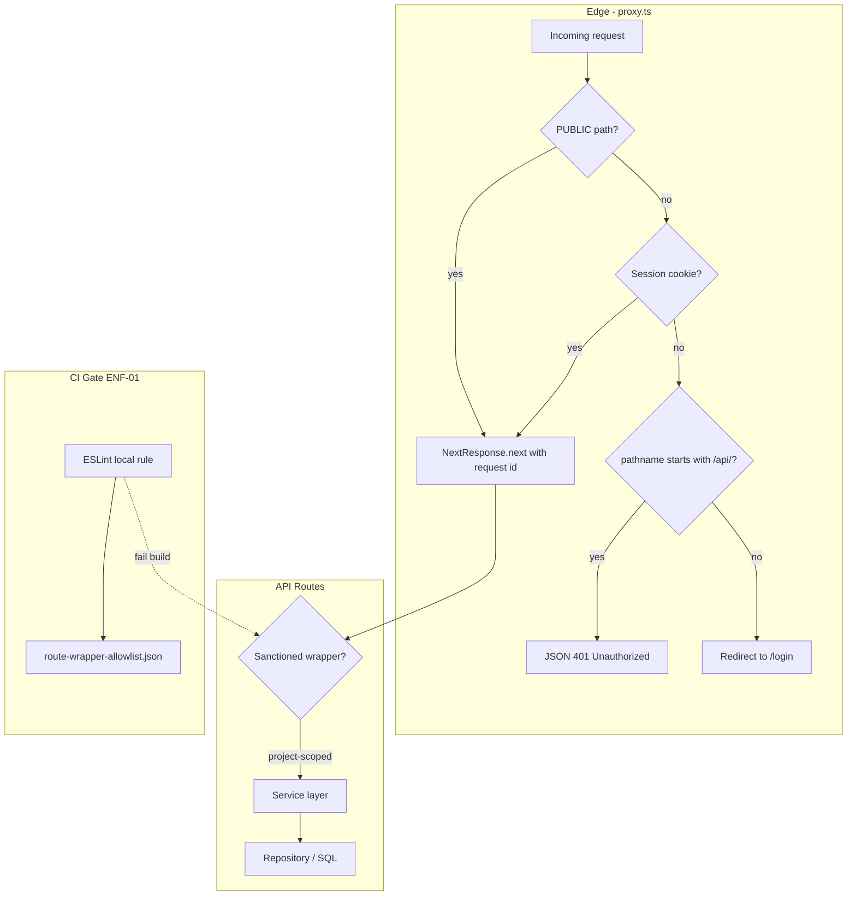

# Phase 20: API Contract & Leftover Routes - Research

**Researched:** 2026-08-28
**Domain:** Next.js 16 proxy auth contract, route-layer enforcement, service extraction for leftover v1 routes
**Confidence:** HIGH

## Summary

Phase 20 closes four v2.1 hardening gaps on the existing Next.js 16 / Vitest 4 stack. The highest-impact change is **`proxy.ts`**: today an unauthenticated request to any non-`PUBLIC` path—including `/api/*`—gets an HTML redirect to `/login` (lines 29–33), while `withAuth` already returns JSON `{ error: 'Unauthorized' }` at 401 [VERIFIED: lib/http/with-auth.ts:92]. PROXY-01 branches on `pathname.startsWith('/api/')` before redirecting, reusing the same error string.

JIRA-01 is a small hygiene fix on `app/api/jira/search/route.ts`: remove the debug `console.log` of custom fields (lines 46–53) and guard `req.json()` so malformed bodies return 400 with `{ error: 'Invalid JSON' }`—matching `withAuth`'s JSON parse catch [VERIFIED: lib/http/with-auth.ts:110-118].

ENF-01 adds a **preventive CI gate** for **project-scoped** `route.ts` files whose exported HTTP handlers are not direct calls to sanctioned wrappers. Current project-scoped routes under `app/api/projects/[id]/**`, `app/api/export/**/[id]/**`, and `app/api/programs/[id]/**` already comply; the gate stops regressions. D-23 carve-outs (`operations/**`, `/api/admin/companies`) and public endpoints live in an **explicit allowlist file**, not comment conventions.

THIN-01 extracts **eight operations routes**, **five admin routes** (excluding users, which already uses `users.service`), and **`/api/config`** from direct repository imports into new or extended service modules—preserving D-23 session+tenant vs platform break-glass semantics (no `withCpmo`/`withRole` on carved-out routes). Import-mapping routes (`import-mapping`, `bug-import-mapping`, `jira/sync-mappings`, `jira/jql-presets`) already call services and need verification only.

**Primary recommendation:** Ship four focused waves—(1) proxy JSON 401 + test, (2) Jira search hygiene + test, (3) ESLint local rule + allowlist + wire `npm run lint` into CI, (4) service extraction for ops/admin/config with route tests updated to mock services not repos.

## Architectural Responsibility Map

| Capability | Primary Tier | Secondary Tier | Rationale |
|------------|-------------|----------------|-----------|
| Unauthenticated API vs page response (PROXY-01) | Frontend Server (`proxy.ts`) | — | Runs before route handlers; must decide redirect vs JSON at the edge |
| Jira search body validation (JIRA-01) | API / Backend (`app/api/jira/search`) | Integrations client | Route owns HTTP 400; Jira client unchanged |
| Wrapper enforcement (ENF-01) | Build / CI (`eslint.config.mjs`) | — | Static AST gate; not runtime |
| Ops/admin/config thinning (THIN-01) | API routes → Services → Repositories | — | Business logic and tenant scoping move to service tier; repos stay SQL-only |
| Session resolution in carved-out routes | API routes (inline `getSessionFromRequest`) | Services (actor passed in) | D-23 keeps break-glass routes off product role wrappers |

<user_constraints>
## User Constraints (from CONTEXT.md)

### Locked Decisions

#### PROXY-01 JSON vs redirect
- Detect API by pathname prefix `/api/` (not Accept header). API → JSON 401 `{ error: 'Unauthorized' }`. Pages → existing login redirect.
- Reuse the same error string already used by `withAuth` (`Unauthorized`) so clients and tests stay consistent.
- Cover with a unit/integration test on the proxy matcher (existing `proxy.matcher.test.mjs` analog).

#### JIRA-01 hygiene
- Remove debug `console.log` of Jira issue custom fields from search path.
- Malformed `req.json()` → 400 with existing ValidationError / `{ error: ... }` shape used by other POST APIs — do not invent a new envelope.
- Do not change Jira credential resolution (INTG-08 already shipped).

#### ENF-01 wrapper CI gate
- Ship an ESLint rule (or CI script invoked from `npm run lint` / test workflow) that fails when a project-scoped `app/api/**/route.ts` exports GET/POST/PUT/PATCH/DELETE not wrapped by sanctioned helpers.
- D-23 exemptions are an **explicit allowlist file** (paths), not a comment convention that can drift.
- Do not require wrapping of truly public health endpoints if they are already exempt; list them.

#### THIN-01 leftover routes
- Ops, admin, config, import-mapping routes call **services**, not repositories (same route → service → repo pattern as v1.0).
- Keep D-23: operations/** and `/api/admin/companies` retain session+tenant vs platform break-glass semantics — do not add `withCpmo`/`withRole` where Phase 10 explicitly left them out.
- Reuse existing service/error patterns (`ConflictError`, `ValidationError`, `assertCompanyWrite`).

### Claude's Discretion

- Exact ESLint rule implementation (custom plugin vs `no-restricted-syntax` vs node script).
- How many new service files vs extending existing services.
- Test file placement (`*.test.ts` next to routes).

### Deferred Ideas (OUT OF SCOPE)

None — discussion stayed within phase scope. UI dashboards, module split, Kysely are later phases.
</user_constraints>

<phase_requirements>
## Phase Requirements

| ID | Description | Research Support |
|----|-------------|------------------|
| PROXY-01 | Unauthenticated `/api/*` → JSON 401; pages still redirect | Branch in `proxy.ts` on `isApi`; reuse `'Unauthorized'` string from `withAuth`; extend `proxy.matcher.test.mjs` or add `proxy.test.ts` |
| JIRA-01 | No custom-field logging; malformed JSON → 400 | Delete lines 46–53 in search route; wrap/migrate to `withAuth` schema path or manual try/catch for `{ error: 'Invalid JSON' }` |
| ENF-01 | CI fails on unwrapped project-scoped handlers; D-23 allowlist | Local ESLint rule via `@typescript-eslint/utils`; allowlist file; add `npm run lint` to `.github/workflows/test.yml` |
| THIN-01 | Ops/admin/config/import-mapping through services; D-23 preserved | New `operations.service.ts`, `admin-platform.service.ts` (or split), `settings.service.ts`; 8 ops + 5 admin + 1 config routes; import-mapping already done |
</phase_requirements>

## Project Constraints (from CLAUDE.md)

`CLAUDE.md` is empty in-repo. Constraints inherited from `PROJECT.md` and `AGENTS.md`:

- Stack fixed: Next.js 16.2.4, React 19.2.4, PostgreSQL, Vitest 4 — no framework swap
- Layer pattern: route → service → repository; `@/` imports
- No CASL / second policy engine — extend existing wrappers only
- D-23 carve-out is locked: no product role asserts on `operations/**` or platform `/api/admin/companies`
- Vitest 4 is the gate; capabilities need tests (HYG-03)
- Do not merge origin DATA branch leftover

## Standard Stack

### Core (unchanged — no new runtime deps)

| Library | Version | Purpose | Why Standard |
|---------|---------|---------|--------------|
| next | 16.2.4 | App Router, `proxy.ts` | Project baseline; proxy replaces middleware [CITED: github.com/vercel/next.js/docs proxy] |
| vitest | 4.1.10 | Route + proxy tests | Dual node/jsdom projects already configured [VERIFIED: vitest.config.ts:6-31] |
| zod | ^4.4.3 | Body schemas at route boundaries | Existing pattern in route `schema.ts` files |

### Supporting (new devDependency for ENF-01)

| Library | Version | Purpose | When to Use |
|---------|---------|---------|-------------|
| `@typescript-eslint/utils` | 8.68.0 | Local ESLint rule authoring | ENF-01 AST check for wrapper CallExpression |

### Alternatives Considered

| Instead of | Could Use | Tradeoff |
|------------|-----------|----------|
| Local ESLint plugin | `scripts/check-route-wrappers.ts` (tsx AST walk) | Faster to ship but duplicates ESLint in CI; use only if flat-config plugin wiring blocks |
| `no-restricted-syntax` | Custom rule | Cannot reliably detect `export const GET = withProjectAccess(...)` vs raw handlers |
| Middleware migration | Keep `proxy.ts` | Next 16 deprecates `middleware.ts` for new work; repo already on proxy |

**Installation (ENF-01 only):**
```bash
npm install -D @typescript-eslint/utils@8.68.0
```

**Version verification:**
```bash
npm view @typescript-eslint/utils version  # 8.68.0
npm view eslint version                    # 10.9.1
```

## Package Legitimacy Audit

| Package | Registry | Age | Downloads | Source Repo | Verdict | Disposition |
|---------|----------|-----|-----------|-------------|---------|-------------|
| `@typescript-eslint/utils` | npm | current | ~158M/wk | github.com/typescript-eslint/typescript-eslint | SUS (too-new signal) | Approved — official typescript-eslint monorepo; seam flagged due to publish date only |

**Packages removed due to SLOP verdict:** none
**Packages flagged as suspicious [SUS]:** `@typescript-eslint/utils` — official package; planner may skip `checkpoint:human-verify` given typescript-eslint org provenance

## Architecture Patterns

### System Architecture Diagram



### THIN-01 Route Inventory (repo-direct today)

| Area | Route files | Repo import | Target service | D-23 note |
|------|-------------|-------------|----------------|-----------|
| Operations | 8 under `app/api/operations/systems/**` | `@/lib/repositories/operations.repo` | `lib/services/operations.service.ts` (new) | Keep inline session check; no `withCpmo` |
| Admin companies | `app/api/admin/companies/route.ts` | `@/lib/repositories/admin.repo` | `lib/services/admin-platform.service.ts` | Platform break-glass `requireAdmin`; no CPMO |
| Admin demo-requests | `app/api/admin/demo-requests/route.ts` | `admin.repo` | same service module | Platform admin only |
| Admin resource-audit | `app/api/admin/resource-audit/route.ts` | `admin.repo` | same service module | Platform admin only |
| Admin jira-config | `app/api/admin/jira-config/[companyId]/route.ts` | `jira-config.repo` | `lib/services/jira-config.service.ts` or admin-platform | Platform admin |
| Admin rag-config | `app/api/admin/rag-config/[companyId]/route.ts` | `rag-config.repo` | extend config service | Platform admin |
| Config | `app/api/config/route.ts` | `@/lib/repositories/settings.repo` | `lib/services/settings.service.ts` (new) | `withAuth` + in-handler `is_admin` for POST |
| Import-mapping | 4 routes + jira presets/sync | Already services | Verify only | Product routes use `withAuth` + `assertCompanyWrite` |

**Already through services (no THIN-01 code move):**
- `import-mapping`, `bug-import-mapping` → `import-mapping.service.ts`
- `jira/sync-mappings`, `jira/jql-presets` → `jira-mapping.service.ts`
- `admin/users` → `users.service.ts` + `withCpmo`

### Pattern 1: PROXY-01 conditional 401

**What:** When no session and not PUBLIC, return JSON for API paths, redirect for pages.
**When to use:** All unauthenticated non-public requests hitting the proxy matcher.
**Example:**
```typescript
// Source: Next.js proxy docs + existing proxy.ts structure
if (!session?.value) {
  if (pathname === '/') {
    return NextResponse.redirect(new URL('/landing', req.url));
  }
  if (isApi) {
    return NextResponse.json({ error: 'Unauthorized' }, { status: 401 });
  }
  const url = new URL('/login', req.url);
  url.searchParams.set('from', pathname);
  return NextResponse.redirect(url);
}
```

**PUBLIC allowlist (verbatim):** `['/login', '/landing', '/api/auth/', '/api/health', '/api/demo-requests']` [VERIFIED: proxy.ts:4]

### Pattern 2: ENF-01 project-scoped wrapper gate

**What:** ESLint rule fires on `ExportNamedDeclaration` where exported identifier is `GET|POST|PUT|PATCH|DELETE` and initializer is NOT a direct `CallExpression` to a sanctioned wrapper.
**Project-scoped globs (recommended):**
- `app/api/projects/[id]/**/route.ts`
- `app/api/export/**/[id]/**/route.ts`
- `app/api/programs/[id]/**/route.ts`
- `app/api/import/resource-plan/[id]/route.ts`

**Sanctioned wrappers:** `withAuth`, `withProjectAccess`, `withProgramAccess`, `withCpmo`, `withRole` [VERIFIED: lib/http/with-auth.ts:83, lib/http/with-project-access.ts:30, lib/http/with-program-access.ts (exists), lib/http/with-role.ts:12-33]

**Explicit allowlist file (recommended path):** `eslint/route-wrapper-allowlist.json` — array of posix paths exempt from the rule (public + D-23 + any documented health/demo routes).

**Minimum allowlist entries:**
- `app/api/health/route.ts` — unauthenticated GET [VERIFIED: app/api/health/route.ts:3-5]
- All of `app/api/operations/**/route.ts` (D-23)
- `app/api/admin/companies/route.ts` (D-23 platform break-glass)

**Example rule skeleton:**
```typescript
// Source: typescript-eslint Custom Rules docs
import { ESLintUtils } from '@typescript-eslint/utils';

const createRule = ESLintUtils.RuleCreator(
  name => `https://github.com/your-org/pm-tool-b/blob/master/eslint/rules/${name}.ts`,
);

const WRAPPERS = new Set([
  'withAuth', 'withProjectAccess', 'withProgramAccess', 'withCpmo', 'withRole',
]);
const METHODS = new Set(['GET', 'POST', 'PUT', 'PATCH', 'DELETE']);

export const requireAuthWrapper = createRule({
  name: 'require-auth-wrapper',
  meta: { type: 'problem', docs: { description: '...' }, schema: [], messages: { unwrapped: '...' } },
  defaultOptions: [],
  create(context) {
    return {
      ExportNamedDeclaration(node) {
        if (node.declaration?.type !== 'VariableDeclaration') return;
        for (const decl of node.declaration.declarations) {
          if (decl.id.type !== 'Identifier' || !METHODS.has(decl.id.name)) continue;
          const init = decl.init;
          const ok =
            init?.type === 'CallExpression' &&
            ((init.callee.type === 'Identifier' && WRAPPERS.has(init.callee.name)) ||
             (init.callee.type === 'MemberExpression' /* re-export edge case */));
          if (!ok) context.report({ node: decl, messageId: 'unwrapped' });
        }
      },
    };
  },
});
```

Register in `eslint.config.mjs` with `files: ['app/api/projects/[id]/**/route.ts', ...]` and `ignores` driven by allowlist.

### Pattern 3: THIN-01 operations service (D-23 preserved)

**What:** Route keeps `getSessionFromRequest` + 401; passes `SessionUser` or `AccessActor` into service; service calls repo.
**When to use:** All `operations/**` routes — do NOT add `withCpmo`/`withRole`.
**Example (follows existing ops route shape):**
```typescript
// Route stays thin — session gate unchanged from app/api/operations/systems/route.ts
export async function GET(req: NextRequest) {
  const user = await getSessionFromRequest(req);
  if (!user) return NextResponse.json({ error: 'Unauthorized' }, { status: 401 });
  return NextResponse.json(await listOperationsSystems(user));
}

// lib/services/operations.service.ts
export async function listOperationsSystems(user: SessionUser) {
  return listOperationsSystemsRepo(user.company_id, Boolean(user.is_admin));
}
```

### Pattern 4: JIRA-01 — migrate search to withAuth

**What:** Replace hand-rolled session check + unguarded `req.json()` with `withAuth` + schema (or manual JSON try/catch).
**Recommended:** `export const POST = withAuth(handler, { schema: jiraSearchSchema })` so malformed JSON automatically returns `{ error: 'Invalid JSON' }` [VERIFIED: lib/http/with-auth.ts:110-118].
**Preserve:** Null-company 401 with Vietnamese Jira-not-configured message (behavior freeze from lines 9–16) — implement as early return inside handler after `withAuth` passes session.

### Anti-Patterns to Avoid

- **Redirect API callers to `/login`:** Breaks JSON clients and fetch error handling; PROXY-01 exists to fix this.
- **Adding `withCpmo` to operations or platform companies routes:** Violates locked D-23 semantics.
- **Comment-based ENF-01 exemptions:** Drift-prone; use allowlist file per CONTEXT.
- **Service extraction that moves auth checks:** THIN-01 moves repo calls, not D-23 session/tenant gates.
- **New error envelope for Jira 400:** Use `{ error: 'Invalid JSON' }` or `ValidationError` mapping — not a new `{ code, details }` shape.

## Don't Hand-Roll

| Problem | Don't Build | Use Instead | Why |
|---------|-------------|-------------|-----|
| Auth wrapper AST enforcement | Ad-hoc grep for `export async function GET` | Local ESLint rule + allowlist | Handles `export const GET = withAuth(...)`, re-exports, and CI integration |
| JSON 401 at edge | Per-route duplicate session checks only | `proxy.ts` branch + existing wrappers | Single contract for all `/api/*` before handlers run |
| Malformed JSON handling | Custom parse middleware | `withAuth` JSON catch or `serviceErrorResponse(ValidationError)` | Already standardized across 60+ wrapped routes |
| Platform admin auth | New policy engine | Existing `requireAdmin` / `is_admin` in handler | D-23 locked break-glass model |
| Operations business rules in routes | Inline SQL | `operations.service.ts` → `operations.repo` | THIN-01 + testability |

**Key insight:** Phase 20 is mostly **wiring and extraction** on patterns that already exist (`withAuth`, service modules, proxy matcher test). The risk is semantic drift on D-23 routes, not missing libraries.

## Common Pitfalls

### Pitfall 1: PROXY-01 breaks PUBLIC API paths
**What goes wrong:** `/api/auth/login` or `/api/health` return 401 JSON instead of working anonymously.
**Why it happens:** JSON 401 branch runs before PUBLIC check.
**How to avoid:** Keep `PUBLIC.some(p => pathname.startsWith(p))` **before** the unauthenticated branch [VERIFIED: proxy.ts:27-34 order].
**Warning signs:** Auth login tests fail; health check returns 401.

### Pitfall 2: D-23 over-gating during THIN-01
**What goes wrong:** Operations routes get `withCpmo` or `assertCompanyWrite`; platform ops lose break-glass access.
**Why it happens:** Copying Phase 10 product-route patterns onto carved-out routes.
**How to avoid:** Service extraction only; preserve `getSessionFromRequest` + `is_admin`/`company_id` repo predicates from existing route code.
**Warning signs:** Admin cannot list all companies; ops systems hidden cross-tenant incorrectly.

### Pitfall 3: ENF-01 scope creep to portfolio routes
**What goes wrong:** Lint fails on 20+ portfolio routes still using raw `export async function GET` with manual session checks.
**Why it happens:** STACK.md mentions all `app/api/**`; CONTEXT locks **project-scoped** only.
**How to avoid:** Limit rule `files` globs to `[id]` project/program/export paths; portfolio thinning is out of ENF-01 scope.
**Warning signs:** Planner tasks to wrap `/api/portfolio/report` in Phase 20.

### Pitfall 4: JIRA-01 changes credential resolution
**What goes wrong:** Accidental refactor of `resolveJiraCredentials` breaks INTG-08 cutover.
**How to avoid:** Delete log block only; wrap JSON parse; leave creds path untouched.
**Warning signs:** Diff touches `lib/integrations/credentials.ts`.

### Pitfall 5: CI lint not wired
**What goes wrong:** ENF-01 rule exists locally but CI only runs `npm test`.
**Why it happens:** `.github/workflows/test.yml` has no lint step today [VERIFIED: test.yml steps are checkout, migrate, test only].
**How to avoid:** Add `npm run lint` after `npm ci` in test workflow.
**Warning signs:** Unwrapped route merges without failure.

## Code Examples

### PROXY-01 test (extend existing matcher test pattern)

```javascript
// Source: proxy.matcher.test.mjs pattern — add behavioral tests in proxy.test.mjs or vitest
import assert from 'node:assert/strict';
import { NextRequest } from 'next/server';
import { proxy } from './proxy.ts';

const req = (path) => new NextRequest(`http://localhost${path}`);

// No session cookie
const apiRes = proxy(req('/api/projects'));
assert.equal(apiRes.status, 401);
assert.equal(await apiRes.json(), { error: 'Unauthorized' });

const pageRes = proxy(req('/projects'));
assert.equal(pageRes.status, 307); // or 302 depending on redirect
assert.ok(pageRes.headers.get('location')?.includes('/login'));
```

### JIRA-01 malformed JSON

```typescript
// Source: withAuth JSON catch — lib/http/with-auth.ts:110-118
export const POST = withAuth(async (req, { user, body }) => {
  // ... existing jql validation and searchIssues call
}, { schema: jiraSearchSchema }); // safeParse failures → 400 via badRequest or first issue message
// Uncaught SyntaxError from req.json → { error: 'Invalid JSON' } at 400
```

## State of the Art

| Old Approach | Current Approach | When Changed | Impact |
|--------------|------------------|--------------|--------|
| `middleware.ts` | Root `proxy.ts` | Next.js 16 | Single edge file; matcher test already guards static assets |
| HTML 307 for all unauthenticated | JSON 401 for `/api/*` | Phase 20 (PROXY-01) | API clients get parseable errors |
| Comment D-23 exemptions | Allowlist JSON file | Phase 20 (ENF-01) | CI-enforced, reviewable |
| Ops/admin routes → repo | Route → service → repo | Phase 20 (THIN-01) | Aligns leftover v1 routes with v2 pattern |

**Deprecated/outdated:**
- Relying on Accept header for API detection — CONTEXT locks pathname prefix `/api/` only.

## Assumptions Log

| # | Claim | Section | Risk if Wrong |
|---|-------|---------|---------------|
| A1 | ENF-01 scope is project-scoped `[id]` routes only, not all `app/api/**` | ENF-01 | Lint scope wrong; massive unrelated churn |
| A2 | `@typescript-eslint/utils@8.68.0` matches `eslint-config-next@16.2.4` peer range | Standard Stack | Plugin load failure in CI |
| A3 | Portfolio/company routes with raw handlers are intentionally out of ENF-01 | ENF-01 | User expected broader gate |
| A4 | `proxy.ts` is the sole edge auth file (no `middleware.ts`) | PROXY-01 | Miss duplicate auth logic |

## Open Questions

1. **Single vs split admin service modules**
   - What we know: 5 admin routes touch `admin.repo`, `jira-config.repo`, `rag-config.repo`
   - What's unclear: One `admin-platform.service.ts` vs `jira-config.service.ts` + `settings.service.ts`
   - Recommendation: Split by domain (`settings.service`, `operations.service`, `admin-platform.service` for companies/demo/resource-audit) — matches existing `users.service` granularity

2. **ESLint vs standalone script for ENF-01**
   - What we know: CONTEXT gives discretion; STACK prefers ESLint
   - Recommendation: Local ESLint plugin primary; keep `scripts/check-route-wrappers.ts` as optional fallback only if plugin wiring fails in CI

## Environment Availability

Step 2.6: SKIPPED for runtime services — phase is code/config-only. CI already provides Node 22 + Postgres 17 [VERIFIED: .github/workflows/test.yml:8-36].

| Dependency | Required By | Available | Version | Fallback |
|------------|------------|-----------|---------|----------|
| Node.js | build, test, lint | ✓ (CI) | 22 | — |
| PostgreSQL | migrate + tests | ✓ (CI service) | 17 | — |
| eslint | ENF-01 | ✓ (devDep) | ^9 / 10.9.1 | — |
| `@typescript-eslint/utils` | ENF-01 rule | ✗ (not installed) | — | Install 8.68.0 in Wave 0 |

**Missing dependencies with no fallback:**
- `@typescript-eslint/utils` — required for ENF-01 local rule (install in first ENF plan task)

## Validation Architecture

### Test Framework

| Property | Value |
|----------|-------|
| Framework | Vitest 4.1.10 |
| Config file | `vitest.config.ts` |
| Quick run command | `npm test` |
| Full suite command | `npm test` (single suite; ~84 route test files) |
| Matcher smoke | `node proxy.matcher.test.mjs` |

### Phase Requirements → Test Map

| Req ID | Behavior | Test Type | Automated Command | File Exists? |
|--------|----------|-----------|-------------------|-------------|
| PROXY-01 | Unauthenticated `/api/*` → JSON 401 | unit | `npm test -- proxy` or `node proxy.test.mjs` | ❌ Wave 0 |
| PROXY-01 | Matcher still bypasses static assets | unit | `node proxy.matcher.test.mjs` | ✅ |
| PROXY-01 | Unauthenticated page → login redirect | unit | same proxy test file | ❌ Wave 0 |
| JIRA-01 | No console.log of custom fields | unit | `npm test -- app/api/jira/search/route.test.ts` | ❌ Wave 0 |
| JIRA-01 | Malformed JSON → 400 `{ error: 'Invalid JSON' }` | unit | same | ❌ Wave 0 |
| ENF-01 | Unwrapped project handler fails lint | lint | `npm run lint` | ❌ Wave 0 (rule + CI step) |
| ENF-01 | Allowlisted D-23 path passes lint | lint | `npm run lint` | ❌ Wave 0 |
| THIN-01 | Ops route calls service not repo | unit | `npm test -- app/api/operations` | ❌ Wave 0 (create route tests) |
| THIN-01 | Admin companies still break-glass | unit/access | extend or add admin route tests | partial (`resource-audit` has access test) |
| THIN-01 | Config GET/POST behavior unchanged | unit | `npm test -- app/api/config/route.test.ts` | ✅ (update mocks to service) |

### Sampling Rate

- **Per task commit:** `npm test` (targeted file path when possible)
- **Per wave merge:** `npm test` + `node proxy.matcher.test.mjs`
- **Phase gate:** `npm run lint && npm test && npm run migrate -- --check` (if migrate check script exists)

### Wave 0 Gaps

- [ ] `proxy.test.mjs` or `proxy.test.ts` — PROXY-01 JSON 401 + page redirect
- [ ] `app/api/jira/search/route.test.ts` — JIRA-01
- [ ] `eslint/rules/require-auth-wrapper.ts` + `eslint/route-wrapper-allowlist.json` — ENF-01
- [ ] Wire `npm run lint` into `.github/workflows/test.yml`
- [ ] `lib/services/operations.service.ts` + route tests mocking service
- [ ] `lib/services/settings.service.ts` — update `config/route.test.ts` mocks
- [ ] `lib/services/admin-platform.service.ts` (or equivalent) + admin route tests
- [ ] DevDependency: `@typescript-eslint/utils@8.68.0`

## Security Domain

### Applicable ASVS Categories

| ASVS Category | Applies | Standard Control |
|---------------|---------|-----------------|
| V2 Authentication | yes | Session cookie + proxy edge gate; JSON 401 for API |
| V3 Session Management | no (unchanged) | Existing DB sessions |
| V4 Access Control | yes | Sanctioned wrappers on project-scoped routes; D-23 carve-out documented in allowlist |
| V5 Input Validation | yes | Zod at boundaries; malformed JSON → 400 |
| V6 Cryptography | no | No change |

### Known Threat Patterns

| Pattern | STRIDE | Standard Mitigation |
|---------|--------|---------------------|
| Unwrapped project route ships without access assert | Elevation of privilege | ENF-01 ESLint + allowlist |
| API client follows HTML login redirect | Information disclosure / broken auth contract | PROXY-01 JSON 401 |
| D-23 route accidentally product-gated | Denial of service to platform ops | THIN-01 preserves session+tenant; allowlist tests |
| Debug log leaks Jira custom field values | Information disclosure | JIRA-01 remove console.log |
| Malformed JSON uncaught exception | Tampering / availability | JIRA-01 400 response |

## Sources

### Primary (HIGH confidence — verified in repo this session)
- `proxy.ts:4-37` — PUBLIC list, redirect behavior, matcher
- `lib/http/with-auth.ts:83-118` — `{ error: 'Unauthorized' }`, Invalid JSON 400
- `lib/http/with-role.ts:12-33` — `withCpmo`, `withRole`
- `app/api/jira/search/route.ts:46-53` — debug log to remove
- `app/api/operations/systems/route.ts:1-29` — repo-direct pattern
- `app/api/admin/companies/route.ts:1-53` — D-23 break-glass pattern
- `app/api/config/route.ts:1-36` — settings.repo direct
- `vitest.config.ts`, `.github/workflows/test.yml`, `eslint.config.mjs`

### Secondary (MEDIUM confidence)
- [Context7 /vercel/next.js/v16.2.9] — proxy JSON 401 canonical pattern
- [Context7 typescript-eslint Custom Rules] — `ESLintUtils.RuleCreator` for local rule
- `.planning/research/STACK.md` — ENF-01 stack recommendation (cross-checked against CONTEXT locked scope)

### Tertiary (LOW — marked ASSUMED in Assumptions Log)
- Exact allowlist completeness for every public route beyond health/auth/demo

## Metadata

**Confidence breakdown:**
- Standard stack: HIGH — brownfield, versions verified via npm view
- Architecture: HIGH — codebase scouted; route inventories grep-verified
- Pitfalls: HIGH — D-23 documented across Phase 10 artifacts and PITFALLS.md

**Research date:** 2026-08-28
**Valid until:** 2026-09-28 (stable stack; ESLint rule API stable within major 8.x)
