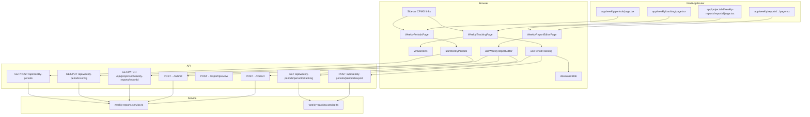

# Phase 22: Weekly Workflow Surfaces - Research

**Researched:** 2026-08-28
**Domain:** Next.js 16 client UI consuming Phase 13/14 weekly APIs; in-repo row virtualization
**Confidence:** HIGH

## Summary

Phase 22 is the **largest v2.1 UI consumer** after dashboards: three CPMO surfaces (period config/list, tracking/export) and one PM report editor, all wired to **already-shipped** APIs from Phases 13 and 14. No backend rewrites, **no new npm packages** (D-08/D-09 lock in-repo `VirtualRows` instead of `@tanstack/react-virtual`).

Implementation follows Phase 21 exactly: pages under `modules/weekly/ui/` with thin `'use client'` re-exports in `app/`. CPMO gets Sidebar links at `/weekly/periods` and `/weekly/tracking`. PMs reach the editor via **existing** Phase 16 deep links (`href: `/projects/${s.project_id}/weekly-reports/${s.report_id}`` from `getPmDashboard`) — the planner must add a thin re-export at `app/projects/[id]/weekly-reports/[reportId]/page.tsx` (and optionally mirror at `/weekly/reports/[projectId]/[reportId]` per D-01).

The API contract is stable and route-tested. UI work is fetch-driven client pages (`Sidebar` + `main`, shadcn `Card`/`Table`/`Button`, `sonner` toasts, mocked `fetch` in Vitest jsdom). **`vitest.config.ts` already includes `modules/**`** (fixed in Phase 21 Wave 0) — component tests will run in CI without config changes.

Critical planner notes:
1. **Honor Phase 16 hrefs** — do not change `getPmDashboard` links; add page re-export at `/projects/:id/weekly-reports/:reportId`.
2. **RAG enum is Title Case** — `'Green' | 'Amber' | 'Red' | 'Not applicable'` [VERIFIED: app/api/projects/[id]/weekly-reports/[reportId]/schema.ts:3-4].
3. **409 on PATCH of submitted snapshot** — show toast, do not retry [VERIFIED: route.test.ts:123-136].
4. **Submit validation** returns `{ error, fields: string[] }` at 400 — surface on form [VERIFIED: lib/api-errors.ts:56-57].
5. **Export** POST returns binary with `Content-Disposition`; reuse `downloadBlob` from dashboards module [VERIFIED: modules/dashboards/ui/shared/downloadBlob.ts:1-8].

**Primary recommendation:** Build `modules/weekly/ui/` with hooks mirroring Phase 21 (`useWeeklyPeriods`, `usePeriodTracking`, `useWeeklyReportEditor`), add CPMO Sidebar links, implement in-repo `VirtualRows` for tracking grid with a component test proving <150 DOM rows for 150 mocked items, and wire PM deep-link re-export before any alternate URL.

<user_constraints>
## User Constraints (from CONTEXT.md)

### Layout and routes
- **D-01:** Implement under `modules/weekly/ui/` with thin App Router re-exports. URLs: `/weekly/periods` (CPMO config + period list/create), `/weekly/tracking` (CPMO tracking + export), `/weekly/reports/[projectId]/[reportId]` (PM draft/submit/correct). Do not overwrite v1 `/reports` or `/report`.
- **D-02:** Sidebar: "Weekly periods" and "Weekly tracking" for `cpmo`; PM reaches reports via dashboard deep links already shipped (`/projects/:id/weekly-reports/:id` may be a thin re-export to the module editor if that path is what Phase 16 hrefs use — honor existing `href` strings from `getPmDashboard` rather than inventing a second URL).
- **D-03:** Consume existing APIs only. No new weekly endpoints.

### Periods (PERD-04)
- **D-04:** CPMO page lists periods, creates a period (existing POST), edits company weekly config (existing config route). Viewer 403 in-page. Match Copywriting density from Phase 21.

### PM report (WKRP-07)
- **D-05:** Editor loads GET report, PATCH draft fields (highlights, completed_work, next_week_goals, nearest_milestone, raid_dependency, leadership_support, this_week_rag). Submit and Correct buttons call existing POST submit/correct. Prev-week RAG read-only. 409 on PATCH of submitted snapshot shown as toast.
- **D-06:** Do not invent a second RAID editor; RAID validation errors from submit are shown on the form.

### Tracking and export (CPMO-05)
- **D-07:** Tracking page GET tracking payload; export POST existing pack endpoint; blob download reuse `modules/dashboards/ui/shared/downloadBlob.ts` if it stays generic, else a weekly copy in `modules/weekly/ui/shared/`.

### Virtualization (PERF-01)
- **D-08:** Do **not** add an npm package. Implement a small in-repo windowed table (`VirtualRows`) with fixed row height + overflow container. Apply to CPMO tracking grid first; reuse on any other list on these pages that can exceed ~100 rows.
- **D-09:** Prove with a component test that renders 150 mocked rows without mounting all 150 DOM rows (query row count in the window).

### Claude's Discretion
- Exact field layout of the PM editor (sections vs single column).
- Whether `/projects/:id/weekly-reports/:id` is an additional re-export alias of the module editor (required if Phase 16 hrefs point there).
- Empty/loading copy (English, match Phase 21).

### Deferred Ideas (OUT OF SCOPE)
- Repo-wide module split — Phase 24
- Document/audit UI — Phase 23
</user_constraints>

<phase_requirements>
## Phase Requirements

| ID | Description | Research Support |
|----|-------------|------------------|
| PERD-04 | CPMO can create and manage weekly periods in the UI | GET/POST `/api/weekly-periods`, GET/PUT `/api/weekly-periods/config` verified; periods page + config form pattern below |
| WKRP-07 | PM with write access can draft, submit, and correct a weekly report in the UI | GET/PATCH `/api/projects/[id]/weekly-reports/[reportId]`, POST submit/correct routes + draft schema verified; editor hook pattern below |
| CPMO-05 | CPMO can track period submissions and export consolidated pack from the UI | GET tracking + POST export/preview verified; tracking grid + selection + blob download pattern below |
| PERF-01 | Large grids virtualize rows past ~100 | In-repo `VirtualRows` pattern + component test contract (D-08, D-09) |
</phase_requirements>

## Project Constraints (from CLAUDE.md)

- **Stack:** Next.js 16.2.4, React 19.2.4, TypeScript strict, PostgreSQL via `pg` — no framework swap [VERIFIED: package.json:25-30]
- **Layers:** Route → service → repository; tenant isolation mandatory (APIs already wrapped)
- **Testing:** Vitest 4 is the gate; capabilities need tests before done [VERIFIED: package.json:52, vitest.config.ts]
- **Import convention:** `@/` alias maps to repo root [VERIFIED: vitest.config.ts:4]
- **Deployment:** Preserve `output: 'standalone'` and `serverExternalPackages` for exceljs/pptxgenjs
- **No CASL / second policy engine** — three fixed roles via existing wrappers (`withCpmo`, `withProjectAccess`)
- **Module layout (v2.1):** New v2 UI lands in `modules/<feature>/ui/` first; Phase 24 completes repo-wide split
- **UI patterns:** `'use client'` pages, `fetch` + `sonner` toasts, shadcn components, Sidebar shell

## Architectural Responsibility Map

| Capability | Primary Tier | Secondary Tier | Rationale |
|------------|-------------|----------------|-----------|
| Period list/create, company weekly config | API / Backend | Browser (forms) | `withCpmo` routes already exist; UI POSTs/PUTs |
| Tracking counts, filters, row assembly | API / Backend | — | `getPeriodTracking` in `weekly-tracking.service.ts` |
| Consolidated export generation (xlsx/docx/pptx) | API / Backend | Browser (blob download) | Server-side `generateConsolidatedWeekly`; UI POSTs + `downloadBlob` |
| PM draft save, submit, correction | API / Backend | Browser (form state) | `weekly-reports.service.ts`; PATCH/POST routes |
| RAID master writes on submit | API / Backend | — | Submit transaction in service; UI only surfaces validation `fields` |
| Period config UI, tracking grid, PM editor | Browser / Client | — | Interactive forms/tables; no SSR this phase (PERF-02 deferred) |
| Row virtualization (DOM windowing) | Browser / Client | — | In-repo `VirtualRows`; no server involvement |
| Role-gated Sidebar links | Browser / Client | — | Hide links by `roles`; authz truth is API 403 |
| PM dashboard deep-link href assembly | API / Backend | — | Already in `getPmDashboard`; UI must not change href shape |

## Standard Stack

### Core (already installed — no new packages)

| Library | Version | Purpose | Why Standard |
|---------|---------|---------|--------------|
| next | 16.2.4 | App Router pages + API proxy | Project stack [VERIFIED: package.json:25] |
| react / react-dom | 19.2.4 | Client pages | Project stack [VERIFIED: package.json:29-30] |
| sonner | ^2.0.7 | Error/success toasts (409 PATCH, submit validation) | Phase 21 pattern |
| lucide-react | ^1.14.0 | Sidebar + page icons | Sidebar convention |
| shadcn / @base-ui/react | ^1.4.1 | Card, Button, Table, Select, Dialog | `components/ui/*` |
| vitest + @testing-library/react | 4.1.10 / 16.3.2 | Component/hook tests | jsdom project includes `modules/**` [VERIFIED: vitest.config.ts:23-26] |
| zod | ^4.4.3 | Request body validation (API) | Already on weekly routes |

### Supporting (server-side only — UI must not import)

| Library | Version | Purpose | When to Use |
|---------|---------|---------|-------------|
| exceljs | ^4.4.0 | Consolidated xlsx export | API `exportConsolidatedWeekly` only |
| docx | ^9.6.1 | Consolidated docx export | API only |
| pptxgenjs | ^4.0.1 | Consolidated pptx export | API only |

### Alternatives Considered

| Instead of | Could Use | Tradeoff |
|------------|-----------|----------|
| In-repo `VirtualRows` | `@tanstack/react-virtual` | **Forbidden** — D-08 locks no new npm; project research docs mention TanStack but phase CONTEXT overrides |
| `/weekly/reports/...` only | `/projects/.../weekly-reports/...` only | **Must support both** — Phase 16 hrefs use project path; D-01 also defines module URL |
| Client-side pack generation | POST export + blob | **Forbidden** — export is server-side Phase 14 |
| Full RAID CRUD UI | Text fields + submit validation | **Required** — D-06 forbids second RAID editor |

**Installation:** None — phase installs zero new packages (D-08).

## Package Legitimacy Audit

> Phase constraint: **no new npm packages.** Existing dependencies only.

| Package | Registry | Verdict | Disposition |
|---------|----------|---------|-------------|
| *(none to install)* | — | — | N/A |

**Packages removed due to [SLOP] verdict:** none
**Packages flagged as suspicious [SUS]:** none

## Architecture Patterns

### System Architecture Diagram



### Recommended Project Structure

```
modules/weekly/ui/
├── periods/
│   ├── WeeklyPeriodsPage.tsx
│   ├── useWeeklyPeriods.ts
│   ├── WeeklyConfigForm.tsx
│   ├── WeeklyPeriodList.tsx
│   └── WeeklyPeriodsPage.component.test.tsx
├── tracking/
│   ├── WeeklyTrackingPage.tsx
│   ├── usePeriodTracking.ts
│   ├── TrackingCountsBar.tsx
│   ├── TrackingFiltersBar.tsx
│   ├── TrackingGrid.tsx              # wraps VirtualRows
│   ├── ExportToolbar.tsx             # selection + format + POST export
│   └── WeeklyTrackingPage.component.test.tsx
├── report/
│   ├── WeeklyReportEditorPage.tsx
│   ├── useWeeklyReportEditor.ts
│   ├── WeeklyReportForm.tsx
│   └── WeeklyReportEditorPage.component.test.tsx
├── shared/
│   ├── VirtualRows.tsx
│   ├── VirtualRows.component.test.tsx
│   ├── types.ts
│   └── weekly.fixture.ts
app/weekly/periods/page.tsx
app/weekly/tracking/page.tsx
app/weekly/reports/[projectId]/[reportId]/page.tsx
app/projects/[id]/weekly-reports/[reportId]/page.tsx   # Phase 16 href re-export
```

### Pattern 1: Thin App Router re-export (D-01)

**What:** One-line `'use client'` page delegating to module default export.
**When to use:** Every new weekly surface URL.
**Example:**

```typescript
'use client';
export { default } from '@/modules/weekly/ui/periods/WeeklyPeriodsPage';
```

Source: Phase 21 [VERIFIED: app/dashboards/portfolio/page.tsx:1-3]

### Pattern 2: Fetch hook with 401/403 in-page (D-04, D-09)

**What:** Client hook loads JSON, maps HTTP status to error state, uses `toast` for mutation failures.
**When to use:** All three weekly hooks.
**Example:**

```typescript
const res = await fetch('/api/weekly-periods');
if (res.status === 401) { setError('unauthorized'); return; }
if (res.status === 403) { setError('forbidden'); return; }
if (!res.ok) { setError('load_failed'); return; }
setData(await res.json());
```

Source: Phase 21 [VERIFIED: modules/dashboards/ui/portfolio/usePortfolioSpecDashboard.ts:26-41]

### Pattern 3: In-repo VirtualRows (D-08, PERF-01)

**What:** Fixed-height row windowing inside a scroll container — only render visible slice + small overscan.
**When to use:** CPMO tracking grid first; period list if >100 periods (unlikely but same component).
**Example:**

```typescript
// Fixed row height contract — tracking grid uses h-10 (40px) rows
const ROW_H = 40;
const OVERSCAN = 3;

function VirtualRows<T>({ items, height, rowHeight, renderRow, rowKey }: Props<T>) {
  const [scrollTop, setScrollTop] = useState(0);
  const start = Math.max(0, Math.floor(scrollTop / rowHeight) - OVERSCAN);
  const visible = Math.ceil(height / rowHeight) + OVERSCAN * 2;
  const end = Math.min(items.length, start + visible);
  const slice = items.slice(start, end);
  const totalH = items.length * rowHeight;

  return (
    <div style={{ height, overflow: 'auto' }} onScroll={(e) => setScrollTop(e.currentTarget.scrollTop)}>
      <div style={{ height: totalH, position: 'relative' }}>
        <div style={{ transform: `translateY(${start * rowHeight}px)` }}>
          {slice.map((item, i) => renderRow(item, start + i))}
        </div>
      </div>
    </div>
  );
}
```

**Test contract (D-09):** Render 150 items in jsdom with container height ~400px and ROW_H=40 → expect `screen.getAllByRole('row')` length ≤ ~15, not 150.

### Pattern 4: Consolidated export blob download (D-07, CPMO-05)

**What:** POST export with JSON body; read `blob()` from 200; pass to shared `downloadBlob`.
**When to use:** Tracking page export toolbar.
**Example:**

```typescript
import { downloadBlob } from '@/modules/dashboards/ui/shared/downloadBlob';

const res = await fetch(`/api/weekly-periods/${periodId}/export`, {
  method: 'POST',
  headers: { 'Content-Type': 'application/json' },
  body: JSON.stringify({ project_ids: selectedIds, format: 'xlsx' }),
});
if (!res.ok) { /* parse JSON error + toast */ return; }
const cd = res.headers.get('Content-Disposition') ?? '';
const match = /filename="([^"]+)"/.exec(cd);
downloadBlob(await res.blob(), match?.[1] ?? 'weekly-export.xlsx');
```

Source: Phase 21 export pattern [VERIFIED: modules/dashboards/ui/portfolio/usePortfolioSpecDashboard.ts:84-100]

### Pattern 5: PM editor submit/correct flow (D-05, WKRP-07)

**What:** Load shell via GET; debounced or explicit-save PATCH for draft fields; POST submit (empty body); POST correct to open correction overlay then PATCH.
**API shapes verified:**

| Action | Method | Path | Body | Success |
|--------|--------|------|------|---------|
| Load | GET | `/api/projects/{id}/weekly-reports/{reportId}` | — | 200 shell JSON |
| Save draft | PATCH | same | `{ highlights?, completed_work?, next_week_goals?, nearest_milestone?, nearest_milestone_id?, raid_dependency?, leadership_support?, this_week_rag? }` | 200 |
| Submit | POST | `.../submit` | empty (`rawBody: true`) | 201 |
| Open correction | POST | `.../correct` | partial draft overlay | 200 |

Draft allowlist [VERIFIED: app/api/projects/[id]/weekly-reports/[reportId]/schema.ts:5-17]:
`highlights`, `completed_work`, `next_week_goals`, `nearest_milestone`, `nearest_milestone_id`, `raid_dependency`, `leadership_support`, `this_week_rag`, `draft_raid_json`

RAG values [VERIFIED: schema.ts:3]: `'Green'`, `'Amber'`, `'Red'`, `'Not applicable'`

Shell fields returned on GET include [VERIFIED: route.test.ts:77-100]: `status`, `correction_open`, `prev_week_rag` (read-only), `display_name`, `iso_week`, `due_at`, all draft columns.

**409 PATCH** when `status === 'submitted' && !correction_open` [VERIFIED: route.test.ts:123-136] → toast "Submitted report cannot be edited — use Correct first."

**Submit validation 400** → `{ error, fields: string[] }` [VERIFIED: lib/api-errors.ts:56-57] → map `fields` to inline form errors (D-06).

### Pattern 6: Sidebar CPMO links (D-02)

**What:** Conditional links after dashboard links, before `NAV_SECONDARY` — same pattern as Phase 21 Spec dashboard.
**Labels:** "Weekly periods" → `/weekly/periods`; "Weekly tracking" → `/weekly/tracking`; visible when `me?.roles?.includes('cpmo')`.

Source: [VERIFIED: components/layout/Sidebar.tsx:161-191]

### Anti-Patterns to Avoid

- **Changing `getPmDashboard` href shape:** Must stay `/projects/${project_id}/weekly-reports/${report_id}` [VERIFIED: lib/services/spec-dashboards.service.ts:213]
- **Adding `@tanstack/react-virtual`:** D-08 forbids; `.planning/research/STACK.md` TanStack guidance is superseded by phase CONTEXT
- **Building RAID CRUD UI:** D-06 — show `raid_dependency` text + submit `fields` errors only
- **Client-side xlsx/docx/pptx:** Export stays server-side Phase 14
- **Touching v1 `/reports` or `/report`:** Phase 13 D-01 parallel surface
- **New weekly API routes:** D-03

## Don't Hand-Roll

| Problem | Don't Build | Use Instead | Why |
|---------|-------------|-------------|-----|
| Row virtualization library | Custom scroll physics / variable-height virtualizer | In-repo fixed-height `VirtualRows` | D-08; variable height adds complexity without phase need |
| Office pack generation | Client-side Excel/Word/PPT | POST `/api/weekly-periods/[periodId]/export` | exceljs/docx/pptxgenjs already server-side |
| RAID master editor | Inline risk/issue forms | Existing project RAID pages + submit validation | D-06; submit writes masters in transaction |
| Period/shell persistence | LocalStorage drafts | PATCH draft API | Server is source of truth; 409 on submitted |
| Authz in UI | Role checks before fetch | API 403 + NAV hide | Phase 21 D-09 pattern |
| ISO week math | Client-side week calculator | POST `{ iso_week: "YYYY-Wnn" }` only | Server validates regex [VERIFIED: app/api/weekly-periods/schema.ts:3-5] |

**Key insight:** Phase 13/14 already encoded weekly business rules in services — UI is a thin consumer; the only novel client code is `VirtualRows`.

## Common Pitfalls

### Pitfall 1: Missing PM deep-link page

**What goes wrong:** PM dashboard links 404 because only `/weekly/reports/...` exists.
**Why it happens:** D-01 module URL vs Phase 16 href mismatch.
**How to avoid:** Ship `app/projects/[id]/weekly-reports/[reportId]/page.tsx` re-exporting module editor [VERIFIED: spec-dashboards.service.ts:213].
**Warning signs:** PM queue href tests pass in API unit tests but manual click fails.

### Pitfall 2: Wrong RAG casing in Select

**What goes wrong:** PATCH 400 validation — server expects `'Green'` not `'green'`.
**Why it happens:** Dashboard fixtures use lowercase rag on projects; weekly schema uses Title Case.
**How to avoid:** Use exact enum from schema.ts in Select options.
**Warning signs:** Draft saves fail silently or toast generic error.

### Pitfall 3: VirtualRows renders all rows

**What goes wrong:** PERF-01 fails at 500+ obligated projects — DOM freeze.
**Why it happens:** Mapping `items.map` inside `<tbody>` without windowing.
**How to avoid:** Wrap tracking rows in `VirtualRows`; component test with 150 items (D-09).
**Warning signs:** Test passes functionally but no row-count assertion.

### Pitfall 4: Exporting ineligible projects

**What goes wrong:** 400 `{ error, fields: [projectId, ...] }` from `assertExportEligible`.
**Why it happens:** Selection includes draft/not_submitted shells.
**How to avoid:** Disable export checkbox for non-`submitted` rows; show toast with ineligible ids.
**Warning signs:** CPMO selects all rows including drafts.

### Pitfall 5: PATCH after submit without Correct

**What goes wrong:** 409 loop confusing PM.
**Why it happens:** Form stays editable when `status === 'submitted'`.
**How to avoid:** Disable fields unless `correction_open`; show Correct button for submitted shells.
**Warning signs:** Toast spam on autosave.

### Pitfall 6: Tracking page without period context

**What goes wrong:** Cannot call tracking API (requires `periodId` path param).
**Why it happens:** `/weekly/tracking` has no period in URL.
**How to avoid:** Period `<Select>` defaulting to latest `iso_week` from GET periods; persist selection in query `?periodId=` (Claude's discretion — recommend query param for shareable CPMO links).

## Code Examples

### Period create (PERD-04)

```typescript
// POST /api/weekly-periods — body schema [VERIFIED: app/api/weekly-periods/schema.ts:3-5]
await fetch('/api/weekly-periods', {
  method: 'POST',
  headers: { 'Content-Type': 'application/json' },
  body: JSON.stringify({ iso_week: '2026-W35' }),
});
// 201 → period row; 409 if duplicate iso_week for company
```

### Company weekly config (PERD-04)

```typescript
// GET /api/weekly-periods/config → { due_weekday, due_time_utc }
// Default when missing [VERIFIED: lib/services/weekly-reports.service.ts:40]:
// { due_weekday: 5, due_time_utc: '18:00:00' }

// PUT body [VERIFIED: app/api/weekly-periods/config/schema.ts:3-6]
await fetch('/api/weekly-periods/config', {
  method: 'PUT',
  headers: { 'Content-Type': 'application/json' },
  body: JSON.stringify({ due_weekday: 5, due_time_utc: '18:00' }),
});
```

### Tracking GET with filters (CPMO-05)

```typescript
// Query params [VERIFIED: app/api/weekly-periods/[periodId]/tracking/route.ts:14-48]
const qs = new URLSearchParams({ status: 'overdue', technology_council: 'true' });
const res = await fetch(`/api/weekly-periods/${periodId}/tracking?${qs}`);
// 200 → { period, counts, rows } [VERIFIED: weekly-tracking.service.ts:214-225]
// counts: obligated, not_submitted, draft, submitted, overdue, late
// rows: project_id, report_id, name, status, overdue, rag, pm_display_name, ...
```

### Export POST (CPMO-05)

```typescript
// Body [VERIFIED: app/api/weekly-periods/[periodId]/export/schema.ts:3-9]
{ project_ids: [100, 101], format: 'xlsx' }  // format: 'xlsx' | 'docx' | 'pptx'
```

## State of the Art

| Old Approach | Current Approach | When Changed | Impact |
|--------------|------------------|--------------|--------|
| No weekly v2 UI (`workflow.ui_phase: false` in v2.0) | Full module UI in v2.1 Phase 22 | 2026-08-28 CONTEXT | CPMO/PM operate in product |
| `@tanstack/react-virtual` in research docs | In-repo `VirtualRows` | Phase 22 D-08 | No new dependency |
| v1 activity `/reports` pages | Parallel v2 weekly API + new routes | Phase 13 D-01 | Do not merge surfaces |

**Deprecated/outdated:**
- `.planning/research/STACK.md` PERF-01 TanStack recommendation — superseded by Phase 22 D-08

## Assumptions Log

| # | Claim | Section | Risk if Wrong |
|---|-------|---------|---------------|
| A1 | Tracking page uses `?periodId=` query for selected period | Pattern 6 / Pitfall 6 | UX confusion if planner picks local-only state |
| A2 | `downloadBlob` import from dashboards module is acceptable cross-module | D-07 | Minor — copy to weekly/shared if import rejected |
| A3 | Period list on `/weekly/periods` does not need virtualization (<100 periods typical) | VirtualRows scope | Low — apply VirtualRows if list grows |
| A4 | PM editor does not need project Sidebar context (standalone page like dashboard deep links) | PM report | Medium — may need project name header from shell/API |

## Open Questions

1. **Preview before export**
   - What we know: `POST /api/weekly-periods/[periodId]/export/preview` exists [VERIFIED: preview/route.ts:12-28]
   - What's unclear: CONTEXT mentions export but not preview UI
   - Recommendation: Optional preview panel in Claude's discretion; export toolbar is minimum for CPMO-05

2. **Row reorder for export**
   - What we know: Phase 14 D-06 — reorder = `project_ids` array order; no persisted order
   - What's unclear: Drag-and-drop vs selection order
   - Recommendation: Checkbox selection + "Export selected" uses DOM selection order; skip DnD unless planner adds UX task

## Environment Availability

Step 2.6: SKIPPED — phase is code/config-only UI consuming existing APIs; no new external tools, CLIs, or services beyond the running Next app and PostgreSQL already required by the project.

## Validation Architecture

### Test Framework

| Property | Value |
|----------|-------|
| Framework | Vitest 4.1.10 + @testing-library/react 16.3.2 |
| Config file | `vitest.config.ts` (jsdom project includes `modules/**`) |
| Quick run command | `npx vitest run --project jsdom modules/weekly/ui/shared/VirtualRows.component.test.tsx` |
| Full suite command | `npm test` |

### Phase Requirements → Test Map

| Req ID | Behavior | Test Type | Automated Command | File Exists? |
|--------|----------|-----------|-------------------|-------------|
| PERD-04 | Periods page 403 for viewer, 200 list for CPMO | component | `npx vitest run --project jsdom modules/weekly/ui/periods/WeeklyPeriodsPage.component.test.tsx` | ❌ Wave 0 |
| PERD-04 | Config PUT persists | component | same file | ❌ Wave 0 |
| WKRP-07 | Editor PATCH draft, POST submit mocked | component | `npx vitest run --project jsdom modules/weekly/ui/report/WeeklyReportEditorPage.component.test.tsx` | ❌ Wave 0 |
| WKRP-07 | 409 PATCH shows toast | component | same file | ❌ Wave 0 |
| CPMO-05 | Tracking loads counts/rows, export POST | component | `npx vitest run --project jsdom modules/weekly/ui/tracking/WeeklyTrackingPage.component.test.tsx` | ❌ Wave 0 |
| PERF-01 | 150 rows → bounded DOM row count | component | `npx vitest run --project jsdom modules/weekly/ui/shared/VirtualRows.component.test.tsx` | ❌ Wave 0 |
| D-02 | Sidebar shows weekly links for cpmo only | component | `npx vitest run --project jsdom components/layout/Sidebar.weekly-nav.component.test.tsx` | ❌ Wave 0 |

### Sampling Rate

- **Per task commit:** `npx vitest run --project jsdom modules/weekly/ui/<changed>.component.test.tsx`
- **Per wave merge:** `npm test`
- **Phase gate:** Full suite green before `/gsd-verify-work`

### Wave 0 Gaps

- [ ] `modules/weekly/ui/shared/VirtualRows.tsx` + `.component.test.tsx` — PERF-01 / D-09
- [ ] `modules/weekly/ui/shared/weekly.fixture.ts` — tracking + shell payloads
- [ ] `modules/weekly/ui/periods/*.component.test.tsx` — PERD-04
- [ ] `modules/weekly/ui/tracking/*.component.test.tsx` — CPMO-05
- [ ] `modules/weekly/ui/report/*.component.test.tsx` — WKRP-07
- [ ] `components/layout/Sidebar.weekly-nav.component.test.tsx` — D-02 (or extend existing dashboard nav test)
- [ ] Thin re-exports under `app/weekly/**` and `app/projects/[id]/weekly-reports/[reportId]/page.tsx`

## Security Domain

### Applicable ASVS Categories

| ASVS Category | Applies | Standard Control |
|---------------|---------|-----------------|
| V2 Authentication | yes | Session cookie; 401 in-page on expired session |
| V3 Session Management | yes | Existing `pm_session`; no change |
| V4 Access Control | yes | `withCpmo` on periods/tracking/export; `withProjectAccess` + `assertProjectWriteAccess` on PM mutate; UI hides NAV only |
| V5 Input Validation | yes | API zod schemas; UI sends allowlisted draft keys only |
| V6 Cryptography | no | No new crypto |

### Known Threat Patterns for {stack}

| Pattern | STRIDE | Standard Mitigation |
|---------|--------|---------------------|
| IDOR on weekly report | Elevation | `withProjectAccess` asserts project company; service re-checks |
| CPMO tracking cross-tenant | Elevation | `getWeeklyPeriodByCompany` + `actor.company_id` match [VERIFIED: weekly-tracking.service.ts:187-188] |
| XSS via draft text fields | Tampering | React text nodes; no `dangerouslySetInnerHTML` on highlights |
| Export of other company data | Information disclosure | `withCpmo` + company-scoped period lookup |

## Sources

### Primary (HIGH confidence)
- `app/api/weekly-periods/route.ts`, `config/route.ts`, `[periodId]/tracking/route.ts`, `[periodId]/export/route.ts` — route contracts read this session
- `app/api/projects/[id]/weekly-reports/[reportId]/route.ts`, `submit/route.ts`, `correct/route.ts` — PM mutate contracts
- `lib/services/weekly-tracking.service.ts` — tracking/export response shapes
- `lib/services/weekly-reports.service.ts` — draft/submit/correct logic
- `lib/services/spec-dashboards.service.ts:213` — PM weekly href
- `modules/dashboards/ui/` — Phase 21 UI patterns
- `vitest.config.ts` — test globs include modules

### Secondary (MEDIUM confidence)
- `.planning/milestones/v2.0-phases/13-weekly-periods-pm-submit/13-CONTEXT.md` — parallel surface D-01
- `.planning/milestones/v2.0-phases/14-cpmo-tracking-consolidated-export/14-CONTEXT.md` — tracking/export semantics

### Tertiary (LOW confidence — superseded where noted)
- `.planning/research/STACK.md` TanStack virtualizer — **superseded by D-08**

## Metadata

**Confidence breakdown:**
- Standard stack: HIGH — no new packages; existing stack verified in package.json
- Architecture: HIGH — APIs and Phase 21 patterns read from source
- Pitfalls: HIGH — derived from route tests and Phase 13/14 CONTEXT

**Research date:** 2026-08-28
**Valid until:** 2026-09-28 (stable APIs; UI-only consumer)
