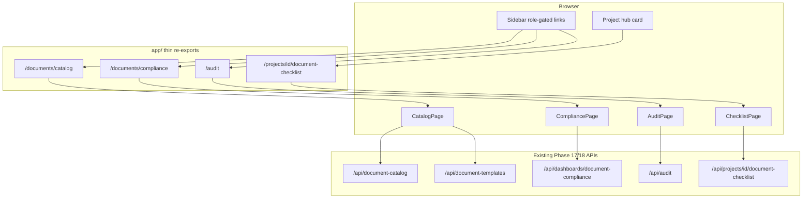

# Phase 23: Document Checklist & Audit Viewer - Research

**Researched:** 2026-08-28
**Domain:** React UI consuming Phase 17/18 document & audit APIs (no backend changes)
**Confidence:** HIGH

## Summary

Phase 23 ships four v2 UI surfaces — CPMO document catalog/templates, CPMO compliance dashboard, PM Confluence checklist editor, and CPMO audit log viewer — by following the established Phase 21/22 pattern: feature code under `modules/<feature>/ui/`, thin `'use client'` re-exports in `app/`, client `fetch` hooks, in-page 401/403 handling, English copy, `bg-blue-600` primary CTAs, and Vitest component tests with mocked `fetch`. All backend routes already exist and are gated; this phase adds **zero** new API endpoints and **zero** npm packages.

The v1 project document dump at `/projects/[id]/documents` (`app/projects/[id]/documents/page.tsx`) is a large AI-assisted charter/SoW editor — it must remain untouched. The spec Confluence checklist is a **parallel surface** at `/projects/[id]/document-checklist` (Phase 17 D-01). PMs reach the checklist from a new project-hub card; CPMO reaches catalog/compliance/audit via Sidebar links gated on `roles.includes('cpmo')`, placed after the weekly NAV block (same pattern as spec dashboard links).

Long lists (audit log default limit 50, max 200; compliance project lists at scale) should reuse `modules/weekly/ui/shared/VirtualRows` when row count exceeds ~100 (PERF-01, D-09). Audit before/after payloads render as `JSON.stringify(obj, null, 2)` inside a scrollable `<pre>` — no custom JSON tree, no `dangerouslySetInnerHTML` (D-10).

**Primary recommendation:** Clone the Phase 22 module layout (`use*Hook` + page shell + `.component.test.tsx`) for `modules/documents/ui/` and `modules/audit/ui/`, wire four thin `app/` pages, extend Sidebar + project hub deep links, and prove each surface with mocked-fetch component tests.

## Architectural Responsibility Map

| Capability | Primary Tier | Secondary Tier | Rationale |
|------------|-------------|----------------|-----------|
| Catalog CRUD + template version insert/retire | API / Backend (existing) | Browser (forms POST/PATCH) | Business rules, company scope, audit append live in services; UI only submits JSON |
| PM checklist PATCH (Confluence URL, status) | API / Backend (existing) | Browser (inline editor) | HTTPS validation, approved/NA field rules enforced server-side |
| Compliance rollup + filters | API / Backend (existing) | Browser (filter bar + table) | `projectComplianceStatus` and dashboard filter keys computed in service |
| Audit log list + filters | API / Backend (existing) | Browser (table + expand row) | Company-scoped SELECT, limit clamp 50–200 in `audit.service.ts` |
| Role-gated navigation | Browser / Client | — | Sidebar and hub cards hide routes; API still returns 403 if URL is hit directly |
| Row virtualization (100+ rows) | Browser / Client | — | `VirtualRows` windowing is pure DOM optimization |

<user_constraints>
## User Constraints (from CONTEXT.md)

### Locked Decisions

#### Layout and routes
- **D-01:** Implement under `modules/documents/ui/` and `modules/audit/ui/` with thin App Router re-exports. URLs: `/documents/catalog` (CPMO catalog + templates), `/documents/compliance` (CPMO compliance), `/projects/[id]/document-checklist` (PM checklist), `/audit` (CPMO audit). Do not overwrite `/projects/[id]/documents`.
- **D-02:** Sidebar: add CPMO-only **Catalog**, **Compliance**, and **Audit log** after weekly NAV (same role-gate pattern as dashboards/weekly). Do not put a PM checklist item on global NAV — PMs open it from the project hub (`app/projects/[id]/page.tsx` card) using `/projects/{id}/document-checklist`. Existing `/documents` NAV_PRIMARY link: if it has no page, retarget it to `/documents/catalog` for cpmo only or leave it; planner must not 404 CPMO. Honor existing hrefs if any Phase 16/17 APIs emit them.
- **D-03:** Consume existing APIs only. No new document or audit endpoints.

#### Catalog and templates (DOC-07)
- **D-04:** Catalog list/create/update (soft-retire `active=false`) via existing catalog routes. Template list/create uses URL-only `template_url` (existing schema). Viewer 403 in-page. English copy matching Phase 21/22 density. Primary CTAs `bg-blue-600`. Two font weights only (400 + 600).

#### PM checklist (DOC-08)
- **D-05:** Editor loads GET checklist; PATCH item with Confluence HTTPS URL and status None/Drafting/Pending approval/Approved/Not applicable. Approved requires date+approver fields the API already enforces; N/A requires reason. Show 400 `{ error, fields }` inline. No file input.
- **D-06:** Do not invent a second document dump UI; v1 `/projects/[id]/documents` stays.

#### Compliance (DOC-09)
- **D-07:** Compliance page GET `/api/dashboards/document-compliance` with existing query filters. 403 in-page.

#### Audit viewer (AUDIT-02)
- **D-08:** Audit page GET `/api/audit` with entity_type, entity_id, from, to, limit. Table of actor/time/entity/action. Expanding a row shows before/after JSON (read-only `<pre>` / text, no `dangerouslySetInnerHTML`). Viewer/PM 403 in-page. No PATCH/DELETE UI.
- **D-09:** If the list can exceed ~100 rows, reuse `modules/weekly/ui/shared/VirtualRows` (or a documents/audit copy if cross-module import is awkward). No new npm virtualizer.

#### Locked research defaults (autonomous)
- **D-10:** JSON snapshots render as pretty-printed text in a scrollable panel, not a custom JSON tree widget.
- **D-11:** Checklist status uses the API enum as-is; do not invent extra statuses.
- **D-12:** Catalog `apply_to_in_flight` is a checkbox on create/update, posted only when the existing API field exists.

### Claude's Discretion

(Grey areas auto-accepted at recommended answers — no separate discretion block in CONTEXT.md.)

### Deferred Ideas (OUT OF SCOPE)

- Repo-wide module split — Phase 24
- Binary uploads
</user_constraints>

<phase_requirements>
## Phase Requirements

| ID | Description | Research Support |
|----|-------------|------------------|
| DOC-07 | CPMO can manage the document catalog and URL-only templates in the UI | `GET/POST /api/document-catalog`, `PATCH /api/document-catalog/[id]` with `apply_to_in_flight`; `GET/POST /api/document-templates`, `PATCH /api/document-templates/[id]` `{ retire: true }`; catalog page at `/documents/catalog` |
| DOC-08 | A PM can complete a project's Confluence checklist in the UI (HTTPS link; Approved or Not applicable) | `GET /api/projects/[id]/document-checklist`, `PATCH .../[itemId]` with status enum + conditional fields; page at `/projects/[id]/document-checklist`; hub deep link |
| DOC-09 | CPMO can view document compliance in the UI | `GET /api/dashboards/document-compliance?stage&status&rag&program`; compliance rollup values; page at `/documents/compliance` |
| AUDIT-02 | CPMO can view the company-scoped audit log in the UI with filters and before/after snapshots | `GET /api/audit` filters + row shape; expand-row `<pre>` JSON; page at `/audit`; VirtualRows if >100 rows |
</phase_requirements>

## Project Constraints (from CLAUDE.md)

`CLAUDE.md` exists but is empty — no additional project directives beyond AGENTS.md model routing.

## Standard Stack

### Core (already installed — no new packages)

| Library | Version | Purpose | Why Standard |
|---------|---------|---------|--------------|
| next | 16.2.4 | App Router re-exports | Project stack [VERIFIED: package.json:25] |
| react / react-dom | 19.2.4 | Client pages | Project stack [VERIFIED: package.json:29-30] |
| zod | 4.4.3 | (API boundary only — UI sends JSON matching existing schemas) | Already on checklist/catalog routes |
| sonner | 2.0.7 | Success/error toasts | Phase 21/22 pattern |
| lucide-react | 1.14.0 | Icons | Sidebar + page chrome |
| @testing-library/react | 16.3.2 | Component tests | Phase 21/22 gate |
| vitest | 4.1.10 | Test runner | `npm test` [VERIFIED: package.json:9,52] |

### Supporting (in-repo, reuse — do not duplicate)

| Asset | Location | When to Use |
|-------|----------|-------------|
| VirtualRows | `modules/weekly/ui/shared/VirtualRows.tsx` | Audit table or compliance table when `items.length > 100` [VERIFIED: D-09] |
| Page shell pattern | `modules/dashboards/ui/portfolio/PortfolioDashboardPage.tsx` | Sidebar + loading spinner + ERROR_COPY forbidden/unauthorized |
| Fetch hook pattern | `modules/weekly/ui/periods/useWeeklyPeriods.ts` | `useCallback` load, 401/403/ok tristate |
| shadcn UI | `components/ui/*` | Button, Input, Label, Card, Dialog, Select |

### Alternatives Considered

| Instead of | Could Use | Tradeoff |
|------------|-----------|----------|
| Cross-import VirtualRows | Copy into `modules/documents/ui/shared/` | Only if import path coupling is awkward — prefer direct import first (Phase 22 already cross-module for `downloadBlob`) |
| New JSON viewer npm | `<pre>` + `JSON.stringify` | D-10 forbids tree widget; zero deps wins |

**Installation:** None — phase constraint D-03 / OUT OF SCOPE new npm.

## Package Legitimacy Audit

No external packages are installed in this phase. Existing dependencies were verified in `package.json`; no legitimacy gate required for new installs.

| Package | Disposition |
|---------|-------------|
| (none new) | N/A |

**Packages removed due to [SLOP] verdict:** none  
**Packages flagged as suspicious [SUS]:** none

## Architecture Patterns

### System Architecture Diagram



### Recommended Project Structure

```
modules/
├── documents/ui/
│   ├── catalog/
│   │   ├── DocumentCatalogPage.tsx
│   │   ├── CatalogList.tsx
│   │   ├── CatalogForm.tsx
│   │   ├── TemplatePanel.tsx
│   │   ├── useDocumentCatalog.ts
│   │   └── DocumentCatalogPage.component.test.tsx
│   ├── compliance/
│   │   ├── DocumentCompliancePage.tsx
│   │   ├── ComplianceFiltersBar.tsx
│   │   ├── ComplianceTable.tsx
│   │   ├── useDocumentCompliance.ts
│   │   └── DocumentCompliancePage.component.test.tsx
│   ├── checklist/
│   │   ├── ProjectChecklistPage.tsx
│   │   ├── ChecklistItemRow.tsx
│   │   ├── useProjectChecklist.ts
│   │   └── ProjectChecklistPage.component.test.tsx
│   └── shared/
│       └── types.ts
└── audit/ui/
    ├── AuditLogPage.tsx
    ├── AuditFiltersBar.tsx
    ├── AuditTable.tsx
    ├── useAuditLog.ts
    └── AuditLogPage.component.test.tsx

app/
├── documents/catalog/page.tsx          # re-export
├── documents/compliance/page.tsx       # re-export
├── audit/page.tsx                      # re-export
└── projects/[id]/document-checklist/page.tsx  # re-export

components/layout/Sidebar.tsx           # CPMO nav links (edit)
app/projects/[id]/page.tsx              # hub card deep link (edit)
```

### Pattern 1: Thin App Router re-export

**What:** One-line client page delegating to module.  
**When to use:** Every new route (Phase 21/22 standard).

```typescript
'use client';

export { default } from '@/modules/documents/ui/catalog/DocumentCatalogPage';
```

[VERIFIED: app/weekly/periods/page.tsx:1-3]

### Pattern 2: Fetch hook with in-page auth errors

**What:** Hook maps HTTP status to `'unauthorized' | 'forbidden' | 'load_failed'`; page shows English copy (no redirect).  
**When to use:** All four surfaces.

```typescript
if (res.status === 401) { setError('unauthorized'); return; }
if (res.status === 403) { setError('forbidden'); return; }
```

[VERIFIED: modules/weekly/ui/periods/useWeeklyPeriods.ts:30-38]

### Pattern 3: CPMO Sidebar gate

**What:** Wrap new links in `me?.roles?.includes('cpmo')` block after weekly links.  
**When to use:** Catalog, Compliance, Audit log.

```typescript
{me?.roles?.includes('cpmo') ? (
  <Link href="/documents/catalog" ...>Catalog</Link>
) : null}
```

[VERIFIED: components/layout/Sidebar.tsx:194-222 — same block structure for weekly]

### Pattern 4: Inline validation from PATCH 400

**What:** On failed PATCH, parse JSON body and show `error` next to the field named in `field`.  
**When to use:** Checklist row editor (D-05).

**Note:** CONTEXT D-05 says `{ error, fields }` but the shipped API returns singular `field` for `ValidationError`:

```typescript
// lib/api-errors.ts:51-54
const body: { error: string; field?: string } = { error: e.message };
if (e.field !== undefined) body.field = e.field;
```

[VERIFIED: lib/api-errors.ts:51-54] — Planner should implement against `{ error, field? }`, not `fields` array.

### Anti-Patterns to Avoid

- **Replacing v1 documents page:** `/projects/[id]/documents` is the charter/SoW AI editor — checklist is a separate route (D-06).
- **Global PM checklist nav:** Checklist is project-scoped from hub only (D-02).
- **File inputs on checklist or templates:** API rejects binary fields; templates are URL-only (Phase 17 D-07).
- **Audit write UI:** No PATCH/DELETE on `/api/audit` (Phase 18 D-04).
- **dangerouslySetInnerHTML for audit JSON:** XSS risk; use text in `<pre>` (D-10).

## Don't Hand-Roll

| Problem | Don't Build | Use Instead | Why |
|---------|-------------|-------------|-----|
| Row virtualization | npm virtualizer or custom infinite scroll | `VirtualRows` | PERF-01 satisfied in Phase 22; proven component test for 150 rows |
| JSON tree viewer | react-json-view or similar | `JSON.stringify(x, null, 2)` in `<pre>` | D-10; no new npm |
| Compliance calculation | Client-side rollup | Trust `compliance` field from API | Single source of truth in `document-compliance.service.ts` |
| Authz in UI only | Hide buttons without API check | Rely on 403 from API + in-page message | Defense in depth already on routes |
| Template file upload | Blob storage UI | `template_url` HTTPS field on POST | Phase 17 URL-only templates |

## Common Pitfalls

### Pitfall 1: Validation error shape mismatch (D-05 vs API)

**What goes wrong:** UI reads `body.fields` array; API returns `body.field` string.  
**Why it happens:** CONTEXT wording vs `serviceErrorResponse` implementation.  
**How to avoid:** Map 400 responses using `{ error, field? }` from [VERIFIED: lib/api-errors.ts:51-54].  
**Warning signs:** Inline errors never highlight the correct input.

### Pitfall 2: Checklist status label drift (D-11)

**What goes wrong:** UI shows "Pending Approval" but POSTs `"Pending approval"` or custom slug.  
**Why it happens:** Human labels vs API snake_case enum.  
**How to avoid:** Display labels are cosmetic; PATCH values must be exactly:

`'none'`, `'drafting'`, `'pending_approval'`, `'approved'`, `'not_applicable'`

[VERIFIED: lib/documents/checklist-status.ts:5-11]  
[VERIFIED: app/api/projects/[id]/document-checklist/[itemId]/route.ts:11-13]

### Pitfall 3: Forgetting conditional fields on status change

**What goes wrong:** PATCH `approved` without `approved_at` / `approved_by` → 400.  
**Why it happens:** `assertChecklistPatchRules` enforces per status [VERIFIED: lib/documents/checklist-status.ts:39-60].  
**How to avoid:** Show date + approver inputs when status is `approved`; show reason textarea when `not_applicable`; require HTTPS URL for `pending_approval` and `approved`.

### Pitfall 4: Catalog page accessible to Viewer

**What goes wrong:** Viewer hits `/documents/catalog` directly.  
**Why it happens:** GET catalog uses `withAuth` (PM can read); CPMO UI is nav-gated but API returns 403 for pure viewer via service.  
**How to avoid:** Treat 403 like Phase 21 dashboard — static forbidden copy, no retry loop.

### Pitfall 5: Template retire body shape

**What goes wrong:** PATCH template with `{ active: false }` instead of `{ retire: true }`.  
**Why it happens:** Catalog uses `active`; templates use separate retire schema.  
**How to avoid:** Template retire: `PATCH /api/document-templates/[id]` body `{ "retire": true }` [VERIFIED: app/api/document-templates/[id]/route.ts:7-16].

### Pitfall 6: Compliance unknown filter keys

**What goes wrong:** Sending dashboard-only keys (e.g. `portfolio_year`) → 400.  
**Why it happens:** Compliance accepts subset only: `stage`, `status`, `rag`, `program` [VERIFIED: lib/services/document-compliance.service.ts:12-13].  
**How to avoid:** Compliance filter bar exposes only those four keys.

## Code Examples

### Catalog create (CPMO)

```typescript
// POST /api/document-catalog
await fetch('/api/document-catalog', {
  method: 'POST',
  headers: { 'Content-Type': 'application/json' },
  body: JSON.stringify({
    name: 'Project Charter',
    purpose: 'Signed charter on Confluence',
    stage: 'L2',           // L0|L1|L2|L3|L4|L5|ALL
    mandatory: true,
    active: true,
    apply_to_in_flight: false,  // D-12 checkbox
  }),
});
```

Schema [VERIFIED: app/api/document-catalog/route.ts:10-18]

### Template version create (URL-only)

```typescript
// POST /api/document-templates?catalog_id= optional on GET only
await fetch('/api/document-templates', {
  method: 'POST',
  headers: { 'Content-Type': 'application/json' },
  body: JSON.stringify({
    catalog_id: 1,
    name: 'Charter template v2',
    document_type: 'charter',
    effective_date: '2026-08-01',
    guidance: 'Use company space template',
    template_url: 'https://confluence.example.com/templates/charter',
  }),
});
```

[VERIFIED: app/api/document-templates/route.ts:10-18]

### Checklist PATCH

```typescript
await fetch(`/api/projects/${projectId}/document-checklist/${itemId}`, {
  method: 'PATCH',
  headers: { 'Content-Type': 'application/json' },
  body: JSON.stringify({
    status: 'approved',
    confluence_url: 'https://confluence.example.com/pages/123',
    approved_at: '2026-08-15',
    approved_by: 'Jane Sponsor',
  }),
});
```

Status enum [VERIFIED: app/api/projects/[id]/document-checklist/[itemId]/route.ts:11-13]

### Compliance GET with filters

```typescript
const qs = new URLSearchParams({ stage: 'L2', rag: 'red' });
const res = await fetch(`/api/dashboards/document-compliance?${qs}`);
// { filters, projects: [{ project_id, name, stage, status, rag, compliance }] }
// compliance ∈ 'compliant' | 'not_compliant' | 'not_applicable'
```

[VERIFIED: lib/documents/compliance.ts:1] — type `'compliant' | 'not_compliant' | 'not_applicable'`

### Audit GET + JSON expand

```typescript
const qs = new URLSearchParams({
  entity_type: 'document_checklist',
  from: '2026-08-01',
  to: '2026-08-31',
  limit: '100',
});
const rows = await fetch(`/api/audit?${qs}`).then(r => r.json());
// Row: { id, actor_id, entity_type, entity_id, action, before, after, created_at }

function formatJson(value: unknown): string {
  if (value == null) return '—';
  return JSON.stringify(value, null, 2);
}
// Render: <pre className="overflow-auto max-h-64 text-xs">{formatJson(row.before)}</pre>
```

[VERIFIED: lib/repositories/audit.repo.ts:21-31]  
[VERIFIED: app/api/audit/route.ts:6-19]

### VirtualRows for audit (when rows.length > 100)

```typescript
import VirtualRows from '@/modules/weekly/ui/shared/VirtualRows';

<VirtualRows
  items={rows}
  height={480}
  rowKey={(row) => row.id}
  renderRow={(row) => <AuditRow row={row} />}
/>
```

[VERIFIED: modules/weekly/ui/shared/VirtualRows.component.test.tsx:7-27]

## State of the Art

| Old Approach | Current Approach | When Changed | Impact |
|--------------|------------------|--------------|--------|
| API-only document catalog (Phase 17) | + React CPMO catalog UI (Phase 23) | v2.1 | DOC-07 consumer |
| API-only checklist PATCH | + PM checklist editor UI | v2.1 | DOC-08 consumer |
| Server tests only for audit read | + CPMO audit viewer UI | v2.1 | AUDIT-02 consumer |
| Inline 500+ row DOM tables | VirtualRows windowing (Phase 22) | v2.1 Phase 22 | Reuse for audit/compliance |

**Deprecated/outdated:**
- Using v1 `/projects/[id]/documents` for spec checklist — never valid (Phase 17 D-01).

## Assumptions Log

| # | Claim | Section | Risk if Wrong |
|---|-------|---------|---------------|
| A1 | Project hub gets a **new** quick-link card for checklist (existing `/documents` card stays for v1) | D-02 | PMs cannot find checklist |
| A2 | Cross-module import of `VirtualRows` is acceptable (same as `downloadBlob` in Phase 22) | D-09 | Planner copies component unnecessarily |
| A3 | No global `/documents` portfolio route exists today — only project-scoped v1 page | D-02 | Retarget decision moot |
| A4 | CPMO catalog UI should treat non-CPMO 403 even though PM can GET catalog API | D-04 | Page works for PM if they guess URL — may be acceptable |

## Open Questions

1. **D-05 error body: `field` vs `fields`**
   - What we know: `ValidationError` maps to `{ error, field? }` [VERIFIED: lib/api-errors.ts:51-54].
   - What's unclear: CONTEXT says `{ error, fields }`.
   - Recommendation: Implement `field` (singular) to match shipped API; update VALIDATION.md if needed.

2. **Project hub card copy**
   - What we know: Must deep-link to `/projects/{id}/document-checklist` without removing v1 Documents card.
   - What's unclear: Exact label/description (English vs mixed VN like other hub cards).
   - Recommendation: English title "Document checklist", description "Confluence links and approval status" to match Phase 21/22 density.

3. **Catalog + templates on one page vs tabs**
   - What we know: Single route `/documents/catalog` per D-01.
   - What's unclear: Tab vs stacked sections.
   - Recommendation: Two sections on one page — catalog table above, template panel for selected catalog row (minimal clicks).

## Environment Availability

Step 2.6: **SKIPPED** — phase is UI-only over existing APIs; no new external tools, CLIs, or services.

## Validation Architecture

### Test Framework

| Property | Value |
|----------|-------|
| Framework | vitest 4.1.10 + @testing-library/react 16.3.2 |
| Config file | `vitest.config.ts` (node + jsdom projects) |
| Quick run command | `npx vitest run modules/documents modules/audit --reporter=dot` |
| Full suite command | `npm test` |

### Phase Requirements → Test Map

| Req ID | Behavior | Test Type | Automated Command | File Exists? |
|--------|----------|-----------|-------------------|-------------|
| DOC-07 | Catalog page loads list, shows 403 for forbidden | component | `npx vitest run modules/documents/ui/catalog/DocumentCatalogPage.component.test.tsx` | ❌ Wave 0 |
| DOC-07 | Create catalog POST success refreshes list | component | same | ❌ Wave 0 |
| DOC-08 | Checklist page renders items, PATCH shows inline 400 | component | `npx vitest run modules/documents/ui/checklist/ProjectChecklistPage.component.test.tsx` | ❌ Wave 0 |
| DOC-09 | Compliance page applies filters to query string | component | `npx vitest run modules/documents/ui/compliance/DocumentCompliancePage.component.test.tsx` | ❌ Wave 0 |
| AUDIT-02 | Audit page expand row shows pretty JSON | component | `npx vitest run modules/audit/ui/AuditLogPage.component.test.tsx` | ❌ Wave 0 |
| PERF-01 | Audit table >100 rows uses VirtualRows window | component | extend audit page test or reuse VirtualRows test pattern | ✅ pattern exists |

Backend coverage already shipped (Phase 17/18) — UI phase does not re-test services:

| API | Existing test |
|-----|---------------|
| document-catalog | `app/api/document-catalog/route.test.ts` |
| document-checklist | `app/api/projects/[id]/document-checklist/[itemId]/route.test.ts` |
| document-compliance | `app/api/dashboards/document-compliance/route.test.ts` |
| audit | `app/api/audit/route.test.ts` |

### Sampling Rate

- **Per task commit:** `npx vitest run <new-component-test>.component.test.tsx`
- **Per wave merge:** `npx vitest run modules/documents modules/audit`
- **Phase gate:** `npm test` green before `/gsd-verify-work`

### Wave 0 Gaps

- [ ] `modules/documents/ui/catalog/DocumentCatalogPage.component.test.tsx`
- [ ] `modules/documents/ui/checklist/ProjectChecklistPage.component.test.tsx`
- [ ] `modules/documents/ui/compliance/DocumentCompliancePage.component.test.tsx`
- [ ] `modules/audit/ui/AuditLogPage.component.test.tsx`
- [ ] Shared fixtures under `modules/documents/ui/shared/` (catalog row, checklist row, compliance project, audit row)
- [ ] Mock pattern: `vi.mock('@/components/layout/Sidebar')`, `vi.stubGlobal('fetch', ...)`, `vi.mock('next/navigation')` [VERIFIED: modules/weekly/ui/periods/WeeklyPeriodsPage.component.test.tsx:6-16]

## Security Domain

### Applicable ASVS Categories

| ASVS Category | Applies | Standard Control |
|---------------|---------|-----------------|
| V2 Authentication | yes | Session cookie; 401 in-page on expired session |
| V3 Session Management | no (read-mostly UI) | — |
| V4 Access Control | yes | API `withCpmo` / `withProjectAccess`; UI 403 copy |
| V5 Input Validation | yes | Client mirrors server rules (HTTPS URL, required fields); server remains authoritative |
| V6 Cryptography | no | — |

### Known Threat Patterns

| Pattern | STRIDE | Standard Mitigation |
|---------|--------|---------------------|
| XSS via audit JSON display | Tampering/Spoofing | Render as text in `<pre>`, never `dangerouslySetInnerHTML` (D-10) |
| IDOR on checklist PATCH | Elevation | `withProjectAccess` + `assertProjectWriteAccess` on API |
| Cross-company audit leak | Information disclosure | `listAuditLogs` filters `company_id = actor.company_id` (Phase 18 D-05) |
| File upload bypass | Tampering | No file inputs in UI; API `rejectBinaryFields` |

## Sources

### Primary (HIGH confidence)

- Phase 23 `23-CONTEXT.md` — locked D-01..D-12
- `app/api/document-catalog/route.ts`, `[id]/route.ts` — catalog CRUD schemas
- `app/api/document-templates/route.ts`, `[id]/route.ts` — template URL + retire
- `app/api/projects/[id]/document-checklist/route.ts`, `[itemId]/route.ts` — checklist GET/PATCH
- `app/api/dashboards/document-compliance/route.ts` — compliance GET
- `app/api/audit/route.ts` — audit list filters
- `lib/documents/checklist-status.ts` — status enum
- `lib/documents/compliance.ts` — compliance rollup values
- `lib/api-errors.ts` — 400/403 response shapes
- `modules/weekly/ui/shared/VirtualRows.tsx` — virtualization
- Phase 21/22 module + test patterns

### Secondary (MEDIUM confidence)

- Phase 17/18 CONTEXT — domain rules (Confluence HTTPS, no binaries, audit immutability)

### Tertiary (LOW confidence)

- None material — all critical enums and routes verified in-repo this session.

## Metadata

**Confidence breakdown:**
- Standard stack: HIGH — no new packages; patterns copied from Phases 21–22
- Architecture: HIGH — API contracts read from route + service source files
- Pitfalls: HIGH — validation shape verified against `lib/api-errors.ts`

**Research date:** 2026-08-28  
**Valid until:** 2026-09-28 (stable UI patterns; APIs frozen since v2.0)
